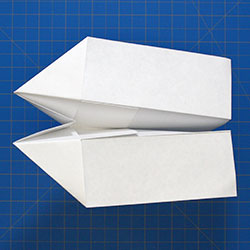
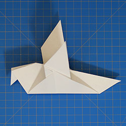
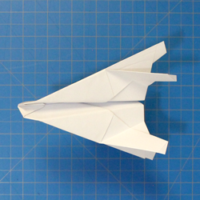
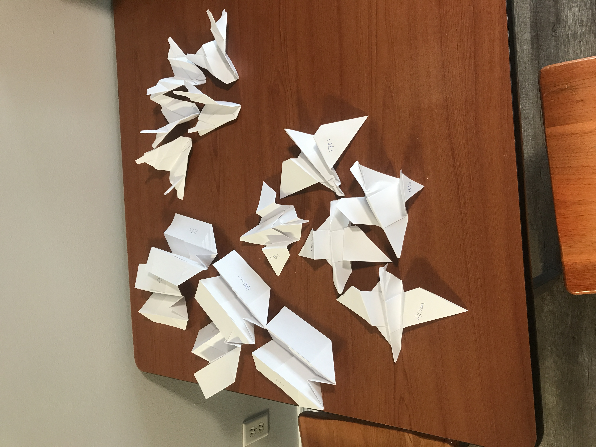
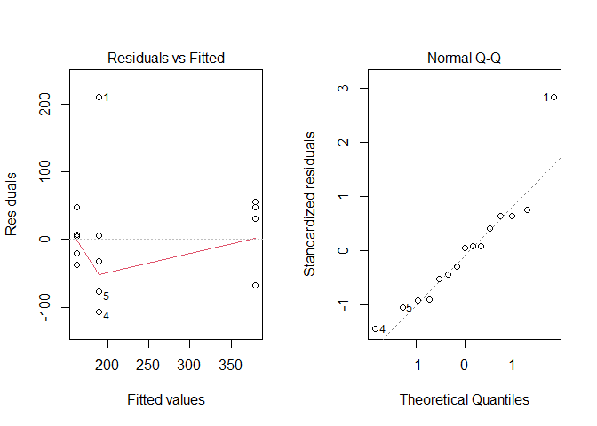
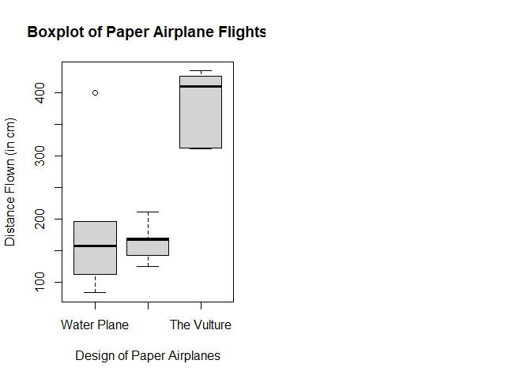

# Paper Airplanes in the Night Sky
## Introduction 
The purpose of this experiment is to see which airplane design out of a randomly selected 3 is more efficient. The efficiency in this case is going to be the distance that the airplanes travel. The manufacturer will be yours truly using a medium of standard computer paper (I really splurged on this project). The designs of the aircraft can be found at this site [Airplane Designs](https://www.foldnfly.com/#/1-1-1-1-1-1-1-1-2) 

* Response - the distance that the plane travels (measured in centimeters)

* Treatment - the different designs of the airplanes (there are three). Those designs are: the water plane, the white dove, and the vulture. 

| Water Plane | White Dove | Vulture | 
|:-------------:|:------------:|:---------:|
|  |  |  | 

* The units - the computer paper that I spent a great amount of money on 

## Methods (Experimental Protocol)

1. Obviously, the first thing is to gather all of the required materials. Those materials are: paper, a tape measure, and a means or recording data. Note: the "White Dove" design does require scissors.

2. After the materials have been gathered, the next step would be to pick which designs you are going to create. To do this, I numbered each of the designs as they are displayed on the page that is linked above. 

3. I then used a random number generator to obtain three random numbers (rand function on a TI-84). I then counted until I reached the number. Boom! The different designs have been selected.

4. Conveniently, the website provides step-by-step instructions required to make each individual design. Follow those until the planes are built. This creation process will be repeated until 5 of each design is created. There should 15 total planes

5. The next step is set up a straight line "runway." Find a good stretch of land (results may vary... better to prepare for large values than to have the planes cut off) and lay the tape measure along the path. In order to decrease possible variance, the same person should throw all of the planes. Note to thrower: Try to keep the same method of throwing in order to decrease variability. 

6. After throwing, write down the spot where it landed (measure at the nose of the aircraft). 


### Sources of Variance

1. I am by no means an expert folder of paper airplanes. As a result, the airplanes are not exactly the same. There is bound to be a bit of within group variablility because of this fact. A larger sample size could possibly solve this issue, but that will not happen in this particular study. In order to reduce the effect that this may cause, I will be folding all of the airplanes.  

2. Certain designs have distinct disadvantages simply because of their nature. In this case, the White Dove is at a major disadvantage. It is not meant to be a flying plane. It is supposed to be a decorative piece. However, if I left it out of the population, I would be violating a key rule of taking a simple random sample. Each member of the population must have a fair shot of being chosen. 

3. The order that the planes are launched in should not have an effect on how each of the planes flies. The planes' flights should be independent of each other. The flight order will be haphazard, but it should not have an effect on the overall results. To summarize, I will be just picking here and there which planes to throw.

4. Different people will be able to throw paper airplanes at different strength levels. In order to avoid any sort of variability with this, I will be the only one throwing the planes.

$$
H_0: \alpha_1 = \alpha_2 = \alpha_3 = 0
$$
$$
H_a: \alpha_i \neq 0
$$
**For at least one i**

For the purposes of the study, we will assume a significance of 0.05.

## Experimentation and Analysis

Below, you will find a picture of the final product of the paper airplane folding. 


| The Fleet |
|:---------:|


### Data


```r
PaperFlights <- read_csv("Data/Paper Airplane Flights1.csv", 
    col_types = cols(Design = col_factor(levels = c("Water Plane", 
        "White Dove", "The Vulture"))))
pander(PaperFlights)
```


------------------------
   Design      Distance 
------------- ----------
 Water Plane    400.6   

 Water Plane    196.1   

 Water Plane    157.4   

 Water Plane      83    

 Water Plane    112.5   

 White Dove     170.1   

 White Dove      211    

 White Dove     125.1   

 White Dove     167.3   

 White Dove     142.3   

 The Vulture    311.7   

 The Vulture    435.1   

 The Vulture    426.8   

 The Vulture    410.4   

 The Vulture    312.3   
------------------------

```r
Airplanes.aov <- aov(Distance ~ Design, data = PaperFlights, contrasts = list(Design = contr.sum))
```

### Graphics and Test


```r
par(mfrow = c(1,2))
plot(Airplanes.aov, which = 1:2)
```

<!-- -->

```r
boxplot(Distance ~ Design, data = PaperFlights, xlab = "Design of Paper Airplanes", ylab = "Distance Flown (in cm)", main = "Boxplot of Paper Airplane Flights")
pander(summary(Airplanes.aov), caption = "One Way ANOVA Test Results")
```


------------------------------------------------------------
    &nbsp;       Df   Sum Sq   Mean Sq   F value    Pr(>F)  
--------------- ---- -------- --------- --------- ----------
  **Design**     2    138775    69387     10.09    0.002691 

 **Residuals**   12   82541     6878       NA         NA    
------------------------------------------------------------

Table: One Way ANOVA Test Results

<!-- -->

## Conclusion

At the 0.05 significance level, there is sufficient evidence to reject the null hypothesis that the effects of each factor are equal to zero. There is at least one effect that is greater than zero. Which one that is could be confirmed by running a pairwise comparison; however, that may be a moot point when you look at the boxplot. The validity of this experiment is in question when the plots are examined. The residuals plot does show a large difference in the variance. That could be of concern. The Q-Q plot is also questionable. I suspect that a larger sample size would yield more promising and trustworthy results.   
