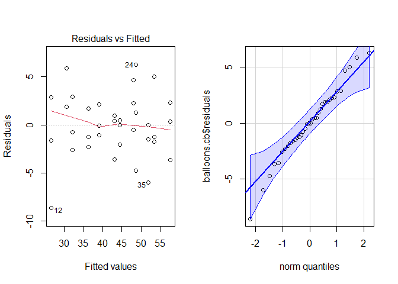
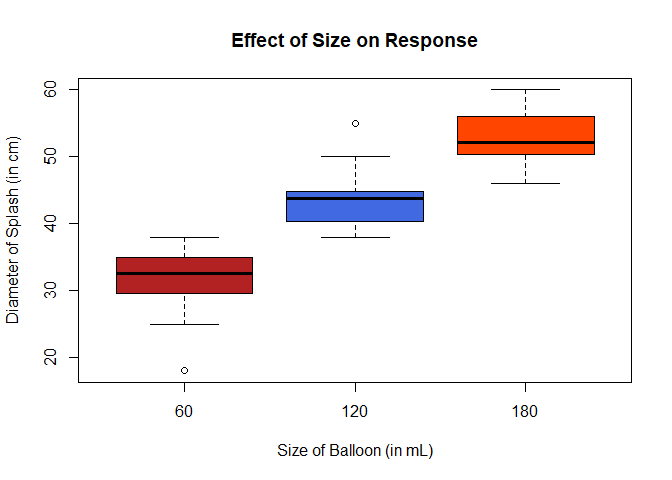
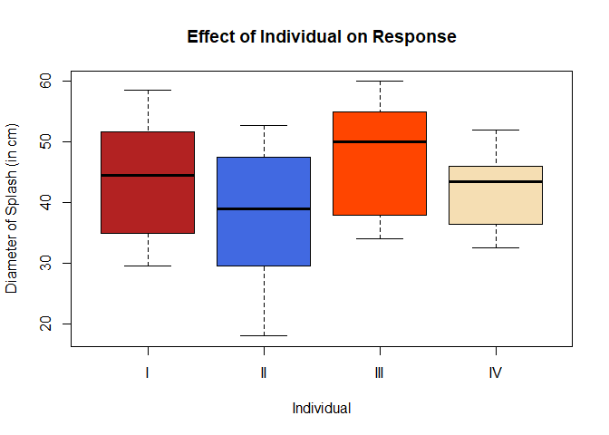

# Ballistics with Balloons Part 2


## Introduction


Previously, I tried to see if the size of a splash radius was affected by the size of a water balloon and/or the distance at which it was thrown. There were several problems with that study. It didn't really take into account different individuals throwing water balloons. I can't be at every water balloon fight. For that, I apologize. This time, I will be leaving distance as a constant. The factor that I will be changing will once again be the size of the water balloons. Another change that I will be making is the target. I plan to use something less absorbent this time as opposed to the rather porous material that was used in the last part of this experiment. 


## Experimentation


**Response** -The diameter of the splash mark caused by the water balloon (measured from edge to edge of the rough circle). This will be measured in centimeters. 

**Treatment** - The size of the water balloons (60 mL, 120 mL, and 180 mL)
 
**Block** - The individual throwing the water balloon (I will be recruiting three of my friends)

**Units** - the water balloons


## Experimental Protocol

1. Gather the materials required. For this experiment, you will need: water balloons, a nice solid object to throw against (I will be using a wall), a place where you can set up a straight shot, (in order to get an exact volume) syringes, and, of course, WATER!!

2. The first step after gathering the materials will be to randomly assign balloons to the different size categories (This will be done using a random number generator). To clarify, the size categories will be numbered 1-3 and the balloons will be assigned to one of the three groups.

3. The second step will be to assign a thrower to it. This will be done in a similar fashion to the previous step. Except that the groups will already be split into sizes.

4. Make it so each person is throwing three balloons of each size.

5. Fill the balloons with the water.

6. Set up the shot by putting a marker at 5 meters.

7. THROW THE BALLOONS!! Make sure to note which thrower is going at that time.

8. After each throw, take a measuring device and measure from one edge of the circle to the other edge. Record the diameter of each circle.

## Hypotheses and Model

For the size of the balloons
$$
H_0: \tau_1 = \tau_2 = \tau_3 = 0 
$$
$$
H_a: \tau_i \neq 0
$$
$$
\text{For at least one i}
$$


For this study, I will be using a **0.05** significance level.


This study will be employing the following mathematical model:

$$
Y_\text{ijk} = \mu + \beta_i + \tau_j + \epsilon_\text{ijk}
$$

Where:

* $Y$ is the observed value

* $\mu$ is the grand mean

* $\beta$ is the individual (block)

* $\tau$ is the treatment (size of balloon)

* $\epsilon$ is the residual


## Sources of Variation

1. In order to minimize the effect of any measurement error, only one person will be measuring the diameters of the splashes. 

2. The process of filling the balloons is quite tedious and difficult (when filling exact volumes). It is possible that water will leak out and the balloons will not be *exactly* the volume that they are supposed to be. I am hoping that it will be a small difference and it will average out in the number crunching. It shouldn't be too bad. Not a lot of water leaks out in the process. 

3. Overlap of splash impacts is a very possible phenomenon. To combat this, I will be using different sections of wall so that possibility is minimized. 

4. The power of each throw will most likely be different. Like the volumes issue discussed in point 2, I am hoping that the difference is small enough to not make a huge difference in the calculations.


## Data


```r
BalloonsBlock <- read_csv("Data/BalloonsBlock.csv")
BalloonsBlock$Size <- factor(BalloonsBlock$Size)
BalloonsBlock$Individual <- factor(BalloonsBlock$Individual)
balloons.cb <- aov(Diameter ~ Individual + Size, data = BalloonsBlock, contrasts = list(Individual = contr.sum, Size = contr.sum))
pander(BalloonsBlock)
```


------------------------------
 Individual   Size   Diameter 
------------ ------ ----------
     I         60       35    

     I         60      31.3   

     I         60      29.5   

     I        120      42.5   

     I        120      44.5   

     I        120       45    

     I        180      58.5   

     I        180      52.2   

     I        180      51.7   

     II        60      29.5   

     II        60       25    

     II        60       18    

     II       120      41.2   

     II       120       39    

     II       120       38    

     II       180      47.5   

     II       180      50.3   

     II       180      52.7   

    III        60       38    

    III        60       35    

    III        60       34    

    III       120       50    

    III       120       44    

    III       120       55    

    III       180       60    

    III       180       58    

    III       180       54    

     IV        60      36.5   

     IV        60      32.5   

     IV        60      32.5   

     IV       120      39.5   

     IV       120       44    

     IV       120      43.5   

     IV       180       52    

     IV       180       46    

     IV       180      50.5   
------------------------------

## Diagnostic Plots


```r
par(mfrow = c(1, 2))
plot(balloons.cb, which = 1)
qqPlot(balloons.cb$residuals, id = FALSE)
```

<!-- -->

The Residuals vs. Fitted plot appears to be fine. There isn't a definite megaphone shape and no distinct pattern. The QQ plot is a bit concerning in some areas, but it may be all right after all. I shall proceed with the test anyway.


## Test and Analysis 


```r
pander(summary(balloons.cb), caption = "CB[1] Test Results")
```


--------------------------------------------------------------
     &nbsp;       Df   Sum Sq   Mean Sq   F value    Pr(>F)   
---------------- ---- -------- --------- --------- -----------
 **Individual**   3    428.4     142.8     12.08    2.346e-05 

    **Size**      2     2768     1384      117.1    6.71e-15  

 **Residuals**    30   354.5     11.82      NA         NA     
--------------------------------------------------------------

Table: CB[1] Test Results

From this test, the null hypothesis is rejected at the **0.05** level. That means that there is sufficient evidence that size has an effect on the diameter of a splash impact. Another thing that can be seen in this table is the value of blocking on individual. Considering that the $p$-value for individual is significant, it can be determined that it was worth it. Although, the Sum of Squares (a measure of variance) value for Individual is lower than Size. Perhaps it wasn't as "worth it" as I had initially assumed.   


## Visuals


```r
palette(c("firebrick", "royalblue", "orangered", "wheat"))
boxplot(Diameter ~ Size, data = BalloonsBlock, col = palette(), main = "Effect of Size on Response", xlab = "Size of Balloon (in mL)", ylab = "Diameter of Splash (in cm)")
```

<!-- -->

```r
boxplot(Diameter ~ Individual, data = BalloonsBlock, col = palette(), main = "Effect of Individual on Response", ylab = "Diameter of Splash (in cm)")
```

<!-- -->


As it can be seen from these boxplots, the levels of the different factors do indeed have an impact on the diameter of the splash. The Sum of Squares conclusion can also be supported by looking at this plot. The Size boxplot shows three distinct figures with little to no overlap between the different levels. Thus, a great deal of variation can be seen here. The individual boxplot shows a bit of a different story. There is quite a bit of overlap which would explain the lower sum of squares found in the table. 


## Numerical Summaries 


```r
pander(favstats(Diameter ~ Size, data = BalloonsBlock)[,-10], caption = "Numerical Summary for Size Factor")
```


----------------------------------------------------------------
 Size   min    Q1     median    Q3     max   mean     sd     n  
------ ----- ------- -------- ------- ----- ------- ------- ----
  60    18    29.5     32.5     35     38    31.4    5.497   12 

 120    38    40.78   43.75    44.62   55    43.85   4.763   12 

 180    46    50.45    52.1     55     60    52.78   4.274   12 
----------------------------------------------------------------

Table: Numerical Summary for Size Factor

```r
pander(favstats(Diameter ~ Individual, data = BalloonsBlock)[,-10], caption = "Numerical Summary for Individual Block")
```


---------------------------------------------------------------------
 Individual   min     Q1    median    Q3    max    mean     sd     n 
------------ ------ ------ -------- ------ ------ ------- ------- ---
     I        29.5    35     44.5    51.7   58.5   43.36   9.932   9 

     II        18    29.5     39     47.5   52.7   37.91   11.78   9 

    III        34     38      50      55     60    47.56   10.08   9 

     IV       32.5   36.5    43.5     46     52    41.89   7.171   9 
---------------------------------------------------------------------

Table: Numerical Summary for Individual Block


## Conclusion

This study and previous studies that have been conducted have concluded that the size of a water balloon does indeed splash effect of the balloon. The case study here does conclude that the individual throwing the water balloon affects the size of the balloon splash. So, if you want to make a bigger splash this summer, make sure you stretch before throwing so that you are able to get the bigger splash. 
