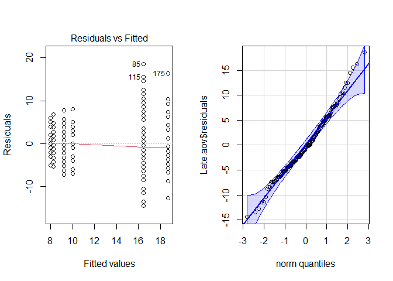
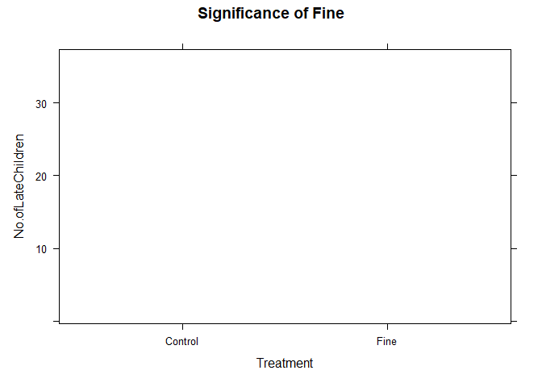
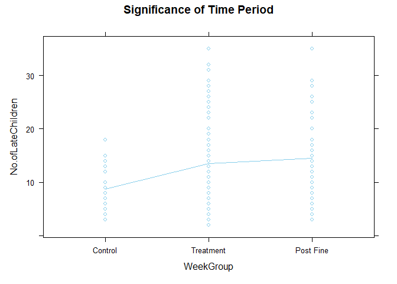
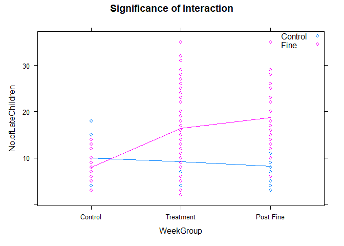

<script type="text/javascript">
 function showhide(id) {
    var e = document.getElementById(id);
    e.style.display = (e.style.display == 'block') ? 'none' : 'block';
 }
</script>


----

<!--If you want to give your critiquers some ideas about what you have questions on and would like help with, place those details here.-->

**Comments to Critiquers:** 

In the analysis below, the term "WeekGroup" is used. This refers to the original study where there are three distinct groups of weeks.

* The first group is the weeks 1-4 and has been labeled as the "Control" group.

* The second group is the weeks 5-16 and has been labeled as the "Treatment" group.

* The third group is the weeks 17-20 and has been labeled as the "Post Fine Removal" group.

<!--End your comments to your critiquers before this line.-->

----


## Background {.tabset .tabset-fade}

### Overview
<!-- Be sure to add your own background here before beginning the Analysis. -->


<!--End your background before here.-->
<!--Click the little black arrow to 
the left to expand/hide these next sections.-->
### Study Details

<div style="color:#a8a8a8;">
This background is quoted directly from the article ["A Fine is a Price"](http://rady.ucsd.edu/faculty/directory/gneezy/pub/docs/fine.pdf). 
</div>

<div style="padding-left:30px; padding-right:30px;">

There are two types of day-care centers in Israel: private and public. A study was conducted in 10 private day-care centers in the city of Haifa from January to June 1998. All of these centers are located in the same part of town, and there is no important difference among them. During the day children are organized into groups according to age, from 1 to 4 years old. Each day-care center is allowed to hold a maximum of 35 children. In some exceptional cases a few additional children are allowed. The fee for each child is NIS 1,400 per month. (The NIS is the New Israeli Shekel.) At the time of the study, a U.S. dollar was worth approximately NIS 3.68, so the fee was about $380 at that time. 

The contract signed at the beginning of the year states that the day-care
center operates between 0730 and 1600. There is no mention of what happens if parents come late to pick up their children. In particular, before the beginning of the study, there was no fine for coming late. When parents did not come on time, one of the teachers had to wait with the children concerned. Teachers would rotate in this task, which is considered part of the job of a teacher, a fact that is clearly explained when a teacher is hired. Parents rarely came after 1630. 

A natural option [to fix the problem of parents showing up late] is to introduce a fine: every time a parent comes late, [they] will have to pay a fine. Will that reduce the number of parents who come late? If the fine is removed, will things revert back to the way they were originally?

The overall period of the study was 20 weeks. In the first 4 weeks we
simply recorded the number of parents who arrived late each week. At the
beginning of the fifth week, we introduced a fine in six of the 10 day-care centers, which had been selected randomly. The announcement of the fine was made with a note posted on the bulletin board of the day-care center. Parents tend to look at this board every day, since important announcements are posted there. The announcement specified that the fine would be NIS 10 for a delay of 10 minutes or more. The fine was per child; thus, if parents had two children in the center and they came late, they had to pay NIS 20. Payment was made to the principal of the day-care center at the end of the month. Since monthly payments are made to the owner during the year, the fines were added to those amounts. The money was paid to the owner, rather then to the teacher who was staying late (and did not get any additional money). The teachers were informed of the fine but not of the study. Registering the names of parents who came late was a common practice in any case.

At the beginning of the seventeenth week, the fine was removed with no explanation. Notice of the cancellation was posted on the board. If parents asked why the fines were removed, the principals were instructed to reply that the fine had been a trial for a limited time and that the results of this trial were now being evaluated.

A comparison with other fines in Israel may give an idea of the size of
the penalty that was introduced. A fine of NIS 10 is relatively small but not insignificant. In comparison, the fine for illegal parking is NIS 75; the fine for driving through a red light is NIS 1,000 plus penalties; the fine for not collecting the droppings of a dog is NIS 360. For many of these violations, however, detection and enforcement are low or, as in the case of dog dirt, nonexistent in practice. A baby-sitter earns between NIS 15 and NIS 20 per hour. The average gross salary per month in Israel at the time of the study was NIS 5,595.

</div>


### The Data (Wide)


The `late` Day Care Center data is shown here in the "wide data format". 


```r
#Show the full width of the "Wide" version of the late data:
pander(late, split.tables = Inf)
```


--------------------------------------------------------------------------------------------------------------------------------------------------------------------------------------------------------------
 Treatment   Center   No.ofChidren   Week1   Week2   Week3   Week4   Week5   Week6   Week7   Week8   Week9   Week10   Week11   Week12   Week13   Week14   Week15   Week16   Week17   Week18   Week19   Week20 
----------- -------- -------------- ------- ------- ------- ------- ------- ------- ------- ------- ------- -------- -------- -------- -------- -------- -------- -------- -------- -------- -------- --------
   Fine        1           37          8       8       7       6       8       9       9      12      13       13       15       13       14       16       14       15       16       13       15       17   

   Fine        2           35          6       7       3       5       2      11      14       9      16       12       10       14       14       16       12       17       14       10       14       15   

   Fine        3           35          8       9       8       9       3       5      15      18      16       14       20       18       25       22       27       19       20       23       23       22   

   Fine        4           34         10       3      14       9       6      24       8      22      22       19       25       18       23       22       24       17       15       23       25       18   

   Fine        5           33         13      12       9      13      15      10      27      28      35       10       24       32       29       29       26       31       26       35       29       28   

   Fine        6           28          5       8       7       5       5       9      12      14      19       17       14       13       10       15       14       16       6        12       17       13   

  Control      7           35          7      10      12       6       4      13       7       8       5       12       3        5        6        13       7        4        7        10       4        6    

  Control      8           34         12       9      14      18      10      11       6      15      14       13       7        12       9        9        17       8        5        11       8        13   

  Control      9           34          3       4       9       3       3       5       9       5       2       7        6        6        9        4        9        2        3        8        3        5    

  Control      10          32         15      13      13      12      10       9      15      15      15       10       17       12       13       11       14       17       12       9        15       13   
--------------------------------------------------------------------------------------------------------------------------------------------------------------------------------------------------------------


### The Data (Long)

The `Late` Day Care Center data is shown here in the "long data format".


```r
# This code reshapes the data into "long" format called Late.
# To get the "Late" dataset into your R Console, 
# you need to click the green "play" arrow in 
# the top right corner of this gray R-Chunk. 
# Then type:
#   > View(Late)
# in your R Console
Late <- reshape(late,
                varying = paste("Week",1:20, sep=""), 
                v.names = "No.ofLateChildren",
                timevar = "Week", 
                times = 1:20, 
                idvar = "Center",
                new.row.names = 1:200,
                direction = "long")
pander(Late)
```


--------------------------------------------------------------
 Treatment   Center   No.ofChidren   Week   No.ofLateChildren 
----------- -------- -------------- ------ -------------------
   Fine        1           37         1             8         

   Fine        2           35         1             6         

   Fine        3           35         1             8         

   Fine        4           34         1            10         

   Fine        5           33         1            13         

   Fine        6           28         1             5         

  Control      7           35         1             7         

  Control      8           34         1            12         

  Control      9           34         1             3         

  Control      10          32         1            15         

   Fine        1           37         2             8         

   Fine        2           35         2             7         

   Fine        3           35         2             9         

   Fine        4           34         2             3         

   Fine        5           33         2            12         

   Fine        6           28         2             8         

  Control      7           35         2            10         

  Control      8           34         2             9         

  Control      9           34         2             4         

  Control      10          32         2            13         

   Fine        1           37         3             7         

   Fine        2           35         3             3         

   Fine        3           35         3             8         

   Fine        4           34         3            14         

   Fine        5           33         3             9         

   Fine        6           28         3             7         

  Control      7           35         3            12         

  Control      8           34         3            14         

  Control      9           34         3             9         

  Control      10          32         3            13         

   Fine        1           37         4             6         

   Fine        2           35         4             5         

   Fine        3           35         4             9         

   Fine        4           34         4             9         

   Fine        5           33         4            13         

   Fine        6           28         4             5         

  Control      7           35         4             6         

  Control      8           34         4            18         

  Control      9           34         4             3         

  Control      10          32         4            12         

   Fine        1           37         5             8         

   Fine        2           35         5             2         

   Fine        3           35         5             3         

   Fine        4           34         5             6         

   Fine        5           33         5            15         

   Fine        6           28         5             5         

  Control      7           35         5             4         

  Control      8           34         5            10         

  Control      9           34         5             3         

  Control      10          32         5            10         

   Fine        1           37         6             9         

   Fine        2           35         6            11         

   Fine        3           35         6             5         

   Fine        4           34         6            24         

   Fine        5           33         6            10         

   Fine        6           28         6             9         

  Control      7           35         6            13         

  Control      8           34         6            11         

  Control      9           34         6             5         

  Control      10          32         6             9         

   Fine        1           37         7             9         

   Fine        2           35         7            14         

   Fine        3           35         7            15         

   Fine        4           34         7             8         

   Fine        5           33         7            27         

   Fine        6           28         7            12         

  Control      7           35         7             7         

  Control      8           34         7             6         

  Control      9           34         7             9         

  Control      10          32         7            15         

   Fine        1           37         8            12         

   Fine        2           35         8             9         

   Fine        3           35         8            18         

   Fine        4           34         8            22         

   Fine        5           33         8            28         

   Fine        6           28         8            14         

  Control      7           35         8             8         

  Control      8           34         8            15         

  Control      9           34         8             5         

  Control      10          32         8            15         

   Fine        1           37         9            13         

   Fine        2           35         9            16         

   Fine        3           35         9            16         

   Fine        4           34         9            22         

   Fine        5           33         9            35         

   Fine        6           28         9            19         

  Control      7           35         9             5         

  Control      8           34         9            14         

  Control      9           34         9             2         

  Control      10          32         9            15         

   Fine        1           37         10           13         

   Fine        2           35         10           12         

   Fine        3           35         10           14         

   Fine        4           34         10           19         

   Fine        5           33         10           10         

   Fine        6           28         10           17         

  Control      7           35         10           12         

  Control      8           34         10           13         

  Control      9           34         10            7         

  Control      10          32         10           10         

   Fine        1           37         11           15         

   Fine        2           35         11           10         

   Fine        3           35         11           20         

   Fine        4           34         11           25         

   Fine        5           33         11           24         

   Fine        6           28         11           14         

  Control      7           35         11            3         

  Control      8           34         11            7         

  Control      9           34         11            6         

  Control      10          32         11           17         

   Fine        1           37         12           13         

   Fine        2           35         12           14         

   Fine        3           35         12           18         

   Fine        4           34         12           18         

   Fine        5           33         12           32         

   Fine        6           28         12           13         

  Control      7           35         12            5         

  Control      8           34         12           12         

  Control      9           34         12            6         

  Control      10          32         12           12         

   Fine        1           37         13           14         

   Fine        2           35         13           14         

   Fine        3           35         13           25         

   Fine        4           34         13           23         

   Fine        5           33         13           29         

   Fine        6           28         13           10         

  Control      7           35         13            6         

  Control      8           34         13            9         

  Control      9           34         13            9         

  Control      10          32         13           13         

   Fine        1           37         14           16         

   Fine        2           35         14           16         

   Fine        3           35         14           22         

   Fine        4           34         14           22         

   Fine        5           33         14           29         

   Fine        6           28         14           15         

  Control      7           35         14           13         

  Control      8           34         14            9         

  Control      9           34         14            4         

  Control      10          32         14           11         

   Fine        1           37         15           14         

   Fine        2           35         15           12         

   Fine        3           35         15           27         

   Fine        4           34         15           24         

   Fine        5           33         15           26         

   Fine        6           28         15           14         

  Control      7           35         15            7         

  Control      8           34         15           17         

  Control      9           34         15            9         

  Control      10          32         15           14         

   Fine        1           37         16           15         

   Fine        2           35         16           17         

   Fine        3           35         16           19         

   Fine        4           34         16           17         

   Fine        5           33         16           31         

   Fine        6           28         16           16         

  Control      7           35         16            4         

  Control      8           34         16            8         

  Control      9           34         16            2         

  Control      10          32         16           17         

   Fine        1           37         17           16         

   Fine        2           35         17           14         

   Fine        3           35         17           20         

   Fine        4           34         17           15         

   Fine        5           33         17           26         

   Fine        6           28         17            6         

  Control      7           35         17            7         

  Control      8           34         17            5         

  Control      9           34         17            3         

  Control      10          32         17           12         

   Fine        1           37         18           13         

   Fine        2           35         18           10         

   Fine        3           35         18           23         

   Fine        4           34         18           23         

   Fine        5           33         18           35         

   Fine        6           28         18           12         

  Control      7           35         18           10         

  Control      8           34         18           11         

  Control      9           34         18            8         

  Control      10          32         18            9         

   Fine        1           37         19           15         

   Fine        2           35         19           14         

   Fine        3           35         19           23         

   Fine        4           34         19           25         

   Fine        5           33         19           29         

   Fine        6           28         19           17         

  Control      7           35         19            4         

  Control      8           34         19            8         

  Control      9           34         19            3         

  Control      10          32         19           15         

   Fine        1           37         20           17         

   Fine        2           35         20           15         

   Fine        3           35         20           22         

   Fine        4           34         20           18         

   Fine        5           33         20           28         

   Fine        6           28         20           13         

  Control      7           35         20            6         

  Control      8           34         20           13         

  Control      9           34         20            5         

  Control      10          32         20           13         
--------------------------------------------------------------


 
##  
<!-- You can begin writing again after here.-->


## Analysis

The study was conducted in three phases. There was the control phase, the treatment phase, and the "return to normal" phase. The hope is with this test to see if the time had an effect on the number of late children or if the treatment had an effect on the number of late children, or perhaps both!

1. The first question that we must ask if the treatment itself had an effect on the number of late children.

2. Then we ask if the actual week had an effect on the number of late children.

3. We then see if there is any sort of interaction between the week and the treatment.

$$
H_0: \mu_\text{Control} = \mu_\text{Treatment}
$$
$$
H_a: \mu_\text{Control} \neq \mu_\text{Treatment}
$$


$$
H_0: \mu_\text{Control} = \mu_\text{Treatment} = \mu_\text{Post Fine Removal}
$$


$$
H_a: \text{At least one of the means is different}
$$


$$
H_0: \text{The effect of the week is the same no matter if there is a treatment or not.}
$$


$$
H_a: \text{The effect of the week is not the same whether or not there is a treatment.}
$$

For the purpose of this study, a **0.05** significance level will be used. 


```r
LateF <- Late %>% 
  mutate(WeekF = as.factor(Week))

LateF <- LateF %>% 
  mutate(WeekGroup = case_when(Week %in% 1:4 ~ "Control", Week %in% 5:16 ~ "Treatment", Week %in% 17:20 ~ "Post Fine"), 
WeekGroup = factor(WeekGroup, levels=c("Control", "Treatment", "Post Fine"), ordered = TRUE))

Late.aov <- aov(No.ofLateChildren ~ WeekGroup*Treatment, data = LateF)
pander(summary(Late.aov))
```


------------------------------------------------------------------------
         &nbsp;            Df    Sum Sq   Mean Sq   F value    Pr(>F)   
------------------------- ----- -------- --------- --------- -----------
      **WeekGroup**         2     828       414      12.91    5.456e-06 

      **Treatment**         1     1740     1740      54.25    4.925e-12 

 **WeekGroup:Treatment**    2    847.7     423.9     13.22    4.162e-06 

      **Residuals**        194    6222     32.07      NA         NA     
------------------------------------------------------------------------

Table: Analysis of Variance Model


## Plots


```r
par(mfrow = c(1, 2))
plot(Late.aov, which = 1)
qqPlot(Late.aov$residuals, id = FALSE)
```

<!-- -->


```r
  xyplot(No.ofLateChildren ~ Treatment, data = LateF, type = c("p", "a"), main = "Significance of Fine", col = "skyblue")
```

```
## Warning in order(as.numeric(x)): NAs introduced by coercion
```

```
## Warning in diff(as.numeric(x[ord])): NAs introduced by coercion
```

```
## Warning in (function (x, y, type = "p", groups = NULL, pch = if
## (is.null(groups)) plot.symbol$pch else superpose.symbol$pch, : NAs introduced by
## coercion
```

<!-- -->

```r
LateF %>% 
  group_by(Treatment) %>% 
  summarise("Mean" = mean(No.ofLateChildren)) %>% 
  pander(caption = "Average number of late children based on presence of treatment")
```


-------------------
 Treatment   Mean  
----------- -------
  Control    9.188 

   Fine      15.21 
-------------------

Table: Average number of late children based on presence of treatment

```r
xyplot(No.ofLateChildren ~ WeekGroup, data = LateF, type = c("p", "a"), main = "Significance of Time Period", col = "skyblue")
```

<!-- -->

```r
LateF %>% 
  group_by(WeekGroup) %>% 
  summarise("Mean" = mean(No.ofLateChildren)) %>% 
  pander(caption = "Average number of late children based on time slot")
```


-------------------
 WeekGroup   Mean  
----------- -------
  Control     8.8  

 Treatment   13.56 

 Post Fine   14.53 
-------------------

Table: Average number of late children based on time slot

```r
xyplot(No.ofLateChildren ~ WeekGroup, data = LateF, groups = Treatment, type = c("p", "a"), main = "Significance of Interaction", auto.key = list(corner = c(1,1)))
```

<!-- -->

```r
LateF %>% 
  group_by(WeekGroup, Treatment) %>% 
  summarise("Mean" = mean(No.ofLateChildren)) %>% 
  spread(Treatment, Mean) %>% 
  pander(caption = "Average number of late children based on treatment AND time slot")
```


-----------------------------
 WeekGroup   Control   Fine  
----------- --------- -------
  Control      10        8   

 Treatment    9.229    16.44 

 Post Fine    8.25     18.71 
-----------------------------

Table: Average number of late children based on treatment AND time slot


## Conclusion 

Based on the results of this test, there is sufficient evidence to reject all of the null hypotheses. Meaning that there is sufficient evidence to claim the following: the average number of late children (treatment or control) is not equal, at least one of the means out of the three week groups is different than the others, and the effects of the week are not the same whether there is a treatment or not. Judging by the plots above, these conclusions make sense. If the results of the test were not significant, we would see a more horizontal line. Alas, that is not the case here. This test might not be the most reliable considering the state of the diagnostic plots. The residual vs. fitted plot has a vaguely megaphone shape to it which is concerning. The QQ plot of the residuals shows some curvature, but it does stay within the boundary curves so it might just be okay. The conclusions that were mentioned before can be supported by looking at the numerical summaries for each grouping. Those numbers in the summaries are all measured in "late children units." Technically speaking, the following numbers would have to be rounded because it isn't totally possible to have a decimal of a child that happens to be late. In the first table above, the two means for the treatment levels can be seen: **9.188** for the control group and **15.21** for the fine group. In this situation, the means are *very* different. The second conclusion that was made is justified by looking at that second table. Once again, that same idea of *very* different means shows up. The Control time period has a mean of **8.8**, the Post Fine time period has a mean of **14.53** , and the Treatment time period has a mean of **13.56**. Finally, the difference in the effects of the treatment is also quite apparent. The highest mean being in the Post Fine/Fine category **18.71** and the lowest being in the Control/Fine category **8**.       

