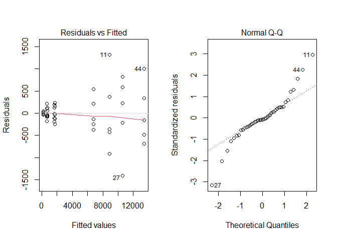
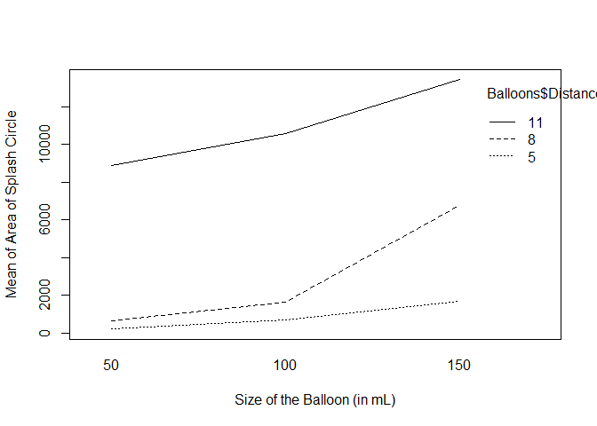
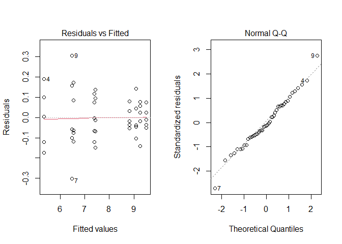

# Ballistics with Balloons

## Introduction

Summer is approaching!! An essential component of summer is a water balloon fight. This study will be examining how the size of a water balloon as well as the distance at which it is thrown affects the splash radius of the impact. This way, by reading this study, you can see if there really is a best size of water balloon. Another thing that can be obtained is how close do you have to be to get the MAXIMUM SPLASH. 

**Response** - The size of the splash mark caused by the water balloon (measured from the center of the rough circle).
  
*Side note:* the radii will be recorded in the dataset, there will be a separate column for the area. The AREA of the splash mark will be the response

(Both will be recorded in centimeters/centimeters squared)

**Treatments** - This study will employ two treatment factors. Those treatment factors are the distance at which they are thrown and the size of the balloon.

  Distances - 5 meters, 8 meters, and 11 meters 

  Sizes - 50 cubic centimeters, 100 cubic centimeters, and 150 cubic centimeters
(Volumes of the various sizes)

**Units** - the water balloons 

## Experimental Protocol

1. Gather the materials required. For this experiment, you will need: water balloons, plain white T-shirts, food coloring (to differentiate between sizes), a place where you can set up a straight shot, markers (to mark the distance), (in order to get an exact volume) syringes, and, of course, WATER!!

2. The first step after gathering the materials will be to randomly assign balloons to the different size categories (This will be done using a random number generator). To clarify, the size categories will be numbered 1-3 and the balloons will be assigned to one of the three groups.

3. The second step will be to assign a distance to it. This will be done in a similar fashion to the previous step. Except that the groups will already be split into sizes.

4. Make it so that all of the possible combinations have five balloons in each. 

5. Fill the balloons with the water. In order to differentiate between the sizes and their impacts, use food coloring to color the water of the different sizes. Personally, I will be using the primary colors (blue for large balloons, yellow for medium balloons, and red for small balloons). 

6. Set up the straight shot by setting up markers along the way at 5 meters, 8 meters, and 11 meters. To do this, use a piece of plywood (or other flat surface) and attach the shirt in some way. Personally, I found a piece of plywood that was narrow enough that I could slip the shirt over it.  

7. Throw the balloons at the respective distances (try to use the same amount of force for each throw)

8. After each throw, take a measuring device and measure from the center of each impact. Preferably, measure from the approximate center to the edge that is on the shirt. Because of human accuracy, it may be difficult to have an accurate measurement (could end up hitting near one of the edges of the shirt). Record the radius of the circle.

## Hypotheses

For the purposes of this experiment, I will be using the following mathematical model:

In this model:

* $\Y$ represents the observed value

* $\mu$ represents the grand mean

* $\alpha$ represents the effect of the size

* $\beta$ represents the effect of the distance

* $\alpha$$\beta$ represents the effect of the interaction of the size and distance

* $\epsilon$ represents the residual error of each term

$$
Y_\text{ijk} = \mu + \alpha_i + \beta_j + (\alpha\beta)_\text{ij} + \epsilon_\text{ijk} 
$$

The hypotheses for this test are as follows. Starting with the sizes. Note that the alpha and beta below are the same as the ones that were defined with the model. 

$$
H_0: \alpha_1 = \alpha_2 = \alpha_3 = 0
$$

$$
H_a: \alpha_i \neq 0
$$
$$
\text{For at least one i}
$$


Second, for the distance:

$$
H_0: \beta_1 = \beta_2 = \beta_3 = 0
$$

$$
H_a: \beta_j \neq 0
$$

$$
\text{For at least one j}
$$


The interaction of size and distance:

$$
H_0: \text {The effect of the size is the same for all of the distances}
$$
$$
H_a: \text {The effect of the size is different for at least one of the distances}
$$

The signifance level that will be used is **0.05**

## Sources of variation

1. Because I am only human, the water balloons will not be exactly the size that I want them to be. I hope that any sort of variation that results will not mess up the results too badly.

2. Because of the expense of purchasing multiple shirts, I will be using the same shirt for many tosses. The colored water could bleed and mess up the measurement, effectively destroying the measurement. In order to avoid as much of this effect as possible, I will be switching out the shirt after shot and letting the shirt dry. That way, the water won't bleed as much (I hope). 

3. Once again, I am only human. As a result of this, it is likely that the throws will be different in some way, shape, or form. This could disrupt the splash radius in some way. I will try to replicate each throw so that this effect is not as prominent. 

4. The shot order will end up being haphazard. This could greatly affect the measurements. I will try to do my best and let the shirts dry after each shot. 


## Data 


```r
Balloons <- read_csv("../../../Data/Water Balloons.csv")
Balloons$Size <- as.factor(Balloons$Size)
Balloons$Distance <- as.factor(Balloons$Distance)
Balloons$Balloon <- as.character(Balloons$Balloon)
pander(Balloons)
```


--------------------------------------------
 Balloon   Size   Distance   Radius   Area  
--------- ------ ---------- -------- -------
    1       50       5        7.5     176.7 

    2       50       5        8.2     211.2 

    3       50       5        7.7     186.3 

    4       50       5         9      254.5 

    5       50       5        8.6     232.4 

    6       50       8         14     615.8 

    7       50       8        12.4    483.1 

    8       50       8        13.7    589.6 

    9       50       8        16.8    886.7 

   10       50       8        15.6    764.5 

   11       50       11        57     10207 

   12       50       11       54.3    9263  

   13       50       11       52.1    8528  

   14       50       11       51.9    8462  

   15       50       11       50.4    7980  

   16      100       5        15.5    754.8 

   17      100       5        14.4    651.4 

   18      100       5         14     615.8 

   19      100       5        16.2    824.5 

   20      100       5        14.3    642.4 

   21      100       8        24.1    1825  

   22      100       8        21.4    1439  

   23      100       8         22     1521  

   24      100       8        23.6    1750  

   25      100       8        22.7    1619  

   26      100       11       58.6    10788 

   27      100       11        54     9161  

   28      100       11       60.2    11385 

   29      100       11       57.4    10351 

   30      100       11       59.6    11159 

   31      150       5        21.5    1452  

   32      150       5        22.4    1576  

   33      150       5        24.3    1855  

   34      150       5         23     1662  

   35      150       5        24.8    1932  

   36      150       8        45.6    6533  

   37      150       8        47.2    6999  

   38      150       8         46     6648  

   39      150       8        48.3    7329  

   40      150       8        45.2    6418  

   41      150       11       64.2    12949 

   42      150       11        65     13273 

   43      150       11       63.7    12748 

   44      150       11       67.8    14441 

   45      150       11       66.2    13768 
--------------------------------------------

```r
balloons.aov <- aov(Area ~ Size*Distance, data = Balloons, contrasts = list(Size = contr.sum, Distance = contr.sum))
```


### Effects


```r
pander(balloons.aov$coefficients, caption = "Effect Sizes of Data")
```


------------------------------------------------------------------------
 (Intercept)   Size1   Size2    Distance1   Distance2   Size1:Distance1 
------------- ------- -------- ----------- ----------- -----------------
    4954       -1697   -654.5     -4085       -1926          1041       
------------------------------------------------------------------------

Table: Table continues below

 
-----------------------------------------------------
 Size2:Distance1   Size1:Distance2   Size2:Distance2 
----------------- ----------------- -----------------
      483.7            -662.5            -742.9      
-----------------------------------------------------


### Diagnostic Plots


```r
par(mfrow = c(1,2))
plot(balloons.aov, which = 1:2)
```

<!-- -->


## Test and Analysis


```r
pander(summary(balloons.aov), caption = "Two Way ANOVA Test Results")
```


----------------------------------------------------------------------
      &nbsp;         Df    Sum Sq      Mean Sq    F value    Pr(>F)   
------------------- ---- ----------- ----------- --------- -----------
     **Size**        2    132624706   66312353     267.6    2.454e-22 

   **Distance**      2    847853680   423926840    1711     2.063e-36 

 **Size:Distance**   4    34172152     8543038     34.48    7.429e-12 

   **Residuals**     36    8919366     247760       NA         NA     
----------------------------------------------------------------------

Table: Two Way ANOVA Test Results

It can clearly be seen that the results of these tests are all significant. Since the interaction factor is significant, the individual factors should not be interpreted. The null hypothesis that the effect of the size is the same for all of the distances is rejected at the 0.05 significance level. Therefore, there is sufficient evidence that the effect of the size is different for at least one of the distances. 


### Interaction Plot


```r
interaction.plot(Balloons$Size, Balloons$Distance, Balloons$Area, xlab = "Size of the Balloon (in mL)", ylab = "Mean of Area of Splash Circle")
```

<!-- -->

As it can be seen in this interaction plot, there appears to be no sections where the lines are parallel. An argument could be made for some parts of it, but it doesn't seem to be enough to show a complete lack of interaction. 


## Conclusion

At the end of this, there were several things that could've been better with this experiment. The response variable could've been changed into something more convenient and measured in a better fashion. Judging by the diagnostic plots, this test should not be trusted. The constant variance requirement appears to be violated and the QQ plot isn't pretty either. 


## Logaritmic What-if

This data had issues with it. Neither the QQ nor the Residuals vs. Fitted plot looked pretty. In this section, I will be performing a log transformation on this dataset to see if that has an effect on the validity of this test and the test in general.


```r
balloons.aov.log <- aov(log(Area) ~ Size*Distance, data = Balloons, contrasts = list(Size = contr.sum, Distance = contr.sum))
```


```r
par(mfrow = c(1,2))
plot(balloons.aov.log, which = 1:2)
```

<!-- -->


```r
pander(summary(balloons.aov.log), caption = "Two Way ANOVA Test Results (Area logged)")
```


-----------------------------------------------------------------
      &nbsp;         Df   Sum Sq   Mean Sq   F value    Pr(>F)   
------------------- ---- -------- --------- --------- -----------
     **Size**        2    19.52     9.761     631.3    9.346e-29 

   **Distance**      2     61.6     30.8      1992     1.37e-37  

 **Size:Distance**   4    5.734     1.434     92.72    1.922e-18 

   **Residuals**     36   0.5566   0.01546     NA         NA     
-----------------------------------------------------------------

Table: Two Way ANOVA Test Results (Area logged)


```r
pander(balloons.aov.log$coefficients, caption = "Effect Sizes of Logged Data")
```


----------------------------------------------------------------------------
 (Intercept)    Size1     Size2     Distance1   Distance2   Size1:Distance1 
------------- --------- ---------- ----------- ----------- -----------------
    7.764      -0.7906   -0.03119    -1.323      -0.1983        -0.3011     
----------------------------------------------------------------------------

Table: Table continues below

 
-----------------------------------------------------
 Size2:Distance1   Size1:Distance2   Size2:Distance2 
----------------- ----------------- -----------------
     0.1327            -0.2929           -0.1413     
-----------------------------------------------------

The results of the test are the same whether or not the Area is logged. I reject the null hypothesis in both cases. The logged data seems to be the more reliable data. The diagnostic plots looks really good when the data is logged. In both cases, the $p$-value is signficant for the interaction. 
