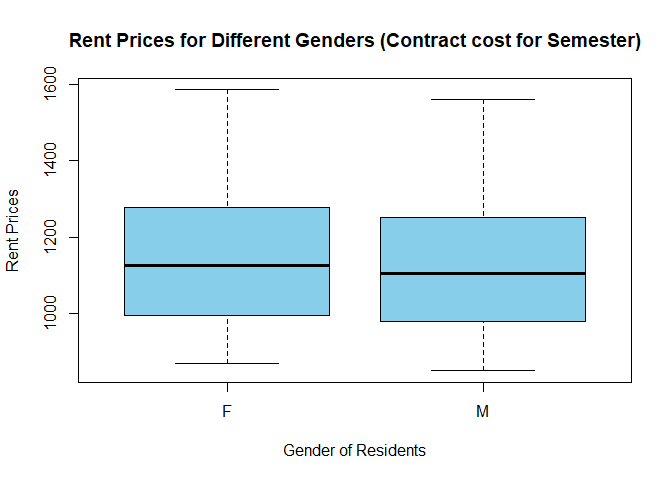

**Week 1 Analysis**


<br />

## Background

Here is a data table showing the available approved housing apartment options at BYU-Idaho for single students. There are 122 entries comprising 57 female and 65 male apartment options.
<!-----
<div style = "color:DodgerBlue;">
Disclaimer: All analysis-relevant text will be in this color. 
Additional  
</div>
----->

This analysis is designed to find out the answer to the following question: Is there a difference in the rent price (Contract cost for one semester) for males and females?


Disclaimer: All complexes that don't list a value for their price have been eliminated from the dataset as they are not applicable to the matter at hand.


```r
# Code to get you started. 
# View(...) works great in the Console, but datatable(...) must be
# used instead within an R-chunk.
RentGenderPrice <- select(Rent,  c(Apartment, Gender, Price))
RentGenderPrice <- filter(RentGenderPrice, !is.na(Price))

datatable(RentGenderPrice, options=list(lengthMenu = c(3,10,30)), extensions="Responsive")
```

```{=html}
<div class="datatables html-widget html-fill-item-overflow-hidden html-fill-item" id="htmlwidget-4b2a5984e019e5167f78" style="width:100%;height:auto;"></div>
<script type="application/json" data-for="htmlwidget-4b2a5984e019e5167f78">{"x":{"filter":"none","vertical":false,"extensions":["Responsive"],"data":[["1","2","3","4","5","6","7","8","9","10","11","12","13","14","15","16","17","18","19","20","21","22","23","24","25","26","27","28","29","30","31","32","33","34","35","36","37","38","39","40","41","42","43","44","45","46","47","48","49","50","51","52","53","54","55","56","57","58","59","60","61","62","63","64","65","66","67","68","69","70","71","72","73","74","75","76","77","78","79","80","81","82","83","84","85","86","87","88","89","90","91","92","93","94","95","96","97","98","99","100","101","102","103","104","105","106","107","108","109","110","111","112","113","114","115","116","117"],["ABBY LANE MANOR","ABODE DUPLEX","ABRI APARTMENTS - MEN","ABRI APARTMENTS - WOMEN","ALBION APARTMENT","ALEXANDER APARTMENT","ALLDREDGE HOUSE","ALLEN RIDGE APARTMENTS","ALLEN'S SUNRISE VILLAGE - MEN","ALLEN'S SUNRISE VILLAGE - WOMEN","ALPINE CHALET","ALTA VIEW APARTMENTS","AMERICAN AVENUE - MEN","AMERICAN AVENUE - WOMEN","ARBOR COVE","ARCADIA APARTMENTS","ARPAD","ASPEN VILLAGE - MEN","ASPEN VILLAGE - WOMEN","AUTUMN WINDS","AVONLEA APARTMENTS","BAYSIDE MANOR","BIRCH PLAZA","BIRCH WOOD I","BIRCH WOOD II","BLUE DOOR, THE","BOUNTIFUL PLACE","BRIARWOOD APARTMENTS","BRIGHAM'S MILL","BRIGHTON APARTMENTS-MEN","BRIGHTON APARTMENTS-WOMEN","BROOKLYN APARTMENTS","BROOKSIDE VILLAGE - MEN","BROOKSIDE VILLAGE - WOMEN","BUENA VISTA","BUNKHOUSE","CAMDEN APARTMENTS-MEN","CAMDEN APARTMENTS-WOMEN","CAMPUS VIEW APARTMENTS","CARRIAGE HOUSE","CEDARS, THE-MEN","CEDARS, THE-WOMEN","CENTRE SQUARE-MEN","CENTRE SQUARE-WOMEN","CHAPMAN HOUSE","CLARKE APARTMENTS","COLLEGE AVENUE APARTMENTS","COLONIAL HEIGHTS TOWNHOUSE","COLONIAL HOUSE","CONDIE COTTAGE","COTTONWOOD-MEN","COTTONWOOD-WOMEN","CREEKSIDE COTTAGES - WOMEN","CREEKSIDE COTTAGES-MEN","CRESTWOOD APARTMENTS","CRESTWOOD COTTAGE","CRESTWOOD HOUSE","DAVENPORT APARTMENTS","DELTA PHI APARTMENTS","GATES, THE - MEN","GATES, THE - WOMEN","GEORGETOWN APARTMENTS","GREENBRIER NORTH","GREENBRIER SOUTH","HARRIS HALL","HEMMING HOUSE I","HEMMING HOUSE III","HEMMING HOUSE IV","HERITAGE MEN","HERITAGE WOMEN","HILLCREST TOWNHOUSES","HILL'S COLLEGE AVE APTS","IVY, THE - Men","IVY, THE - Women","JACOB'S HOUSE","JORDAN RIDGE","KENSINGTON MANOR - MEN","KENSINGTON MANOR - WOMEN","LA JOLLA - MEN","LA JOLLA - WOMEN","LEGACY RIDGE","MOUNTAIN CREST","MOUNTAIN LOFTS - MEN","MOUNTAIN LOFTS - WOMEN","NAUVOO HOUSE I","NAUVOO HOUSE II","NORMANDY APARTMENTS","NORTHPOINT - MEN","NORTHPOINT - WOMEN","PARK VIEW APTS - WOMEN","PARK VIEW APTS-MEN","PINCOCK HOUSE","PINES SOUTH, THE","PINNACLE POINT","QUINCY HOUSE","RED BRICK HOUSE","RED DOOR, THE","ROCKLAND APARTMENTS","ROOST, THE - MEN","ROOST, THE - WOMEN","ROYAL CREST","SHADETREE APARTMENT","SHELBOURNE APARTMENTS","SNOWED INN, THE","SNOWVIEW APARTMENTS","SOMERSET APARTMENTS - MEN","SOMERSET APARTMENTS - WOMEN","SPORI VILLA","SUNSET HALL","TOWERS I","TOWERS II","TUSCANY PLACE - WOMEN","WEBSTER HOUSE","WEST WINDS","WHITFIELD HOUSE","WINDSOR MANOR-MEN","WINDSOR MANOR-WOMEN"],["F","M","M","F","F","F","F","M","M","F","M","M","M","F","M","M","M","M","F","F","F","F","F","F","F","M","M","M","M","M","F","F","M","F","F","M","M","F","M","F","M","F","M","F","M","M","F","M","F","F","M","F","F","M","M","F","M","F","M","M","F","M","M","F","M","F","M","M","M","F","F","F","M","F","M","M","M","F","M","F","F","M","M","F","M","F","F","M","F","F","M","M","M","M","M","F","M","M","M","F","F","F","M","M","F","M","F","M","F","M","F","F","F","M","M","M","F"],[1035,980,1420,1445,1062.5,972.5,1045,890,1000,1000,999,895,1202.5,1050,1018.333333,995,1150,1100,900,1345,1222,960,980,1019,1275,925,1200,998,1325,1225,1300,870,1310,1310,925,961.666666,1250,1216.666666,988,1075,1345,1495,1349,1349,1198,995,995,850,1245,1120,955,950,1261.666666,1245,940,940,925,895,995,1375,1375,995,981,981,1020,1120,975,1010,1189,1259,1125,880,1267.5,1267.5,1120,1374,1095,1224,1189,1129,1374,950,1323,1388,1279,1279,995,1537.333333,1537.333333,1050,1133.333333,1276,975,1046.25,900,1126,972.5,896.666666,1175,1175,995,915,1155,1150,1125,1110,1110,895,967,1300,1400,1302.5,1125,1410,1198,1560,1585]],"container":"<table class=\"display\">\n  <thead>\n    <tr>\n      <th> <\/th>\n      <th>Apartment<\/th>\n      <th>Gender<\/th>\n      <th>Price<\/th>\n    <\/tr>\n  <\/thead>\n<\/table>","options":{"lengthMenu":[3,10,30],"columnDefs":[{"className":"dt-right","targets":3},{"orderable":false,"targets":0}],"order":[],"autoWidth":false,"orderClasses":false,"responsive":true}},"evals":[],"jsHooks":[]}</script>
```


## Graphic

<!-- Present an interesting graphic using the Rent data set. Do not create the same graphics that are shown in the [Good Example Analysis](./Analyses/StudentHousing.html), but you can certainly use those graphics as a guide to inspire you on what to do yourself. -->


```r
# Use this R-chunk to...
# ...Create an interesting graphic using the Rent data set.
 


boxplot(Price~Gender, RentGenderPrice, xlab= "Gender of Residents", ylab = "Rent Prices", main = "Rent Prices for Different Genders (Contract cost for Semester)", col = "skyblue")
```

<!-- -->


<!-- Write a few statements here that explain your graphic and what it shows. -->
<!-- <div style = "color:DodgerBlue; "> -->
The boxplots for this dataset are very similar. They appear to have median values that are very close to each other. In addition to this, the range is similar. As many similarities as they have, there is still a difference between the two boxplots. It is a pretty subtle difference. 
<!-- </div> -->


```r
# Use this R-chunk to...
# ...compute and display a meaningful table of numerical summaries supporting your above graphic.


RentGenderPrice %>% 
  group_by(Gender) %>% 
  summarise(Min = min(Price), Q1 = quantile(Price, 0.25), Median = median(Price), Q3 = quantile(Price, 0.75), Max = max(Price)) %>% 
  pander(caption = "Five Number Summary - Rent Price Comparison")
```


---------------------------------------------
 Gender   Min    Q1     Median    Q3    Max  
-------- ----- ------- -------- ------ ------
   F      870    995     1125    1277   1585 

   M      850   980.2    1105    1249   1560 
---------------------------------------------

Table: Five Number Summary - Rent Price Comparison

```r
RentGenderPrice %>% 
  group_by(Gender) %>% 
  summarise(Mean = mean(Price)) %>% 
  pander(caption = "Average Rent Price Comparison")
```


---------------
 Gender   Mean 
-------- ------
   F      1147 

   M      1120 
---------------

Table: Average Rent Price Comparison

<!-- Write a few statements here that introduce your table of numerical summaries and what they show. -->
<!-- <div style = "color:DodgerBlue; "> -->
This numerical summary serves as further evidence that there is just a slight difference between the contract price per semester for males and females. As it can be seen, even the average prices differ only slightly. 
<!-- </div> -->


## Conclusion
<!-- <div style = "color:DodgerBlue; "> -->
Based on the information found in these graphics and numerical summary, there isn't that much of a difference in rent price for female and male residents. On the other hand, both the boxplots and the average rent price lead to the assumption that females pay more than males. Further studies could be used to see if there is some sort of discrimination in price based on the gender of the resident. Although, it is not likely that such a study would produce any significant results due to the little difference.
<!-- </div> -->


