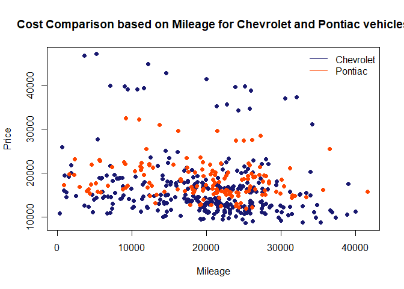
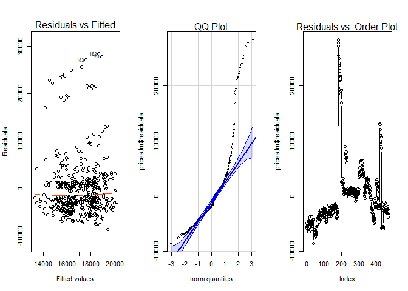
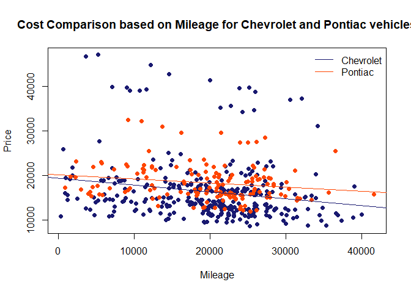

<br>

## Background

When I was in high school, I wanted a Pontiac. I don't remember the reason... I just did. I ended receiving a Chevrolet Malibu at the end of my high school career. Using this data set, I want to see the relationship between the mileage a car has and the price of a car. In particular, I want to look at those cars of the Chevrolet or Pontiac make. In other words, I will be comparing the mileage of a car to its price for different makes of cars.  

## Hypotheses and Models

The model being used in this analysis is as follows:
$$
\underbrace{Y_i}_\text{Price of vehicle} = \overbrace{\beta_0}^\text{Chevy car Price if mileage is zero} + \overbrace{\beta_1}^\text{Change in price with respect to mileage} \underbrace{X_i}_\text{Mileage of car} + \overbrace{\beta_2}^\text{Change in y-intercept due to Make}X_\text{2i} + \overbrace{\beta_3}^\text{Change in slope due to Make}X_\text{1i}X_\text{2i} + \epsilon_i \quad \text{Where} \ \epsilon_i \sim N(0, \sigma^2)
$$
Since I am using multiple linear regression, the thing that I am going to be testing for is whether or not this data has a linear relationship at all. To do this, I will be using the following hypotheses:
$$
H_0: \beta_1 = 0
$$
$$
H_a: \beta_1 \neq 0
$$
Of course, this hypothesis only refers to the slope of the line for the Chevrolet make.

I also want to see if the fact that the car is a Pontiac makes a difference in the slope of the model. I will do that by using these hypotheses:

$$
H_0: \beta_3 = 0
$$
$$
H_a: \beta_3 \neq 0
$$


## Plots
Here we can see a scatterplot of the data without the trendlines drawn on it.  

```r
CarPrices1 <- filter(CarPrices, Make == "Pontiac" | Make == "Chevrolet")
CarPrices1$Make <- as.factor(CarPrices1$Make)
prices.lm <- lm(Price ~ Mileage + Make + Mileage:Make, data = CarPrices1)
palette(c("midnightblue", "orangered"))
plot(Price ~ Mileage, data = CarPrices1, col = as.factor(Make), pch = 16, main = "Cost Comparison based on Mileage for Chevrolet and Pontiac vehicles")
legend("topright", legend = c("Chevrolet", "Pontiac"), bty = "n", lty = 1, col = palette())
```

<!-- -->


Below, I will try to see if the test that I perform is appropriate in this instance. I will do this by using three diagnostic plots. A Residuals vs. Fitted plot which will assess the linearity and the variance assumptions, a Q-Q Plot of the Residuals which will test the normality of the residuals, and a Residuals vs. Order plot which tests to see if the errors are independent of one another. These plots have to do with the fundamental assumptions of performing a linear regression analysis.


```r
par(mfrow = c(1,3))
plot(prices.lm, which = 1)
qqPlot(prices.lm$residuals, id = FALSE)
mtext(side = 3, text = "QQ Plot")
plot(prices.lm$residuals, type = "b")
mtext(side = 3, text = "Residuals vs. Order Plot")
```

<!-- -->

These plots aren't the prettiest to look at. The Q-Q plot shows a definite curvature and goes way beyond the boundary lines. The Residuals vs. Fitted plot has a slight megaphone shape to it which could be of concern. Nevertheless, I shall continue with this test.

## Test and Trendlines


```r
pander(summary(prices.lm), caption = "Linear Regression Test")
```


-----------------------------------------------------------------------
         &nbsp;            Estimate   Std. Error   t value   Pr(>|t|)  
------------------------- ---------- ------------ --------- -----------
     **(Intercept)**        19467       879.9       22.12    1.143e-74 

       **Mileage**         -0.1547     0.04132     -3.742    0.000205  

     **MakePontiac**        756.4        1554      0.4867     0.6267   

 **Mileage:MakePontiac**   0.06088     0.07381     0.8249     0.4099   
-----------------------------------------------------------------------


---------------------------------------------------------------
 Observations   Residual Std. Error    $R^2$    Adjusted $R^2$ 
-------------- --------------------- --------- ----------------
     470               6055           0.05539      0.04931     
---------------------------------------------------------------

Table: Linear Regression Test


As it can be seen, there is sufficient evidence to reject one of the null hypotheses made earlier. With a $p$-value of **0.000205**, there is sufficient evidence to say that the slope of the Chevrolet line is not equal to zero. On the other hand, there is insufficient evidence to say that the difference in the two slopes, $\beta_3$, is not equal to zero. If you look at the **Mileage:MakePontiac** Estimate (which is $\beta_3$), you can clearly see that it is a small number relatively speaking. So, this conclusion is a logical one.

Using this information, I can make trendlines that fit this data.

The equations that result are as follows:
$$
\hat{Y_i} = 19467 - 0.1547x 
$$
$$
\hat{Y_i} = 20223.40 - 0.09382x
$$
These equations were built using the results from the table. The first line represents Chevrolet and the second line represents Pontiac. The changes in slope and intercept were added in to get the Pontiac line. For slope that was 0.06088 and 756.4 for intercept. From this, we can assume that Pontiacs are worth more when they have zero miles and depreciate at a slower rate than Chevrolets.

Here we can see that same scatterplot of the data with the trendlines on it.

```r
B <- prices.lm$coefficients
plot(Price ~ Mileage, data = CarPrices1, col = as.factor(Make), pch = 16, main = "Cost Comparison based on Mileage for Chevrolet and Pontiac vehicles")
legend("topright", legend = c("Chevrolet", "Pontiac"), bty = "n", lty = 1, col = palette())
abline(B[1], B[2], col = palette()[1], lty = 1, lwd = 1)
abline((B[1] + B[3]), (B[2] + B[4]), col = palette()[2], lty = 1, lwd =1)
```

<!-- -->

Even though the reliability of this study was a bit shaky, it can be seen that, based on this data, a Pontiac is a good choice (if you're just considering value). However, there are several things that have to be considered when purchasing cars including fuel efficiency and maintenance. If high school me were looking to buy a car, he better make sure to look at those factors and not just the overall value of the vehicle.
