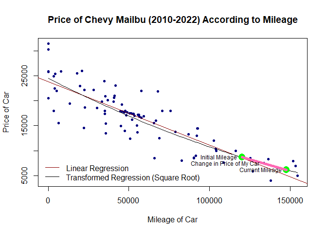
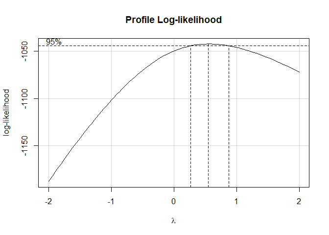

# Introduction

I grew up on a ranch in a small town. Thanks to my quick learning and necessity, I have learned how to drive many different vehicles. Oftentimes, if my parents needed to borrow the car that I would frequently drive, I would basically take anything that could run to school. So, it was a pretty big deal when I got my own car! My first car was a 2006 maroon Chevy Malibu. I had that car for the latter half of my high school career and my first semesters here at BYU-I. After the Spring semester, I went back home to work. One day, my mom borrowed my car so that she could go to a stake meeting. On her way back home, she ended up hitting a deer (she was not injured for the record). Unfortunately, there were two casualties that night. The car was totaled and scrapped. Prior to returning for another semester, my dad and I went car shopping. We ended up getting another Chevy Malibu. This one was from 2012 and it was black. This car is getting older and I need to start looking for a new one. The Chevy Malibu has become one of my favorite make/model combinations out there. Therefore, I collected data on Chevy Malibus that are either older than my current car or *much* younger. I didn't specify the trim, build, or anything like that because I'm rather indifferent when it comes to those characteristics. I did collect the color because that would make a difference in my decision. 


## Bargain Brand CarFax {.tabset .tabset-pills .tabset-fade}


### Plotting to Buy a Car?


```r
palette(c("red4", "black"))
plot(Price ~ Mileage, data = sellingPrices, col = "navyblue", pch = 20, main = "Price of Chevy Mailbu (2010-2022) According to Mileage", xlab = "Mileage of Car", ylab = "Price of Car")
abline(sell.lm, col = "red4")
curve((ss[1] + ss[2]*x)^2, col = "black", add = TRUE)
points(120000, 8693.492, pch = 16, col = "green", cex = 2)
points(147658, 6187.378, pch = 16, col = "green", cex = 2)
text(120000, 8693.492, "Initial Mileage", pos = 2, cex = 0.75)
text(147658, 6187.378, "Current Mileage", pos = 2, cex = 0.75)
segments(120000, 8693.492, 147658, 6187.378, col = "hotpink", lwd = 5)
text(133829, 7440.435, "Change in Price of My Car", pos = 2, cex = 0.75)
legend("bottomleft", col = palette(), lty = 1, legend =c( "Linear Regression", "Transformed Regression (Square Root)"), bty = "n") 
```

<!-- -->


$$
\hat{Y_i} = 23773 - 0.1264X_i
$$
$$
\hat{Y_i}\prime = \sqrt{\hat{Y_i}}
$$
$$
\hat{Y_i}\prime = \sqrt{156.50 - 0.0005271X_i}
$$
$$
\hat{Y_i} = (156.50 - 0.0005271 X_i)^2
$$

According to my transformed regression curve, in the time that I've had it, my car has lost a little over 2500 dollars in value. That results in an average of 1250 dollars per year/per 10,000 miles. It has served me well, so it is definitely worth it. The regression did predict the initial value of my car to be about 8700 dollars. Then again, this is based off of Idaho and Utah prices. Apparently, purchasing my car outside of these two states was wise because I got the car for around 6800 dollars which is not that far off of the value that my car currently has. 


Based off of what I have seen in both the data collection and the regression, I don't think a new car is really worth it. Sure, it would be more reliable and be really cool, but I am a college student. Right now in my life, I can't afford a car loan. Perhaps consistently putting value back into the car would help offset the depreciation. The graph makes it look more extreme than it actually is. One can hope... One can dream...


 

### Mechanics Behind the Math


```r
pander(summary(sell.lm), caption = "Simple Linear Regression Results")
```


---------------------------------------------------------------
     &nbsp;        Estimate   Std. Error   t value   Pr(>|t|)  
----------------- ---------- ------------ --------- -----------
 **(Intercept)**    23773       476.1       49.93    1.643e-72 

   **Mileage**     -0.1264     0.007091    -17.83    8.11e-33  
---------------------------------------------------------------


--------------------------------------------------------------
 Observations   Residual Std. Error   $R^2$    Adjusted $R^2$ 
-------------- --------------------- -------- ----------------
     102               2846           0.7607       0.7583     
--------------------------------------------------------------

Table: Simple Linear Regression Results

```r
par(mfrow = c(1,3))
plot(sell.lm, which = 1)
qqPlot(sell.lm$residuals, id = FALSE)
plot(sell.lm$residuals)
```

<!-- -->

There have definitely been better diagnostic plots out there. The Residuals vs. Fitted plot shows concerns on both fronts. There is some definite bend in that line and there appears to be an inconsistent variance. Both of these could be attributed to the outliers that are present within the data. The QQ-Plot isn't much better. It suggests that this data is heavy tailed. The only one that *might* be acceptable is the Residuals vs. Order plot. Then again, there is a sort of megaphone shape to this one as well. Hopefully, the transformed plots have something better to offer. 


```r
boxCox(sell.lm)
```

<!-- -->

This test shows that a $\lambda$ value of about **0.5** would be all right for this transformation. In other words, a square root transformation. 


```r
pander(summary(sell.sqrt), caption = "Transformed Regression Results")
```


-----------------------------------------------------------------
     &nbsp;         Estimate    Std. Error   t value   Pr(>|t|)  
----------------- ------------ ------------ --------- -----------
 **(Intercept)**     156.5        1.831       85.46    2.713e-95 

   **Mileage**     -0.0005271   2.727e-05    -19.33    1.529e-35 
-----------------------------------------------------------------


--------------------------------------------------------------
 Observations   Residual Std. Error   $R^2$    Adjusted $R^2$ 
-------------- --------------------- -------- ----------------
     102               10.95          0.7888       0.7867     
--------------------------------------------------------------

Table: Transformed Regression Results

```r
par(mfrow = c(1,3))
plot(sell.sqrt, which = 1)
qqPlot(sell.sqrt$residuals, id = FALSE)
plot(sell.sqrt$residuals, main = "Residuals vs. Order Plot")
```

<!-- -->

The transformation appears to have changed the plots, so that's good! Unfortunately, it appears that not everything was changed for the better. The Residuals vs. Fitted plot looks much better than the initial one. Not as much concern regarding linearity and the constant variance doesn't appear to be as much of an issue. The QQ-Plot was one of the casualties sustained with the transformation. The transformation appears to have exaggerated the heavy-tailed aspect that was observed in the initial plot. The Residuals vs. Order plot maintained its vague trend. Of course, this *could* attributed to the connected aspect of the data (it's the same make/model).  


 

### A More Convenient, But Less Informative Car Catalog


```r
datatable(sellingPrices, options=list(lengthMenu = c(5,10,30)), extensions="Responsive")
```

```{=html}
<div class="datatables html-widget html-fill-item-overflow-hidden html-fill-item" id="htmlwidget-e09082d11107eaddf929" style="width:100%;height:auto;"></div>
<script type="application/json" data-for="htmlwidget-e09082d11107eaddf929">{"x":{"filter":"none","vertical":false,"extensions":["Responsive"],"data":[["1","2","3","4","5","6","7","8","9","10","11","12","13","14","15","16","17","18","19","20","21","22","23","24","25","26","27","28","29","30","31","32","33","34","35","36","37","38","39","40","41","42","43","44","45","46","47","48","49","50","51","52","53","54","55","56","57","58","59","60","61","62","63","64","65","66","67","68","69","70","71","72","73","74","75","76","77","78","79","80","81","82","83","84","85","86","87","88","89","90","91","92","93","94","95","96","97","98","99","100","101","102"],[2013,2019,2013,2016,2019,2019,2018,2019,2018,2019,2018,2019,2020,2021,2020,2019,2019,2019,2018,2019,2010,2020,2011,2013,2017,2018,2020,2018,2016,2017,2018,2018,2019,2018,2019,2018,2020,2013,2012,2021,2021,2021,2016,2020,2016,2011,2021,2019,2016,2017,2020,2021,2017,2018,2011,2020,2021,2018,2017,2018,2017,2021,2010,2019,2018,2017,2018,2014,2016,2013,2020,2020,2012,2017,2019,2015,2019,2019,2020,2016,2010,2011,2015,2013,2014,2011,2017,2015,2020,2020,2016,2020,2019,2017,2018,2017,2017,2020,2015,2013,2017,2018],[116250,44872,103832,75837,52885,55657,47225,44870,92307,51237,57782,59256,5159,4201,3971,45520,45432,48972,53566,52034,154429,28269,153245,136411,40933,48299,22748,36829,55387,33359,65523,17813,50323,92605,46640,56359,7979,133697,90252,2,4201,10,55387,3971,47575,138000,2,20977,66885,35788,3971,0,44958,70528,125185,5159,4201,36829,52001,34797,40611,3527,126730,22395,92188,55000,34976,35685,55387,151697,41574,6495,91522,21984,35069,78819,56252,50355,19834,47760,147056,125185,65923,68914,90337,108586,57611,82588,3545,3,41140,5159,30389,67881,36829,50738,45630,35340,86965,104053,102716,13255],[9969,17899,10329,18000,17361,17200,17630,17899,14421,17469,16609,16931,21998,25403,22440,17845,17845,17630,17039,17415,5000,22157,7000,8314,20599,17099,18685,20103,13660,19797,15495,25490,17523,14450,17791,16770,25900,7590,8566,25874,25403,25733,13660,22440,13995,4000,31375,26000,15999,13500,22440,30233,14995,17995,8499,21998,25403,20103,16255,23957,19844,18000,5850,22200,12995,15000,17942,15426,13660,7890,22999,15500,8999,14600,17400,13777,17146,17523,22899,18000,6477,8499,8500,12500,8499,7649,21995,8000,24851,20535,20995,21998,18545,21900,20103,12371,19250,20888,13244,9995,12000,19400],["White",null,"Gray","Pearl",null,null,null,null,null,null,null,"White","White","White","Black","Silver",null,"White","Black","Gray","White","White","White",null,"Gray","Silver","Silver","Black","Black","White","White","Blue","White","Gray","Black","Silver","Red","Silver","Silver","Red","White","Silver","Black","Black","Pearl","Blue","Silver","Silver","Maroon","Gray","Black","White","Blue","White","Red","White","White","Black","Silver","White","Blue","Red","Black","White","Black","Gray","Red","Silver","Black","Blue","Silver","Silver","Silver","Gray","White","Beige",null,null,"White","Blue","Silver","Red","Purple","Black","Blue","White","White","Red","Blue","Red","Red","White","Black","White","Black","Gray","White","Silver","Silver","Silver","White","White"]],"container":"<table class=\"display\">\n  <thead>\n    <tr>\n      <th> <\/th>\n      <th>Year<\/th>\n      <th>Mileage<\/th>\n      <th>Price<\/th>\n      <th>Color<\/th>\n    <\/tr>\n  <\/thead>\n<\/table>","options":{"lengthMenu":[5,10,30],"columnDefs":[{"className":"dt-right","targets":[1,2,3]},{"orderable":false,"targets":0}],"order":[],"autoWidth":false,"orderClasses":false,"responsive":true}},"evals":[],"jsHooks":[]}</script>
```

This data was collected from KSL.com on Thursday, May 6th. This is also the day that I recorded my mileage on my car. The initial mileage was not exact, merely estimated. The Chevy Malibus ranged from 2010 to 2022 and mileages from 0 to 300,000. If you want to see the specifics, see here: [KSL Car Site](https://cars.ksl.com/search/make/Chevrolet/model/Malibu/yearFrom/2010/yearTo/2022/mileageFrom/0/mileageTo/300000/newUsed/Used;Certified;New/numberDoors/4)
