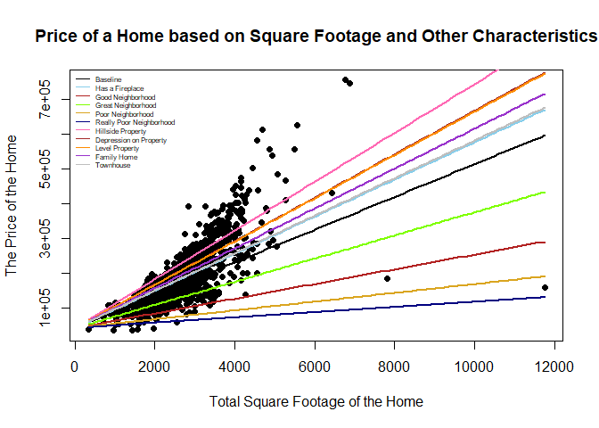

# Location, Location, Location

It is often said in real estate that the location of the house can matter a great deal. Using the dataset provided, I am going to see if location is *all* that matters, or if there are other characteristics that can affect the sale price of a home. 

# The Chosen Factors 

There were a lot of things that I considered while composing the model that I ended up with. I thought about when the house was built, when it may have been remodeled, and even the season in which the house was sold. The factors that ended up in the final model are as follows:

* Whether or not the house has at least one fireplace on the property

* The quality of the neighborhood
  
  * This was separated out based upon the median sale price of each neighborhood
  
  * The "Really Poor" neighborhood group has houses with a median sale price of 88,000 dollars. 
  
  * The "Poor" neighborhood group has houses with median sale prices that range from 103,000 to 137,500 dollars
  
  * The "Good" neighborhood group has houses with median sale prices that range from 139,500 to 191,000 dollars
  
  * The "Great" neighborhood group has houses with median sale prices that range from 197,200 to 228,475 dollars
  
  * The "Excellent" neighborhood group has houses with median sale prices that range from 278,000 to 315,000 dollars
  
  * Note that this grouping has no logical reasoning behind it. It seemed like logical grouping at the time.

* The "flatness" of the property

  * "Lvl" meaning that the property is level
  
  * "Bnk" meaning that the property is banked. A banked property is one that has a "quick and significant rise from street grade to building." (According to the data description file)
  
  * "HLS" is a property with a "significant slope from side to side." 
  * "Low" meaning that the house was built in close proximity to a depression
  
* The type of the home
  
  * "Duplex" - the house in question is a duplex
  
  * "Family" - the house is a family home (either for one family or two families)
  
  * "Townhouse" - the house is part of a townhouse complex (either end unit or interior unit)


The logic behind these particular choices honestly isn't the strongest. The fireplaces came from looking at the pairs plot of the original data and there appeared to be something there, so I mutated it to turn it into an on/off switch that could be used. The other factors came as a result of a pursuit. I was attempting to identify the reason why two of the largest homes in the dataset were relatively cheap. I wrote down everything that they had in common in order to find a model that helped explain them well. In my pursuit, I found many other characteristics that had a significant impact on the sale price of a home. A good way to sum up the logic here is the phrase "shot in the dark." There were a few of those that occurred here. It produced a decent model so I guess you could say it paid off. 

# Interpretation of Coefficients

A majority of the coefficients in the model are changes in slope. The change of intercept coefficients were removed due to their lack of interpretability. The y-intercept in this case would refer to a home that has zero square feet. That doesn't make too much sense. Therefore, all change in intercept coefficents were removed from the model. 

* The slope (and change in slope) coefficients would be interpreted as follows: 
  
  * TotalSF - The change in the average sale price of a home for each additional square foot
  
  * TotalSF:hasFireplace - The change in the average sale price of a home for each additional square foot given that the home has a fireplace
  
  * TotalSF:NeighborhoodGroupGood - The change in the average sale price of a home for each additional square foot given that the home is in the "Good" neighborhood group.
  
  * TotalSF:NeighborhoodGroupGreat - The change in the average sale price of a home for each additional square foot given that the home is in the "Great" neighborhood group.
  
  * TotalSF:NeighborhoodGroupPoor - The change in the average sale price of a home for each additional square foot given that the home is in the "Poor" neighborhood group.
  
  * TotalSF:NeighborhoodGroupReallyPoor - The change in the average sale price of a home for each additional square foot given that the home is in the "Really Poor" neighborhood group.

  * TotalSF:LandContourHLS - The change in the average sale price of a home for each additional square foot given that the house is built on a hillside property. 

  * TotalSF:LandContourLow - The change in the average sale price of a home for each additional square foot given that the house is built on a depression.
  
  * TotalSF:LandContourLvl - The change in the average sale price of a home for each additional square foot given that the house is built on a level property.
  
  * TotalSF:BldgTypeFamily - The change in the average sale price of a home for each additional square foot given that the house is a family style home.
  
  * TotalSF:BldgTypeTownhouse - The change in the average sale price of a home for each additional square foot given that the house is a townhouse style home. 


# Graph of the Model

The model is composed of several lines. It could be more concise and be made  up of one curve; however, there might be some loss of interpretability. I could be overlooking something entirely...


```r
b <- coef(lm.final)
palette(c("gray0", "skyblue", "firebrick", "chartreuse", "goldenrod", "navyblue", "hotpink", "brown", "darkorange", "darkorchid", "gray"))
plot(SalePrice ~ TotalSF, data = house.century, pch = 16, xlab = "Total Square Footage of the Home", ylab = "The Price of the Home", main = "Price of a Home based on Square Footage and Other Characteristics")
curve(b[1] + b[2]*x, add = TRUE, col = palette()[1], lwd = 2)
curve(b[1] + (b[2] + b[3])*x, add = TRUE, col = palette()[2], lwd = 2)
curve(b[1] + (b[2] + b[4])*x, add = TRUE, col = palette()[3], lwd = 2)
curve(b[1] + (b[2] + b[5])*x, add = TRUE, col = palette()[4], lwd = 2)
curve(b[1] + (b[2] + b[6])*x, add = TRUE, col = palette()[5], lwd = 2)
curve(b[1] + (b[2] + b[7])*x, add = TRUE, col = palette()[6], lwd = 2)
curve(b[1] + (b[2] + b[8])*x, add = TRUE, col = palette()[7], lwd = 2)
curve(b[1] + (b[2] + b[9])*x, add = TRUE, col = palette()[8], lwd = 2)
curve(b[1] + (b[2] + b[10])*x, add = TRUE, col = palette()[9], lwd = 2)
curve(b[1] + (b[2] + b[11])*x, add = TRUE, col = palette()[10], lwd = 2)
curve(b[1] + (b[2] + b[12])*x, add = TRUE, col = palette()[11], lwd = 2)
legend("topleft", legend = c("Baseline", "Has a Fireplace", "Good Neighborhood", "Great Neighborhood", "Poor Neighborhood", "Really Poor Neighborhood", "Hillside Property", "Depression on Property", "Level Property", "Family Home", "Townhouse"), lty = 1, bty = "n", cex = 0.5, col = palette())
```

<!-- -->


# Validation


```r
lm.final <- lm(SalePrice ~ TotalSF + hasFireplace:TotalSF + NeighborhoodGroup:TotalSF + LandContour:TotalSF + TotalSF:BldgType, data = house.century)
set.seed(121)
num_rows <- 1000
keep <- sample(1:nrow(house.century), num_rows)
mytrain <- house.century[keep, ]
mytest <- house.century[-keep, ]
lm.train <- lm(SalePrice ~ TotalSF + TotalSF:hasFireplace + TotalSF:NeighborhoodGroup + TotalSF:LandContour + TotalSF:BldgType, data = mytrain)

yhat <- predict(lm.train, newdata = mytest)
ybar <- mean(mytest$SalePrice)
SSTO <- sum( (mytest$SalePrice - ybar)^2 )
SSE <- sum( (mytest$SalePrice - yhat)^2 )
rsq <- 1 - SSE/SSTO
n <- length(mytest$SalePrice)
p <- length(coef(lm.train))
adjrsq <- 1 - (n-1)/(n-p)*SSE/SSTO

my_output_table <- data.frame(Model = c("My lm"), `Original R2` = summary(lm.final)$r.squared, `Orig. Adj. R-Squared` = summary(lm.final)$adj.r.squared, `Validation R-Squared` = rsq, `Validation Adj. R2` = adjrsq)
colnames(my_output_table) <- c("Model", "Original $R^2$", "Original Adj. $R^2$", "Validation $R^2$", "Validation Adj. $R^2$")
knitr::kable(my_output_table, escape=TRUE, digits=4)
```


|Model | Original $R^2$| Original Adj. $R^2$| Validation $R^2$| Validation Adj. $R^2$|
|:-----|--------------:|-------------------:|----------------:|---------------------:|
|My lm |         0.8129|              0.8115|            0.782|                0.7766|

# Significance


```r
pander(summary(lm.final), caption = "Linear Regression Test Results")
```


---------------------------------------------------------------------------
                 &nbsp;                    Estimate   Std. Error   t value 
----------------------------------------- ---------- ------------ ---------
             **(Intercept)**                42170        3797       11.11  

               **TotalSF**                  47.13       2.687       17.54  

        **TotalSF:hasFireplace**            6.284       0.856       7.341  

    **TotalSF:NeighborhoodGroupGood**       -25.99      1.075      -24.18  

   **TotalSF:NeighborhoodGroupGreat**       -13.82      1.069      -12.92  

    **TotalSF:NeighborhoodGroupPoor**       -34.51      1.281      -26.93  

 **TotalSF:NeighborhoodGroupReallyPoor**    -39.58      4.892       -8.09  

       **TotalSF:LandContourHLS**           23.02       2.315       9.946  

       **TotalSF:LandContourLow**           15.38       2.561       6.005  

       **TotalSF:LandContourLvl**           15.12        1.6        9.453  

       **TotalSF:BldgTypeFamily**           10.22       1.928       5.301  

      **TotalSF:BldgTypeTownhouse**          6.8        2.283       2.978  
---------------------------------------------------------------------------

Table: Table continues below

 
------------------------------------------------------
                 &nbsp;                     Pr(>|t|)  
----------------------------------------- ------------
             **(Intercept)**               1.475e-27  

               **TotalSF**                 1.282e-62  

        **TotalSF:hasFireplace**           3.517e-13  

    **TotalSF:NeighborhoodGroupGood**      8.381e-109 

   **TotalSF:NeighborhoodGroupGreat**      3.069e-36  

    **TotalSF:NeighborhoodGroupPoor**      7.461e-130 

 **TotalSF:NeighborhoodGroupReallyPoor**   1.247e-15  

       **TotalSF:LandContourHLS**          1.371e-22  

       **TotalSF:LandContourLow**          2.422e-09  

       **TotalSF:LandContourLvl**          1.276e-20  

       **TotalSF:BldgTypeFamily**           1.33e-07  

      **TotalSF:BldgTypeTownhouse**         0.002945  
------------------------------------------------------


--------------------------------------------------------------
 Observations   Residual Std. Error   $R^2$    Adjusted $R^2$ 
-------------- --------------------- -------- ----------------
     1460              34492          0.8129       0.8115     
--------------------------------------------------------------

Table: Linear Regression Test Results

As it can be seen, all of the $p$-values are significant at the 0.05 $\alpha$ level. Either these factors are decent predictors of the sale price of a home, or there are some Type-I errors that are happening here. Let's hope it's the former rather than the latter. 
