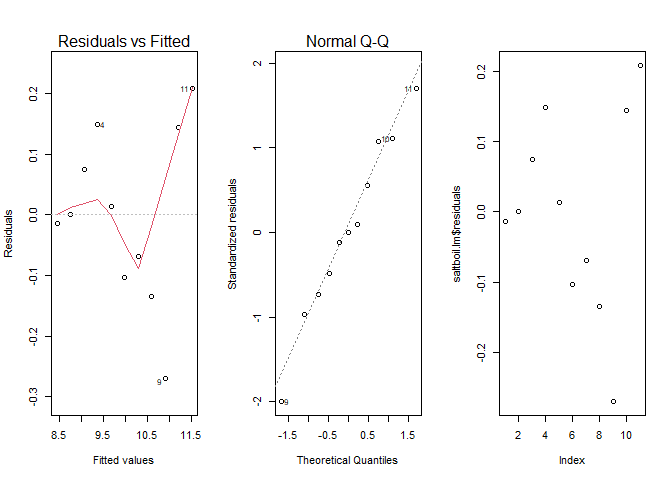
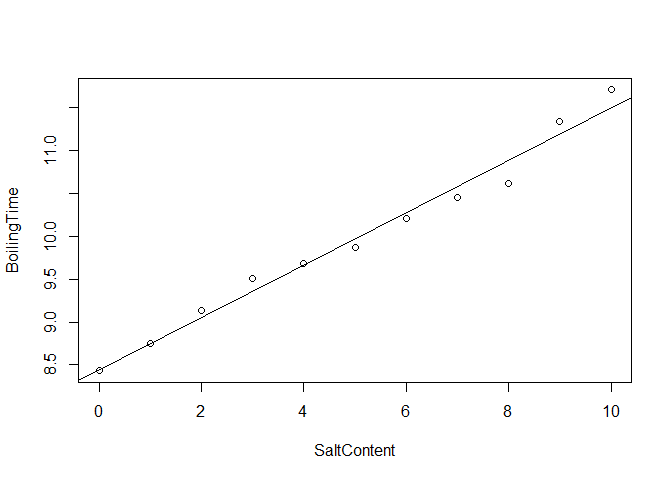

```r
# Load your libraries
library(readr)
library(mosaic)
library(car)
library(tidyverse)
library(pander)

# Load your data after saving a csv file in your Data folder.
# You can use either 
#   someName <- read.csv("../Data/YourDataFileName.csv", header=TRUE)
# or
#   library(readr)
#   someName <- read_csv("../Data/YourDataFileName.csv")

# Don't forget to run "Session -> Set Working Directory -> To Source file location"

SaltBoil <- read_csv("../../Data/SaltBoil.csv")

saltboil.lm <- lm(BoilingTime ~ SaltContent, data = SaltBoil)
```


<!-- Directions

Come up with a simple linear regression of your own creation. 

* Write the Background and clearly state your question. Then collect data and perform the linear regression analysis in order to answer your question. Use the proper order of first, ask the question, then second, figure out the answer.

* You should collect both the quantitative response variable and the quantitative explanatory variable yourself. This can be data you collect from 
    - the internet (like weather data, Facebook data, or
    - your own experiment 
    - your own observational study
* However,     
    - The data should not be a single pre-existing dataset. It must be something that you piece together yourself.

* You need at least $n=3$ $(X,Y)$ pairs to perform the regression. However, your regression will only be useful if you can get around $n=10$ or more observations.

-->


## Background
Does adding salt to water actually decrease the time that it takes to boil water?

In this experiment, I will be seeing if there is a way to use the salt content of water to predict average amount of time that it takes to boil a pot of water.

For this experiment, the amount of water used was 4 cups and all of the salt measurements are in 1/2 tablespoons. The heat setting used was med-high and it was ensured that the stovetop was cooled between each trial.

The seconds on each time were divided by sixty and then added to the minutes in order to get some nice decimal values that could be computed. 

## Hypotheses and Linear model


$$
H_0: \beta_1 = 0
$$

$$
H_a: \beta_1 \neq 0
$$
$$
\underbrace{Y_i}_\text{Time for water to boil} = \beta_0 + {\beta_1} \underbrace{X_i}_\text{Salt content} + \epsilon_i \quad \text{where} \ \epsilon_i \sim N(0, \sigma^2)
$$

$\alpha$ = 0.05


## Data and Plots

```r
pander(SaltBoil)
```


---------------------------
 SaltContent   BoilingTime 
------------- -------------
      0           8.43     

      1           8.75     

      2           9.13     

      3           9.51     

      4           9.68     

      5           9.87     

      6           10.21    

      7           10.45    

      8           10.62    

      9           11.34    

     10           11.71    
---------------------------

```r
par(mfrow = c(1,3))
plot(saltboil.lm, which = 1:2)
plot(saltboil.lm$residuals)
```

<!-- -->

## Test and Analysis
$$
\underbrace{\hat{Y}_i}_\text{Average boiling time} = 8.444 + 0.3058\underbrace{X_i}_\text{Salt added}
$$


```r
pander(summary(saltboil.lm))
```


---------------------------------------------------------------
     &nbsp;        Estimate   Std. Error   t value   Pr(>|t|)  
----------------- ---------- ------------ --------- -----------
 **(Intercept)**    8.444      0.08377      100.8    4.724e-15 

 **SaltContent**    0.3058     0.01416      21.6     4.605e-09 
---------------------------------------------------------------


--------------------------------------------------------------
 Observations   Residual Std. Error   $R^2$    Adjusted $R^2$ 
-------------- --------------------- -------- ----------------
      11              0.1485          0.9811       0.979      
--------------------------------------------------------------

Table: Fitting linear model: BoilingTime ~ SaltContent

```r
plot(SaltBoil)
abline(saltboil.lm)
```

<!-- -->

## Interpretation and Conclusion

With a p-value of 4.605e-09, the null hypothesis is rejected at the 0.05 significance level. This means that there is sufficient evidence that the slope coefficient is not equal to zero. There were a bit of issues that could have been present with this experiment. For instance, it is possible that the pot wasn't cooled off enough between trials. The water was replaced between each trial. It is also possible that the timing was off during all of the trials. Also, the diagnostic plots paint a less than ideal picture. If this experiment were to be repeated, there are several things that I would change to make it better for this sort of experiment. One of those things being changing the salt content to something more extreme so that the results were more insightful.
