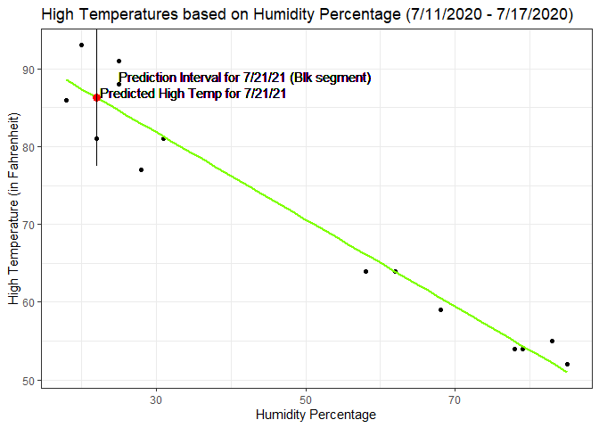
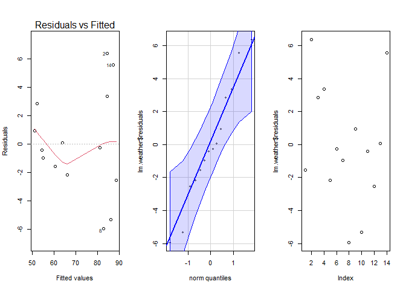
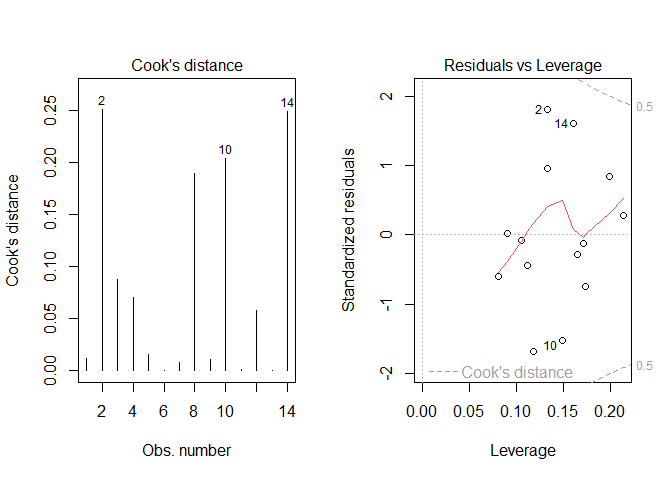

# Prediction 


```r
weather <- read_csv("../../Data/Weather1.csv")
weather1 <- weather %>% 
  mutate(TimeInWords = as.factor(case_when(Time %in% c(0) ~ "Midnight",
                                 Time %in% c(12) ~ "Noon")))
lm.weather <- lm(HighTemp ~ Humidity, data = weather)
pander(predict(lm.weather, data.frame(Humidity = 22)))
```


-------
   1   
-------
 86.31 
-------

```r
pander(predict(lm.weather, data.frame(Humidity = 22), interval = "prediction"))
```


-----------------------
  fit     lwr     upr  
------- ------- -------
 86.31   77.52   95.11 
-----------------------

```r
b <- coef(lm.weather)
```

According to the following study, possible temperatures for Wednesday, July 21st range from **77.52** degrees to **95.11** degrees, centering on **86.31** degrees. As is the trend with prediction intervals, this is quite a large range of values. More likely than not, this interval will be right at *some* point throughout that day. 


# Introduction

The end of the semester is approaching. As is customary with the end of semesters, I am going home. Out of sheer curiosity, I want to know what the temperature will be like for my last day in Rexburg. Using the statistical knowledge that I have gained over the semester, I hope that I can gain some useful insights from this simple linear regression analysis. I was going to try to use some multiple linear regression techniques; however, the factors that I ended up choosing and experimenting with, showed no significance in the bigger model. I elected to stay with the simple model and used data from 2020 for the dates of the week prior to the 21st. In this trial, I didn't use the predicted humidity value for the 21st. Instead, I am hoping that history will repeat itself and I used the humidity of the 21st of 2020 for the prediction. To clarify, I used the humidity value at noon for that day because I believe that this value would yield the maximum air temperature for that day. 


# Plot


Below is a figure that displays the data used for this study. 

* A chartreuse line has been drawn on the graph to indicate where the regression line is. 

* The red dot is to show the predicted temperature for the 21st.

* The black line segments are to show the width of the prediction interval as discussed above.


```r
ggplot(weather, aes(x = Humidity, y = HighTemp)) + 
  geom_point(color = "black", pch = 19) + 
  labs(title = "High Temperatures based on Humidity Percentage (7/11/2020 - 7/17/2020)", x = "Humidity Percentage", y = "High Temperature (in Fahrenheit)") + 
  geom_smooth(method = "lm", formula = y ~x, se = FALSE, color = "chartreuse") + 
  geom_point(x = 22, y = 86.31, color = "red", size = 3) +
  geom_segment(x = 22, xend = 22, y = 77.52, yend = 95.11, color = "black") +
  geom_text(x = 35, y = 87, label = "Predicted High Temp for 7/21/21") +
  geom_text(x = 42, y = 89, label = "Prediction Interval for 7/21/21 (Blk segment)") +
  theme_bw()
```

<!-- -->

# Data 

Here is the full dataset that was used for this particular study. As you can see, there was more than just humidity and high temperature values involved. 


```r
pander(weather, caption = "Data Used for Prediction")
```


----------------------------------------
   Date      Time   Humidity   HighTemp 
----------- ------ ---------- ----------
 7/11/2020    0        68         59    

 7/11/2020    12       25         91    

 7/12/2020    0        83         55    

 7/12/2020    12       25         88    

 7/13/2020    0        58         64    

 7/13/2020    12       31         81    

 7/14/2020    0        78         54    

 7/14/2020    12       28         77    

 7/15/2020    0        85         52    

 7/15/2020    12       22         81    

 7/16/2020    0        79         54    

 7/16/2020    12       18         86    

 7/17/2020    0        62         64    

 7/17/2020    12       20         93    
----------------------------------------

Table: Data Used for Prediction


The data were collected from the following website: [Rexburg Weather](https://www.timeanddate.com/weather/@5605242/historic?month=7&year=2020). The data have been filtered to show historical values from last year (2020). 


# Hypotheses and Linear Models

$$
H_0: \beta_1 = 0
$$

$$
H_a: \beta_1 \neq 0
$$

These hypotheses are referring to the slope coeffiecient of the true regression. This true regression would produce the actual maximum air temperature based on a humidity value. If the null hypothesis is rejected, that would mean that there is indeed a linear relationship between the two variables in question. 


$$
\underbrace{Y_i}_\text{Maximum Air Temperature} = \beta_0 + {\beta_1} \underbrace{X_i}_\text{Humidity Percentage} + \epsilon_i \quad \text{where} \ \epsilon_i \sim N(0, \sigma^2)
$$


Based upon the data, here is the summary output that includes estimates for $\beta_0$ and $\beta_1$ as well as the $R^2$ value.
The $R^2$ value is a way of seeing how well the model fits to this particular scenario.


```r
pander(summary(lm.weather), caption = "Results of the Hypothesis Test")
```


---------------------------------------------------------------
     &nbsp;        Estimate   Std. Error   t value   Pr(>|t|)  
----------------- ---------- ------------ --------- -----------
 **(Intercept)**    98.63       2.157       45.72    7.824e-15 

  **Humidity**     -0.5598     0.03917     -14.29    6.742e-09 
---------------------------------------------------------------


--------------------------------------------------------------
 Observations   Residual Std. Error   $R^2$    Adjusted $R^2$ 
-------------- --------------------- -------- ----------------
      14               3.767          0.9445       0.9399     
--------------------------------------------------------------

Table: Results of the Hypothesis Test


$$
\underbrace{\hat{Y}_i}_\text{Average Maximum Air Temperature} = 98.6270925  -0.5597937\underbrace{X_i}_\text{Humidity Percentage}
$$

While it is interpretable, the y-intercept in this case is somewhat illogical as a 0 percent humidity doesn't happen too frequently. If it were to happen though, the average maximum air temperature would be approximately 98.63 degrees Fahrenheit. The slope coefficient provides a bit more interpretation. It means that for every unit increase of the humidity percentage, the average maximum air temperature is decreasing by a little more than half a degree Fahrenheit (-0.56). 


# Diagnostic Plots


```r
par(mfrow = c(1,3))
plot(lm.weather, which = 1)
qqPlot(lm.weather$residuals, id = FALSE)
plot(lm.weather$residuals)
```

<!-- -->

```r
par(mfrow = c(1,2))
plot(lm.weather, which = c(4,5))
```

<!-- -->


# Conclusion

According to the results of the hypothesis test, there is indeed a linear relationship between the maximum air temperature and the humidity percentage. With a $p$-value of **6.742e-09**, there is more than sufficient evidence to make this conclusion. In regards to the initial hypothesis, there is sufficient evidence to state that $\beta_1$ is not equal to zero! This is very good to know! Now to address the diagnostic plots and make sure that I didn't just waste my time here... The QQ-plot of the residuals seems to be all right considering that it stays within the boundary curves. There doesn't appear to constant variance, and it looks like there might be a problem with linearity (seen when looking at Residuals vs. Fitted plot). The residuals vs. order plot seemed to be chaotic and without a definitive pattern. I also included the Cook's Distance and Residuals vs. Leverage plots. I wasn't *super* concerned about outliers in this particular study; however, it was interesting to see how the plots turned out. While the Cook's distances for some points are relatively high, they are not nearly high enough to cause concern. In addition to that, none of the points have a concerning leverage. This would suggest that if any of the points were to be removed, the regression wouldn't be hurt too much. One final thing that I did find interesting about this was the high $R^2$ value that was produced in the summary output. Now, this could just be a result of the relatively low sample size, or this could actually be a good relationship that I've discovered here. When looking at the diagnostic plots, the credibility of the study does waver quite a bit. I believe that something that could have helped substantially is having a wider range of humidity values within the data set. I feel like I just obtained two ends of the data. I didn't really get a wider range of the data. Perhaps if I had a wider range, I would see a different relationship. Perhaps one that would require a multiple regression approach. OVerall, according to this study, my last day here in Rexburg for the semester should be a great day!  


