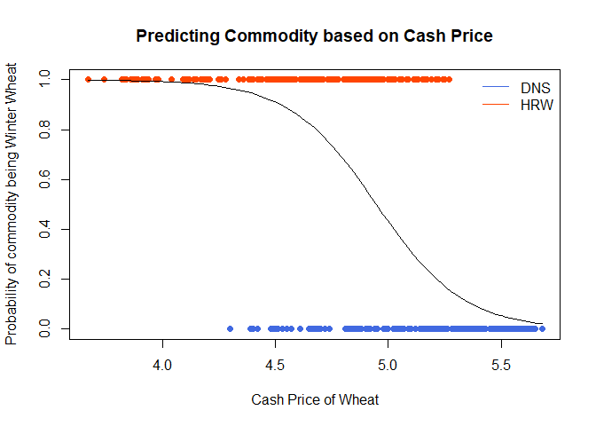

<!-- Find some data of interest to you that can be analyzed with a logistic regression. Complete your Logistic Regression Analysis using this file. 

Hint, run the command 

> data() 

in your Console to see available datasets in R that you could use for this Analysis. You are also welcome to collect data yourself, or find other available datasets online for this Analysis. Just be careful to not use anyone else's "analysis" for this Analysis. Also, no conducting surveys unless you have IRB approval to do so. -->


# Background

Christopher is a statistics student who has been recruited to help with some wheat market data. After he does his consultation, he keeps the data. Curious, he decides to run a logistic regression on the given data to see if it is possible to determine what commodity the wheat is (HRW for Hard Red Winter wheat and DNS for Dark Northern Spring wheat) based on the cash price of the wheat. For the purposes of this, he wants to see if it's possible to determine if it's winter wheat (HRW) based on cash price. These cash prices have been collected and range from June 3rd, 2019 to May 29th, 2020. A datatable below will show these data. The datatable shows the date of the price, what time of year that date is in, the commodity, and the cash price.


# Datatable


```r
datatable(wheat, options = list(lengthMenu = c(3, 5, 20)))
```

```{=html}
<div class="datatables html-widget html-fill-item-overflow-hidden html-fill-item" id="htmlwidget-4b0e15d8ac7710d463f4" style="width:100%;height:auto;"></div>
<script type="application/json" data-for="htmlwidget-4b0e15d8ac7710d463f4">{"x":{"filter":"none","vertical":false,"data":[["1","2","3","4","5","6","7","8","9","10","11","12","13","14","15","16","17","18","19","20","21","22","23","24","25","26","27","28","29","30","31","32","33","34","35","36","37","38","39","40","41","42","43","44","45","46","47","48","49","50","51","52","53","54","55","56","57","58","59","60","61","62","63","64","65","66","67","68","69","70","71","72","73","74","75","76","77","78","79","80","81","82","83","84","85","86","87","88","89","90","91","92","93","94","95","96","97","98","99","100","101","102","103","104","105","106","107","108","109","110","111","112","113","114","115","116","117","118","119","120","121","122","123","124","125","126","127","128","129","130","131","132","133","134","135","136","137","138","139","140","141","142","143","144","145","146","147","148","149","150","151","152","153","154","155","156","157","158","159","160","161","162","163","164","165","166","167","168","169","170","171","172","173","174","175","176","177","178","179","180","181","182","183","184","185","186","187","188","189","190","191","192","193","194","195","196","197","198","199","200","201","202","203","204","205","206","207","208","209","210","211","212","213","214","215","216","217","218","219","220","221","222","223","224","225","226","227","228","229","230","231","232","233","234","235","236","237","238","239","240","241","242","243","244","245","246","247","248","249","250","251","252","253","254","255","256","257","258","259","260","261","262","263","264","265","266","267","268","269","270","271","272","273","274","275","276","277","278","279","280","281","282","283","284","285","286","287","288","289","290","291","292","293","294","295","296","297","298","299","300","301","302","303","304","305","306","307","308","309","310","311","312","313","314","315","316","317","318","319","320","321","322","323","324","325","326","327","328","329","330","331","332","333","334","335","336","337","338","339","340","341","342","343","344","345","346","347","348","349","350","351","352","353","354","355","356","357","358","359","360","361","362","363","364","365","366","367","368","369","370","371","372","373","374","375","376","377","378","379","380","381","382","383","384","385","386","387","388","389","390","391","392","393","394","395","396","397","398","399","400","401","402","403","404","405","406","407","408","409","410","411","412","413","414","415","416","417","418","419","420","421","422","423","424","425","426","427","428","429","430","431","432","433","434","435","436","437","438","439","440","441","442","443","444","445","446","447","448","449","450","451","452","453","454","455","456","457","458","459","460","461","462","463","464","465","466","467","468","469","470","471","472","473","474","475","476","477","478","479","480","481","482","483","484","485","486","487","488","489","490","491","492","493","494","495","496","497","498","499","500"],["3-Jun-19","3-Jun-19","4-Jun-19","4-Jun-19","5-Jun-19","5-Jun-19","6-Jun-19","6-Jun-19","7-Jun-19","7-Jun-19","10-Jun-19","10-Jun-19","11-Jun-19","11-Jun-19","12-Jun-19","12-Jun-19","13-Jun-19","13-Jun-19","14-Jun-19","14-Jun-19","17-Jun-19","17-Jun-19","18-Jun-19","18-Jun-19","19-Jun-19","19-Jun-19","20-Jun-19","20-Jun-19","21-Jun-19","21-Jun-19","24-Jun-19","24-Jun-19","25-Jun-19","25-Jun-19","26-Jun-19","26-Jun-19","27-Jun-19","27-Jun-19","28-Jun-19","28-Jun-19","1-Jul-19","1-Jul-19","2-Jul-19","2-Jul-19","3-Jul-19","3-Jul-19","5-Jul-19","5-Jul-19","8-Jul-19","8-Jul-19","9-Jul-19","9-Jul-19","10-Jul-19","10-Jul-19","11-Jul-19","11-Jul-19","12-Jul-19","12-Jul-19","15-Jul-19","15-Jul-19","16-Jul-19","16-Jul-19","17-Jul-19","17-Jul-19","19-Jul-19","19-Jul-19","22-Jul-19","22-Jul-19","23-Jul-19","23-Jul-19","24-Jul-19","24-Jul-19","25-Jul-19","25-Jul-19","26-Jul-19","26-Jul-19","29-Jul-19","29-Jul-19","30-Jul-19","30-Jul-19","31-Jul-19","31-Jul-19","1-Aug-19","1-Aug-19","2-Aug-19","2-Aug-19","5-Aug-19","5-Aug-19","6-Aug-19","6-Aug-19","7-Aug-19","7-Aug-19","8-Aug-19","8-Aug-19","9-Aug-19","9-Aug-19","12-Aug-19","12-Aug-19","13-Aug-19","13-Aug-19","14-Aug-19","14-Aug-19","15-Aug-19","15-Aug-19","16-Aug-19","16-Aug-19","19-Aug-19","19-Aug-19","20-Aug-19","20-Aug-19","21-Aug-19","21-Aug-19","22-Aug-19","22-Aug-19","23-Aug-19","23-Aug-19","26-Aug-19","26-Aug-19","27-Aug-19","27-Aug-19","28-Aug-19","28-Aug-19","29-Aug-19","29-Aug-19","30-Aug-19","30-Aug-19","3-Sep-19","3-Sep-19","4-Sep-19","4-Sep-19","5-Sep-19","5-Sep-19","6-Sep-19","6-Sep-19","9-Sep-19","9-Sep-19","10-Sep-19","10-Sep-19","11-Sep-19","11-Sep-19","12-Sep-19","12-Sep-19","13-Sep-19","13-Sep-19","16-Sep-19","16-Sep-19","17-Sep-19","17-Sep-19","18-Sep-19","18-Sep-19","19-Sep-19","19-Sep-19","20-Sep-19","20-Sep-19","23-Sep-19","23-Sep-19","24-Sep-19","24-Sep-19","25-Sep-19","25-Sep-19","26-Sep-19","26-Sep-19","27-Sep-19","27-Sep-19","30-Sep-19","30-Sep-19","1-Oct-19","1-Oct-19","2-Oct-19","2-Oct-19","3-Oct-19","3-Oct-19","4-Oct-19","4-Oct-19","7-Oct-19","7-Oct-19","8-Oct-19","8-Oct-19","9-Oct-19","9-Oct-19","10-Oct-19","10-Oct-19","11-Oct-19","11-Oct-19","14-Oct-19","14-Oct-19","15-Oct-19","15-Oct-19","16-Oct-19","16-Oct-19","17-Oct-19","17-Oct-19","18-Oct-19","18-Oct-19","21-Oct-19","21-Oct-19","22-Oct-19","22-Oct-19","23-Oct-19","23-Oct-19","24-Oct-19","24-Oct-19","25-Oct-19","25-Oct-19","28-Oct-19","28-Oct-19","29-Oct-19","29-Oct-19","30-Oct-19","30-Oct-19","31-Oct-19","31-Oct-19","1-Nov-19","1-Nov-19","4-Nov-19","4-Nov-19","5-Nov-19","5-Nov-19","6-Nov-19","6-Nov-19","7-Nov-19","7-Nov-19","8-Nov-19","8-Nov-19","11-Nov-19","11-Nov-19","12-Nov-19","12-Nov-19","13-Nov-19","13-Nov-19","14-Nov-19","14-Nov-19","15-Nov-19","15-Nov-19","18-Nov-19","18-Nov-19","19-Nov-19","19-Nov-19","20-Nov-19","20-Nov-19","21-Nov-19","21-Nov-19","22-Nov-19","22-Nov-19","25-Nov-19","25-Nov-19","26-Nov-19","26-Nov-19","27-Nov-19","27-Nov-19","29-Nov-19","29-Nov-19","2-Dec-19","2-Dec-19","3-Dec-19","3-Dec-19","4-Dec-19","4-Dec-19","5-Dec-19","5-Dec-19","6-Dec-19","6-Dec-19","9-Dec-19","9-Dec-19","10-Dec-19","10-Dec-19","11-Dec-19","11-Dec-19","12-Dec-19","12-Dec-19","13-Dec-19","13-Dec-19","16-Dec-19","16-Dec-19","17-Dec-19","17-Dec-19","18-Dec-19","18-Dec-19","19-Dec-19","19-Dec-19","20-Dec-19","20-Dec-19","23-Dec-19","23-Dec-19","24-Dec-19","24-Dec-19","26-Dec-19","26-Dec-19","27-Dec-19","27-Dec-19","30-Dec-19","30-Dec-19","31-Dec-19","31-Dec-19","2-Jan-20","2-Jan-20","3-Jan-20","3-Jan-20","6-Jan-20","6-Jan-20","7-Jan-20","7-Jan-20","8-Jan-20","8-Jan-20","9-Jan-20","9-Jan-20","10-Jan-20","10-Jan-20","13-Jan-20","13-Jan-20","14-Jan-20","14-Jan-20","15-Jan-20","15-Jan-20","16-Jan-20","16-Jan-20","17-Jan-20","17-Jan-20","21-Jan-20","21-Jan-20","22-Jan-20","22-Jan-20","23-Jan-20","23-Jan-20","24-Jan-20","24-Jan-20","27-Jan-20","27-Jan-20","28-Jan-20","28-Jan-20","29-Jan-20","29-Jan-20","30-Jan-20","30-Jan-20","31-Jan-20","31-Jan-20","3-Feb-20","3-Feb-20","4-Feb-20","4-Feb-20","5-Feb-20","5-Feb-20","6-Feb-20","6-Feb-20","7-Feb-20","7-Feb-20","10-Feb-20","10-Feb-20","11-Feb-20","11-Feb-20","12-Feb-20","12-Feb-20","13-Feb-20","13-Feb-20","14-Feb-20","14-Feb-20","18-Feb-20","18-Feb-20","19-Feb-20","19-Feb-20","20-Feb-20","20-Feb-20","21-Feb-20","21-Feb-20","24-Feb-20","24-Feb-20","25-Feb-20","25-Feb-20","26-Feb-20","26-Feb-20","27-Feb-20","27-Feb-20","28-Feb-20","28-Feb-20","2-Mar-20","2-Mar-20","3-Mar-20","3-Mar-20","4-Mar-20","4-Mar-20","5-Mar-20","5-Mar-20","6-Mar-20","6-Mar-20","9-Mar-20","9-Mar-20","10-Mar-20","10-Mar-20","11-Mar-20","11-Mar-20","12-Mar-20","12-Mar-20","13-Mar-20","13-Mar-20","16-Mar-20","16-Mar-20","17-Mar-20","17-Mar-20","18-Mar-20","18-Mar-20","19-Mar-20","19-Mar-20","20-Mar-20","20-Mar-20","23-Mar-20","23-Mar-20","24-Mar-20","24-Mar-20","25-Mar-20","25-Mar-20","26-Mar-20","26-Mar-20","27-Mar-20","27-Mar-20","30-Mar-20","30-Mar-20","31-Mar-20","31-Mar-20","1-Apr-20","1-Apr-20","2-Apr-20","2-Apr-20","3-Apr-20","3-Apr-20","6-Apr-20","6-Apr-20","7-Apr-20","7-Apr-20","8-Apr-20","8-Apr-20","9-Apr-20","9-Apr-20","13-Apr-20","13-Apr-20","14-Apr-20","14-Apr-20","15-Apr-20","15-Apr-20","16-Apr-20","16-Apr-20","17-Apr-20","17-Apr-20","20-Apr-20","20-Apr-20","21-Apr-20","21-Apr-20","22-Apr-20","22-Apr-20","23-Apr-20","23-Apr-20","24-Apr-20","24-Apr-20","27-Apr-20","27-Apr-20","28-Apr-20","28-Apr-20","29-Apr-20","29-Apr-20","30-Apr-20","30-Apr-20","1-May-20","1-May-20","4-May-20","4-May-20","5-May-20","5-May-20","6-May-20","6-May-20","7-May-20","7-May-20","8-May-20","8-May-20","11-May-20","11-May-20","12-May-20","12-May-20","13-May-20","13-May-20","14-May-20","14-May-20","15-May-20","15-May-20","18-May-20","18-May-20","19-May-20","19-May-20","20-May-20","20-May-20","21-May-20","21-May-20","22-May-20","22-May-20","26-May-20","26-May-20","27-May-20","27-May-20","28-May-20","28-May-20","29-May-20","29-May-20"],["SPRING","SPRING","SPRING","SPRING","SPRING","SPRING","SPRING","SPRING","SPRING","SPRING","SPRING","SPRING","SPRING","SPRING","SPRING","SPRING","SPRING","SPRING","SPRING","SPRING","SPRING","SPRING","SPRING","SPRING","SPRING","SPRING","SPRING","SPRING","SUMMER","SUMMER","SUMMER","SUMMER","SUMMER","SUMMER","SUMMER","SUMMER","SUMMER","SUMMER","SUMMER","SUMMER","SUMMER","SUMMER","SUMMER","SUMMER","SUMMER","SUMMER","SUMMER","SUMMER","SUMMER","SUMMER","SUMMER","SUMMER","SUMMER","SUMMER","SUMMER","SUMMER","SUMMER","SUMMER","SUMMER","SUMMER","SUMMER","SUMMER","SUMMER","SUMMER","SUMMER","SUMMER","SUMMER","SUMMER","SUMMER","SUMMER","SUMMER","SUMMER","SUMMER","SUMMER","SUMMER","SUMMER","SUMMER","SUMMER","SUMMER","SUMMER","SUMMER","SUMMER","SUMMER","SUMMER","SUMMER","SUMMER","SUMMER","SUMMER","SUMMER","SUMMER","SUMMER","SUMMER","SUMMER","SUMMER","SUMMER","SUMMER","SUMMER","SUMMER","SUMMER","SUMMER","SUMMER","SUMMER","SUMMER","SUMMER","SUMMER","SUMMER","SUMMER","SUMMER","SUMMER","SUMMER","SUMMER","SUMMER","SUMMER","SUMMER","SUMMER","SUMMER","SUMMER","SUMMER","SUMMER","SUMMER","SUMMER","SUMMER","SUMMER","SUMMER","SUMMER","SUMMER","SUMMER","SUMMER","SUMMER","SUMMER","SUMMER","SUMMER","SUMMER","SUMMER","SUMMER","SUMMER","SUMMER","SUMMER","SUMMER","SUMMER","SUMMER","SUMMER","SUMMER","SUMMER","SUMMER","SUMMER","SUMMER","SUMMER","SUMMER","SUMMER","SUMMER","SUMMER","SUMMER","SUMMER","FALL","FALL","FALL","FALL","FALL","FALL","FALL","FALL","FALL","FALL","FALL","FALL","FALL","FALL","FALL","FALL","FALL","FALL","FALL","FALL","FALL","FALL","FALL","FALL","FALL","FALL","FALL","FALL","FALL","FALL","FALL","FALL","FALL","FALL","FALL","FALL","FALL","FALL","FALL","FALL","FALL","FALL","FALL","FALL","FALL","FALL","FALL","FALL","FALL","FALL","FALL","FALL","FALL","FALL","FALL","FALL","FALL","FALL","FALL","FALL","FALL","FALL","FALL","FALL","FALL","FALL","FALL","FALL","FALL","FALL","FALL","FALL","FALL","FALL","FALL","FALL","FALL","FALL","FALL","FALL","FALL","FALL","FALL","FALL","FALL","FALL","FALL","FALL","FALL","FALL","FALL","FALL","FALL","FALL","FALL","FALL","FALL","FALL","FALL","FALL","FALL","FALL","FALL","FALL","FALL","FALL","FALL","FALL","FALL","FALL","FALL","FALL","FALL","FALL","FALL","FALL","FALL","FALL","FALL","FALL","FALL","FALL","FALL","FALL","FALL","FALL","FALL","FALL","WINTER","WINTER","WINTER","WINTER","WINTER","WINTER","WINTER","WINTER","WINTER","WINTER","WINTER","WINTER","WINTER","WINTER","WINTER","WINTER","WINTER","WINTER","WINTER","WINTER","WINTER","WINTER","WINTER","WINTER","WINTER","WINTER","WINTER","WINTER","WINTER","WINTER","WINTER","WINTER","WINTER","WINTER","WINTER","WINTER","WINTER","WINTER","WINTER","WINTER","WINTER","WINTER","WINTER","WINTER","WINTER","WINTER","WINTER","WINTER","WINTER","WINTER","WINTER","WINTER","WINTER","WINTER","WINTER","WINTER","WINTER","WINTER","WINTER","WINTER","WINTER","WINTER","WINTER","WINTER","WINTER","WINTER","WINTER","WINTER","WINTER","WINTER","WINTER","WINTER","WINTER","WINTER","WINTER","WINTER","WINTER","WINTER","WINTER","WINTER","WINTER","WINTER","WINTER","WINTER","WINTER","WINTER","WINTER","WINTER","WINTER","WINTER","WINTER","WINTER","WINTER","WINTER","WINTER","WINTER","WINTER","WINTER","WINTER","WINTER","WINTER","WINTER","WINTER","WINTER","WINTER","WINTER","WINTER","WINTER","WINTER","WINTER","WINTER","WINTER","WINTER","WINTER","WINTER","WINTER","WINTER","WINTER","SPRING","SPRING","SPRING","SPRING","SPRING","SPRING","SPRING","SPRING","SPRING","SPRING","SPRING","SPRING","SPRING","SPRING","SPRING","SPRING","SPRING","SPRING","SPRING","SPRING","SPRING","SPRING","SPRING","SPRING","SPRING","SPRING","SPRING","SPRING","SPRING","SPRING","SPRING","SPRING","SPRING","SPRING","SPRING","SPRING","SPRING","SPRING","SPRING","SPRING","SPRING","SPRING","SPRING","SPRING","SPRING","SPRING","SPRING","SPRING","SPRING","SPRING","SPRING","SPRING","SPRING","SPRING","SPRING","SPRING","SPRING","SPRING","SPRING","SPRING","SPRING","SPRING","SPRING","SPRING","SPRING","SPRING","SPRING","SPRING","SPRING","SPRING","SPRING","SPRING","SPRING","SPRING","SPRING","SPRING","SPRING","SPRING","SPRING","SPRING","SPRING","SPRING","SPRING","SPRING","SPRING","SPRING","SPRING","SPRING","SPRING","SPRING","SPRING","SPRING","SPRING","SPRING","SPRING","SPRING","SPRING","SPRING","SPRING","SPRING"],["HRW","DNS","HRW","DNS","HRW","DNS","HRW","DNS","HRW","DNS","HRW","DNS","HRW","DNS","HRW","DNS","HRW","DNS","HRW","DNS","HRW","DNS","HRW","DNS","HRW","DNS","HRW","DNS","HRW","DNS","HRW","DNS","HRW","DNS","HRW","DNS","HRW","DNS","HRW","DNS","HRW","DNS","HRW","DNS","HRW","DNS","HRW","DNS","HRW","DNS","HRW","DNS","HRW","DNS","HRW","DNS","HRW","DNS","HRW","DNS","HRW","DNS","HRW","DNS","HRW","DNS","HRW","DNS","HRW","DNS","HRW","DNS","HRW","DNS","HRW","DNS","HRW","DNS","HRW","DNS","HRW","DNS","HRW","DNS","HRW","DNS","HRW","DNS","HRW","DNS","HRW","DNS","HRW","DNS","HRW","DNS","HRW","DNS","HRW","DNS","HRW","DNS","HRW","DNS","HRW","DNS","HRW","DNS","HRW","DNS","HRW","DNS","HRW","DNS","HRW","DNS","HRW","DNS","HRW","DNS","HRW","DNS","HRW","DNS","HRW","DNS","HRW","DNS","HRW","DNS","HRW","DNS","HRW","DNS","HRW","DNS","HRW","DNS","HRW","DNS","HRW","DNS","HRW","DNS","HRW","DNS","HRW","DNS","HRW","DNS","HRW","DNS","HRW","DNS","HRW","DNS","HRW","DNS","HRW","DNS","HRW","DNS","HRW","DNS","HRW","DNS","HRW","DNS","HRW","DNS","HRW","DNS","HRW","DNS","HRW","DNS","HRW","DNS","HRW","DNS","HRW","DNS","HRW","DNS","HRW","DNS","HRW","DNS","HRW","DNS","HRW","DNS","HRW","DNS","HRW","DNS","HRW","DNS","HRW","DNS","HRW","DNS","HRW","DNS","HRW","DNS","HRW","DNS","HRW","DNS","HRW","DNS","HRW","DNS","HRW","DNS","HRW","DNS","HRW","DNS","HRW","DNS","HRW","DNS","HRW","DNS","HRW","DNS","HRW","DNS","HRW","DNS","HRW","DNS","HRW","DNS","HRW","DNS","HRW","DNS","HRW","DNS","HRW","DNS","HRW","DNS","HRW","DNS","HRW","DNS","HRW","DNS","HRW","DNS","HRW","DNS","HRW","DNS","HRW","DNS","HRW","DNS","HRW","DNS","HRW","DNS","HRW","DNS","HRW","DNS","HRW","DNS","HRW","DNS","HRW","DNS","HRW","DNS","HRW","DNS","HRW","DNS","HRW","DNS","HRW","DNS","HRW","DNS","HRW","DNS","HRW","DNS","HRW","DNS","HRW","DNS","HRW","DNS","HRW","DNS","HRW","DNS","HRW","DNS","HRW","DNS","HRW","DNS","HRW","DNS","HRW","DNS","HRW","DNS","HRW","DNS","HRW","DNS","HRW","DNS","HRW","DNS","HRW","DNS","HRW","DNS","HRW","DNS","HRW","DNS","HRW","DNS","HRW","DNS","HRW","DNS","HRW","DNS","HRW","DNS","HRW","DNS","HRW","DNS","HRW","DNS","HRW","DNS","HRW","DNS","HRW","DNS","HRW","DNS","HRW","DNS","HRW","DNS","HRW","DNS","HRW","DNS","HRW","DNS","HRW","DNS","HRW","DNS","HRW","DNS","HRW","DNS","HRW","DNS","HRW","DNS","HRW","DNS","HRW","DNS","HRW","DNS","HRW","DNS","HRW","DNS","HRW","DNS","HRW","DNS","HRW","DNS","HRW","DNS","HRW","DNS","HRW","DNS","HRW","DNS","HRW","DNS","HRW","DNS","HRW","DNS","HRW","DNS","HRW","DNS","HRW","DNS","HRW","DNS","HRW","DNS","HRW","DNS","HRW","DNS","HRW","DNS","HRW","DNS","HRW","DNS","HRW","DNS","HRW","DNS","HRW","DNS","HRW","DNS","HRW","DNS","HRW","DNS","HRW","DNS","HRW","DNS","HRW","DNS","HRW","DNS","HRW","DNS","HRW","DNS","HRW","DNS","HRW","DNS","HRW","DNS","HRW","DNS","HRW","DNS","HRW","DNS","HRW","DNS","HRW","DNS","HRW","DNS","HRW","DNS","HRW","DNS","HRW","DNS","HRW","DNS","HRW","DNS","HRW","DNS","HRW","DNS","HRW","DNS","HRW","DNS","HRW","DNS","HRW","DNS","HRW","DNS","HRW","DNS","HRW","DNS","HRW","DNS","HRW","DNS"],[5.21,5.4,5.03,5.37,4.8,5.24,4.9,5.36,4.84,5.35,4.88,5.35,4.92,5.36,4.97,5.31,5.03,5.33,5.01,5.3,5,5.28,4.9,5.2,4.82,5.1,4.85,5.07,4.77,5.06,4.9,5.15,4.9,5.19,4.94,5.21,4.93,5.23,4.73,5.16,4.56,5.06,4.44,4.98,4.55,5.02,4.57,4.95,4.59,4.94,4.56,4.88,4.58,4.9,4.78,5.03,4.84,5.04,4.66,4.94,4.63,4.92,4.59,4.91,4.57,4.91,4.46,4.83,4.48,4.82,4.56,4.84,4.54,4.85,4.49,4.86,4.53,4.94,4.5,4.9,4.39,4.81,4.15,4.82,4.21,4.85,4.26,4.87,4.18,4.85,4.17,4.84,4.18,4.83,4.17,4.82,3.92,4.72,3.83,4.66,3.84,4.68,3.89,4.65,3.94,4.69,3.91,4.68,3.86,4.67,3.86,4.65,3.93,4.61,3.91,4.61,3.89,4.55,3.92,4.57,3.92,4.5,3.87,4.42,3.82,4.39,3.67,4.3,3.74,4.4,3.83,4.48,3.83,4.4,3.88,4.42,3.93,4.49,3.93,4.48,3.98,4.53,3.94,4.51,4.04,4.7,3.97,4.67,4.04,4.74,4.14,4.81,4.12,4.85,4.11,4.98,4.1,5.05,4.09,5.15,4.18,5.09,4.17,5.18,4.25,5.15,4.26,5.04,4.2,5,4.2,5,4.19,5.07,4.17,5.19,4.25,5.24,4.28,5.22,4.18,5.16,4.34,5.29,4.4,5.48,4.36,5.41,4.4,5.46,4.46,5.48,4.48,5.4,4.4,5.38,4.36,5.4,4.38,5.43,4.44,5.41,4.47,5.37,4.42,5.28,4.44,5.26,4.43,5.24,4.44,5.25,4.56,5.37,4.53,5.3,4.58,5.32,4.57,5.29,4.54,5.24,4.51,5.24,4.52,5.26,4.68,5.32,4.54,5.26,4.52,5.23,4.47,5.14,4.48,5.14,4.55,5.14,4.58,5.12,4.53,5.06,4.56,5.03,4.66,5.09,4.64,5.05,4.58,4.99,4.7,5.05,4.64,5.15,4.71,5.19,4.75,5.21,4.7,5.29,4.66,5.28,4.61,5.29,4.66,5.34,4.65,5.34,4.77,5.39,4.77,5.41,4.97,5.53,4.92,5.54,4.87,5.49,4.85,5.52,4.87,5.47,4.83,5.48,4.85,5.54,4.95,5.58,5,5.64,4.91,5.58,4.97,5.62,4.91,5.59,4.81,5.48,4.83,5.49,4.81,5.47,4.86,5.48,4.96,5.53,5,5.59,4.98,5.56,4.98,5.57,4.97,5.57,4.85,5.51,5,5.61,5.06,5.63,4.98,5.56,5.03,5.56,4.97,5.53,4.97,5.53,4.93,5.48,4.83,5.41,4.82,5.42,4.76,5.39,4.82,5.39,4.83,5.37,4.89,5.41,4.83,5.38,4.88,5.56,4.88,5.54,4.84,5.52,4.87,5.52,4.82,5.47,4.81,5.46,5.01,5.61,4.95,5.57,4.89,5.5,4.84,5.47,4.7,5.35,4.73,5.37,4.7,5.36,4.61,5.28,4.69,5.33,4.73,5.39,4.74,5.45,4.69,5.4,4.62,5.43,4.62,5.46,4.57,5.41,4.7,5.39,4.71,5.33,4.68,5.35,4.67,5.34,4.59,5.35,4.68,5.35,4.82,5.35,4.91,5.45,4.95,5.47,5.15,5.56,5.16,5.61,5.27,5.63,5.13,5.57,5.12,5.63,5.12,5.6,5.19,5.65,5.05,5.55,4.94,5.5,5.02,5.55,5.05,5.57,5.03,5.55,5.08,5.61,5.22,5.63,5.24,5.68,5.13,5.52,5.09,5.45,5,5.37,5.08,5.37,5.25,5.41,5.17,5.31,5.11,5.29,5.06,5.31,4.95,5.25,4.91,5.2,4.95,5.25,4.88,5.18,5.03,5.26,4.94,5.17,4.98,5.19,4.95,5.21,4.88,5.18,4.89,5.12,4.91,5.17,4.86,5.19,4.8,5.22,4.65,5.09,4.62,5.09,4.63,5.07,4.57,5.05,4.52,5.09,4.69,5.21,4.8,5.19,4.7,5.14,4.73,5.18,4.77,5.14,4.9,5.2,4.96,5.26]],"container":"<table class=\"display\">\n  <thead>\n    <tr>\n      <th> <\/th>\n      <th>Date<\/th>\n      <th>Season<\/th>\n      <th>Commodity<\/th>\n      <th>Price<\/th>\n    <\/tr>\n  <\/thead>\n<\/table>","options":{"lengthMenu":[3,5,20],"columnDefs":[{"className":"dt-right","targets":4},{"orderable":false,"targets":0}],"order":[],"autoWidth":false,"orderClasses":false}},"evals":[],"jsHooks":[]}</script>
```


# Hypothesis and Model

For this test, Christopher is using the following hypotheses:

$$
H_0: \beta_1 = 0
$$
$$
H_a: \beta_1 \neq 0
$$


With these hypotheses, he will trying to determine if there any sort of connection between the log of the odds (odds being the successes divided by failures) and the cash price. The odds develops a ratio of successes to failures. If the results of this test are significant, Christopher can claim that the logistic regression is useful and that it can be used to predict commodity based on price.  

He's using a **0.05** significance level for this study.

$$
  P(Y_i = 1|\, x_i) = \frac{e^{\beta_0 + \beta_1 x_i}}{1+e^{\beta_0 + \beta_1 x_i}}
$$

In this model, $x$ is the cash price and $Y_i$ = 1 is the identification for Winter wheat. The curve that results from this model will predict the probability that the commodity is Winter wheat based on a given cash price. 


# Test

```r
wheat.glm <- glm(Commodity == "HRW" ~ Price, data = wheat, family = binomial)
pander(summary(wheat.glm))
```


---------------------------------------------------------------
     &nbsp;        Estimate   Std. Error   z value   Pr(>|z|)  
----------------- ---------- ------------ --------- -----------
 **(Intercept)**    25.67       2.279       11.27    1.905e-29 

    **Price**       -5.19       0.4585     -11.32    1.072e-29 
---------------------------------------------------------------


(Dispersion parameter for  binomial  family taken to be  1 )


-------------------- ---------------------------
   Null deviance:     693.1  on 499  degrees of 
                               freedom          

 Residual deviance:   422.4  on 498  degrees of 
                               freedom          
-------------------- ---------------------------

As it can be seen, the results of Christopher's test are indeed significant are the **0.05** significance level. This means that Christopher's logistic regression is indeed useful and it can be used to predict the likelihood that the commodity is Winter wheat based on a given cash price. These results also give Christopher the $\beta_0$ and $\beta_1$ values that he needs in order to plot the curve that was mentioned earlier. Those values are: **25.6747** and **-5.1897** respectively.


# Graphic

The following graphic shows the principle of what Christopher is trying to do here. He has collected prices for Spring wheat and Winter wheat. The probability is along the y-axis. Of course, the datapoints along the top have a 100% chance to be Winter wheat because that is what they are. They are cash prices for Winter. The datapoints on the bottom, on the other hand, are Spring wheat which have a 0% chance of being Winter wheat. The curve gives Christopher a means for predicting the probability of the commodity being Winter wheat based on a given cash price. 


```r
palette(c("royalblue", "orangered"))
plot(Commodity == "HRW" ~ Price, data = wheat, col = palette()[as.factor(Commodity)], pch = 16, xlab = "Cash Price of Wheat", ylab = "Probability of commodity being Winter Wheat", main = "Predicting Commodity based on Cash Price")
legend("topright", legend = c("DNS", "HRW"), bty = "n", lty = 1, col = palette())
curve(exp(25.6747 - 5.1897 * x)/(1 + exp(25.6747 - 5.1897 * x)), add = TRUE)
```

<!-- -->

To plot the curve, Christopher needs to use the values that were mentioned earlier in the model above. That equation for the logistic curve can be seen here:

$$
  P(Y_i = 1|\, x_i) = \frac{e^{25.6747 - 5.1897 x_i}}{1+e^{25.6747 - 5.1897 x_i}}
$$

# Goodness of Fit

Christopher wanted to run a test to determine whether or not a logistic regression was a good option. Rather, he wanted to make sure that what he did wasn't a waste of time. After running a "table()" command on the *Price* column, he decided to run the $\chi$-Squared goodness of fit test (there are 120 $x$ values that repeat). The results of that table can be seen below


```r
pchisq(422.37, 498, lower.tail = FALSE)
```

```
## [1] 0.9939354
```


# Conclusion 

Once again, the results of this test were significant so Christopher can claim that there is sufficient evidence that $\beta_1$ is not equal to zero. Pairing that with the results of the $\chi$-Squared Goodness of Fit test, Christopher can claim that "what he did was not trash." In addition to this, Christopher can claim that the odds that the commodity is Winter wheat decreases by **0.051** with each increase in the cash price (increase of 1 cent). That number was obtained by raising $e$ (the Euler constant) to the power of -5.1897 multiplied by 0.01 (one cent) and subtracting that number from 100% or 1 (Formula provided below for clarification). Needless to say, Christopher's curiosity was satisfied and he received some pretty interesting insights because of this test.

* Drop in odds = 1 - $e^{(-5.1897*0.01)}$
