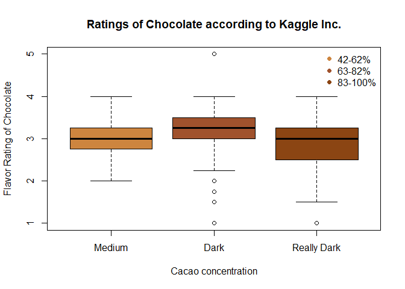

```r
datatable(choc1, options = list(lengthMenu = c(3, 5, 20)))
```

```{=html}
<div class="datatables html-widget html-fill-item-overflow-hidden html-fill-item" id="htmlwidget-381ca31b4e42b45d0181" style="width:100%;height:auto;"></div>
<script type="application/json" data-for="htmlwidget-381ca31b4e42b45d0181">{"x":{"filter":"none","vertical":false,"data":[["1","2","3","4","5","6","7","8","9","10","11","12","13","14","15","16","17","18","19","20","21","22","23","24","25","26","27","28","29","30","31","32","33","34","35","36","37","38","39","40","41","42","43","44","45","46","47","48","49","50","51","52","53","54","55","56","57","58","59","60","61","62","63","64","65","66","67","68","69","70","71","72","73","74","75","76","77","78","79","80","81","82","83","84","85","86","87","88","89","90","91","92","93","94","95","96","97","98","99","100","101","102","103","104","105","106","107","108","109","110","111","112","113","114","115","116","117","118","119","120","121","122","123","124","125","126","127","128","129","130","131","132","133","134","135","136","137","138","139","140","141","142","143","144","145","146","147","148","149","150","151","152","153","154","155","156","157","158","159","160","161","162","163","164","165","166","167","168","169","170","171","172","173","174","175","176","177","178","179","180","181","182","183","184","185","186","187","188","189","190","191","192","193","194","195","196","197","198","199","200","201","202","203","204","205","206","207","208","209","210","211","212","213","214","215","216","217","218","219","220","221","222","223","224","225","226","227","228","229","230","231","232","233","234","235","236","237","238","239","240","241","242","243","244","245","246","247","248","249","250","251","252","253","254","255","256","257","258","259","260","261","262","263","264","265","266","267","268","269","270","271","272","273","274","275","276","277","278","279","280","281","282","283","284","285","286","287","288","289","290","291","292","293","294","295","296","297","298","299","300","301","302","303","304","305","306","307","308","309","310","311","312","313","314","315","316","317","318","319","320","321","322","323","324","325","326","327","328","329","330","331","332","333","334","335","336","337","338","339","340","341","342","343","344","345","346","347","348","349","350","351","352","353","354","355","356","357","358","359","360","361","362","363","364","365","366","367","368","369","370","371","372","373","374","375","376","377","378","379","380","381","382","383","384","385","386","387","388","389","390","391","392","393","394","395","396","397","398","399","400","401","402","403","404","405","406","407","408","409","410","411","412","413","414","415","416","417","418","419","420","421","422","423","424","425","426","427","428","429","430","431","432","433","434","435","436","437","438","439","440","441","442","443","444","445","446","447","448","449","450","451","452","453","454","455","456","457","458","459","460","461","462","463","464","465","466","467","468","469","470","471","472","473","474","475","476","477","478","479","480","481","482","483","484","485","486","487","488","489","490","491","492","493","494","495","496","497","498","499","500","501","502","503","504","505","506","507","508","509","510","511","512","513","514","515","516","517","518","519","520","521","522","523","524","525","526","527","528","529","530","531","532","533","534","535","536","537","538","539","540","541","542","543","544","545","546","547","548","549","550","551","552","553","554","555","556","557","558","559","560","561","562","563","564","565","566","567","568","569","570","571","572","573","574","575","576","577","578","579","580","581","582","583","584","585","586","587","588","589","590","591","592","593","594","595","596","597","598","599","600","601","602","603","604","605","606","607","608","609","610","611","612","613","614","615","616","617","618","619","620","621","622","623","624","625","626","627","628","629","630","631","632","633","634","635","636","637","638","639","640","641","642","643","644","645","646","647","648","649","650","651","652","653","654","655","656","657","658","659","660","661","662","663","664","665","666","667","668","669","670","671","672","673","674","675","676","677","678","679","680","681","682","683","684","685","686","687","688","689","690","691","692","693","694","695","696","697","698","699","700","701","702","703","704","705","706","707","708","709","710","711","712","713","714","715","716","717","718","719","720","721","722","723","724","725","726","727","728","729","730","731","732","733","734","735","736","737","738","739","740","741","742","743","744","745","746","747","748","749","750","751","752","753","754","755","756","757","758","759","760","761","762","763","764","765","766","767","768","769","770","771","772","773","774","775","776","777","778","779","780","781","782","783","784","785","786","787","788","789","790","791","792","793","794","795","796","797","798","799","800","801","802","803","804","805","806","807","808","809","810","811","812","813","814","815","816","817","818","819","820","821","822","823","824","825","826","827","828","829","830","831","832","833","834","835","836","837","838","839","840","841","842","843","844","845","846","847","848","849","850","851","852","853","854","855","856","857","858","859","860","861","862","863","864","865","866","867","868","869","870","871","872","873","874","875","876","877","878","879","880","881","882","883","884","885","886","887","888","889","890","891","892","893","894","895","896","897","898","899","900","901","902","903","904","905","906","907","908","909","910","911","912","913","914","915","916","917","918","919","920","921","922","923","924","925","926","927","928","929","930","931","932","933","934","935","936","937","938","939","940","941","942","943","944","945","946","947","948","949","950","951","952","953","954","955","956","957","958","959","960","961","962","963","964","965","966","967","968","969","970","971","972","973","974","975","976","977","978","979","980","981","982","983","984","985","986","987","988","989","990","991","992","993","994","995","996","997","998","999","1000","1001","1002","1003","1004","1005","1006","1007","1008","1009","1010","1011","1012","1013","1014","1015","1016","1017","1018","1019","1020","1021","1022","1023","1024","1025","1026","1027","1028","1029","1030","1031","1032","1033","1034","1035","1036","1037","1038","1039","1040","1041","1042","1043","1044","1045","1046","1047","1048","1049","1050","1051","1052","1053","1054","1055","1056","1057","1058","1059","1060","1061","1062","1063","1064","1065","1066","1067","1068","1069","1070","1071","1072","1073","1074","1075","1076","1077","1078","1079","1080","1081","1082","1083","1084","1085","1086","1087","1088","1089","1090","1091","1092","1093","1094","1095","1096","1097","1098","1099","1100","1101","1102","1103","1104","1105","1106","1107","1108","1109","1110","1111","1112","1113","1114","1115","1116","1117","1118","1119","1120","1121","1122","1123","1124","1125","1126","1127","1128","1129","1130","1131","1132","1133","1134","1135","1136","1137","1138","1139","1140","1141","1142","1143","1144","1145","1146","1147","1148","1149","1150","1151","1152","1153","1154","1155","1156","1157","1158","1159","1160","1161","1162","1163","1164","1165","1166","1167","1168","1169","1170","1171","1172","1173","1174","1175","1176","1177","1178","1179","1180","1181","1182","1183","1184","1185","1186","1187","1188","1189","1190","1191","1192","1193","1194","1195","1196","1197","1198","1199","1200","1201","1202","1203","1204","1205","1206","1207","1208","1209","1210","1211","1212","1213","1214","1215","1216","1217","1218","1219","1220","1221","1222","1223","1224","1225","1226","1227","1228","1229","1230","1231","1232","1233","1234","1235","1236","1237","1238","1239","1240","1241","1242","1243","1244","1245","1246","1247","1248","1249","1250","1251","1252","1253","1254","1255","1256","1257","1258","1259","1260","1261","1262","1263","1264","1265","1266","1267","1268","1269","1270","1271","1272","1273","1274","1275","1276","1277","1278","1279","1280","1281","1282","1283","1284","1285","1286","1287","1288","1289","1290","1291","1292","1293","1294","1295","1296","1297","1298","1299","1300","1301","1302","1303","1304","1305","1306","1307","1308","1309","1310","1311","1312","1313","1314","1315","1316","1317","1318","1319","1320","1321","1322","1323","1324","1325","1326","1327","1328","1329","1330","1331","1332","1333","1334","1335","1336","1337","1338","1339","1340","1341","1342","1343","1344","1345","1346","1347","1348","1349","1350","1351","1352","1353","1354","1355","1356","1357","1358","1359","1360","1361","1362","1363","1364","1365","1366","1367","1368","1369","1370","1371","1372","1373","1374","1375","1376","1377","1378","1379","1380","1381","1382","1383","1384","1385","1386","1387","1388","1389","1390","1391","1392","1393","1394","1395","1396","1397","1398","1399","1400","1401","1402","1403","1404","1405","1406","1407","1408","1409","1410","1411","1412","1413","1414","1415","1416","1417","1418","1419","1420","1421","1422","1423","1424","1425","1426","1427","1428","1429","1430","1431","1432","1433","1434","1435","1436","1437","1438","1439","1440","1441","1442","1443","1444","1445","1446","1447","1448","1449","1450","1451","1452","1453","1454","1455","1456","1457","1458","1459","1460","1461","1462","1463","1464","1465","1466","1467","1468","1469","1470","1471","1472","1473","1474","1475","1476","1477","1478","1479","1480","1481","1482","1483","1484","1485","1486","1487","1488","1489","1490","1491","1492","1493","1494","1495","1496","1497","1498","1499","1500","1501","1502","1503","1504","1505","1506","1507","1508","1509","1510","1511","1512","1513","1514","1515","1516","1517","1518","1519","1520","1521","1522","1523","1524","1525","1526","1527","1528","1529","1530","1531","1532","1533","1534","1535","1536","1537","1538","1539","1540","1541","1542","1543","1544","1545","1546","1547","1548","1549","1550","1551","1552","1553","1554","1555","1556","1557","1558","1559","1560","1561","1562","1563","1564","1565","1566","1567","1568","1569","1570","1571","1572","1573","1574","1575","1576","1577","1578","1579","1580","1581","1582","1583","1584","1585","1586","1587","1588","1589","1590","1591","1592","1593","1594","1595","1596","1597","1598","1599","1600","1601","1602","1603","1604","1605","1606","1607","1608","1609","1610","1611","1612","1613","1614","1615","1616","1617","1618","1619","1620","1621","1622","1623","1624","1625","1626","1627","1628","1629","1630","1631","1632","1633","1634","1635","1636","1637","1638","1639","1640","1641","1642","1643","1644","1645","1646","1647","1648","1649","1650","1651","1652","1653","1654","1655","1656","1657","1658","1659","1660","1661","1662","1663","1664","1665","1666","1667","1668","1669","1670","1671","1672","1673","1674","1675","1676","1677","1678","1679","1680","1681","1682","1683","1684","1685","1686","1687","1688","1689","1690","1691","1692","1693","1694","1695","1696","1697","1698","1699","1700","1701","1702","1703","1704","1705","1706","1707","1708","1709","1710","1711","1712","1713","1714","1715","1716","1717","1718","1719","1720","1721","1722","1723","1724","1725","1726","1727","1728","1729","1730","1731","1732","1733","1734","1735","1736","1737","1738","1739","1740","1741","1742","1743","1744","1745","1746","1747","1748","1749","1750","1751","1752","1753","1754","1755","1756","1757","1758","1759","1760","1761","1762","1763","1764","1765","1766","1767","1768","1769","1770","1771","1772","1773","1774","1775","1776","1777","1778","1779","1780","1781","1782","1783","1784","1785","1786","1787","1788","1789","1790","1791","1792","1793","1794"],[3.75,2.75,3,3.5,3.5,3.5,4,2.75,3.25,3.75,2.75,3,3.25,3.25,3.5,4,3.5,3.75,3.75,2.5,2.75,3,2.5,2.5,2.75,2.5,3.25,3,3.25,4,3.75,4,3,2.75,3,2.75,2.75,3.25,3.25,3.25,3.25,3.5,3.75,3,3.5,2.5,2.75,3,3.75,3.25,3.25,3.5,3.75,3.5,4,3.75,3.25,3.25,3.5,3.5,2.75,3.25,3.5,3.75,4,2.75,1.75,3.25,3.5,1.75,3.25,3.5,2.5,2.75,3.5,3.5,3.25,3.5,2.75,3.5,3.75,3.25,3,3.25,2.75,2.75,2.75,2.75,2.75,2.75,2.75,3.5,3.25,3.5,2.75,3.5,4,3.5,3.5,2.5,2.5,2.5,3.25,2.75,3,3.5,3.5,3.75,2.75,3,2.75,2.75,3.5,3,3.5,3.5,4,3.25,3.75,3.5,3.25,3.5,3.75,4,3.5,3,4,1.5,3,2.75,3.75,3.75,3.25,3,3.25,3.5,2.75,3.25,3.5,3.5,3.25,2.75,3.5,2.5,2.5,2.5,2.75,2.25,3,2,2,3,2.5,3.25,3.25,3.75,3.75,3.75,3.5,3.5,2.75,3.25,3,3.75,3.25,3.75,4,3.5,3.5,3.25,3.25,1,2.5,3,3.5,3,2.75,3,3.75,3.5,3.25,3.5,3.5,3.25,3,2.5,2.75,2.75,3,2.75,3.25,3.5,3.5,3.25,2.5,3.75,2.5,2.5,2.5,2.75,3,3,3.25,2.75,2.75,3.25,3.25,3.25,3,3,2.75,3.25,3.5,3.25,3.25,3.5,1.5,1,2.75,3.25,2.75,3.5,2.25,2.75,3.75,3.5,2.75,3.75,2.75,3.25,3.5,3.5,3,3.25,3.75,3.25,3.25,3.25,3.75,3.25,3.5,2.75,3.25,3.25,3.25,3,3.25,2.75,2.75,3.5,3.5,3,3,3,3,3,3,3.75,2.5,2.75,3.5,3.75,3.75,3.5,3.25,3.5,2.75,3,3.25,3,3.25,3.75,1.5,3.75,3.5,3,3.75,3.5,3,3.5,3.5,3.75,2.5,3.75,3.25,3.25,4,3.25,3.75,3.25,3.25,3.75,2.75,3.75,2.75,3.25,3,3.25,2,2.75,2.5,2.75,2.5,3.5,3.75,2.75,3,2.5,2,2.25,3,3.25,2.5,2.75,2.75,2.75,3.5,3.5,3.75,3.75,3.5,3.5,3.5,3.5,3.5,3,3.25,3.5,3.5,2,3.5,3.25,3.75,3.75,3.5,3.5,3.5,3.25,3.5,3,3.25,3.5,3.25,3.5,3.75,3.75,3,2.5,3,3.5,2.75,3.25,3.25,2.5,3.5,3,3,3.25,3.75,2.75,2.75,3.5,2.75,3.25,3.25,3,3,3,3,3.5,2.75,2.75,3.25,2.75,3,3,3.25,2,3,3.25,3,3.5,3.5,2.75,3.75,3.5,2.75,3,3.25,3.25,2.75,3.5,3.5,2.5,2.75,3.5,3.75,2.5,2.75,2.75,2.75,2.75,3,3,2.75,3.5,3.75,4,2.5,3.25,2.75,3,3,2.25,3.25,2.75,4,3.5,3,3.25,3.25,2.5,3,3.5,2.75,2.5,2.75,3,2.5,3,2.75,2.75,3.75,2,2.5,2.75,3.25,3.25,3.25,3.75,3,2.5,3.25,4,3.75,3.75,3,3,2.75,3.25,3.25,3.5,3,3.75,2.5,3.25,3,3.25,3,3.25,2.75,2.75,2.5,3.5,3.25,3.25,3.25,3,3.25,3.5,3.75,2.75,3,3,2.5,3.75,3.25,3.75,3,3,3.5,2,2.75,3,3,3.5,1.5,2.25,3.5,2.75,3.5,2.75,2.75,3.25,3.5,2.5,2.75,2.75,2,2,3.5,3,2.5,2.5,2.75,3.75,2.75,3.5,3.75,3.75,3.25,2.75,3,3.25,3.75,3.5,3.5,3.25,3.25,3.5,2.75,3,3.5,3,2.75,3,3.25,3,3,3.25,2.25,2.5,2.75,3,3.25,3,3.25,3.5,2.75,3,3.25,3.75,3,3.25,3.25,3,2.5,2.75,3,3.5,2.75,3,3.25,3.5,3.25,3.5,3,3.75,2,2,4,4,2,3.75,3.75,3.25,3.5,2.5,1.5,3.5,2.75,2.75,3.75,2.5,3,2.75,3.25,2.75,2.75,3.25,3.5,3.25,3.25,3.5,3.5,3.5,3.5,2.75,2.75,2.75,2.5,3,3.75,3,3.5,2.25,2.5,1,2.75,3.5,3,3,3,2.75,3.75,2.75,3.5,2.75,3,3.25,3.5,3,3,2.75,3,2,2.75,2.75,3,3,2.75,3,2.75,3.75,3.25,3,3,3,4,3.25,3.5,3.75,4,2.75,4,3.5,2.75,3.25,3.5,2.75,2.75,3,3.5,3.25,3.5,3,3.5,2.5,2.75,4,3,2.5,2.5,2.75,3.25,3.25,3.5,2.5,3.75,3.75,2.75,3.5,3.25,2,2,3.5,3.5,2.75,2.75,3.25,3.5,2.75,3.25,3,3.25,3,3.5,2.75,2.5,3.25,3.25,3.75,3.5,3.5,3.25,3.25,3.25,3.75,3.75,3.25,3.5,4,3.75,2.75,2.5,2.5,3.5,1.5,3,3.5,3.5,2.75,3.25,4,3.75,3.75,3,3.75,2,2.75,2.75,2,2.5,3.25,3.25,3.5,2.5,3.5,3.5,3.75,3,3,3.25,3.25,3.75,3,3.5,3.75,3.75,3.25,3.75,4,2.75,3.5,3.25,3.5,2.75,3.25,3.25,3,3.25,3.25,3.5,3.75,3.25,4,3.5,3.25,4,4,3.25,3.75,4,3.25,3.5,3.25,3.5,3.5,3.25,3.25,3.5,3,3,3.25,3.75,3.5,2.75,3.5,3.75,3.75,3,2.25,3,3,3.25,3.5,3.5,2.5,2.5,2.75,2.75,3,3.25,3.25,3.25,3.25,3.75,3,2.75,2.75,2.5,3,3,3.25,3.25,2.75,3,3.25,2.75,3,2.5,2.75,2.5,2.75,3,3.5,3.25,2,3.25,2.75,3,3.25,2.75,3,3.25,2.75,3.25,3.5,3.25,3,2.5,3.25,2.75,3,3,3.5,2.75,3.5,3.25,2.5,2.75,3.75,2.75,3,3.25,4,3.5,3.5,4,3.25,3.75,3.75,1.5,3.25,3.25,3.25,3.5,3.75,3.25,3,2.5,2.5,3,3.5,4,2.25,3.5,3.75,3,3.5,3.75,3.25,2.5,3,4,3.5,3,2.75,2.5,3,3.25,3.25,3,3.75,3.25,3.5,3.75,2.75,3.5,3.5,3.75,3.25,3.75,3.5,3.75,3.25,3,3.25,4,3.5,3.5,3.75,3.75,3,4,4,3.5,5,4,2.5,3.75,3.25,3.5,3,3.5,3.75,2.5,3.5,3.5,3.5,3,3.5,2.75,3.75,3.5,3.25,3.5,3.75,4,3.5,3.5,3,3,3,3.5,2,3,3.5,3.25,4,4,3.5,3,2,3,3,3.75,3.5,2.75,3.5,3.75,3,3.75,3,2.75,3.75,3,3.5,3.5,3,3,4,2.75,3,3,4,3.5,2.5,3.75,3.5,4,4,2.5,3,2.5,2.75,2.5,2.75,3.75,2.75,3.25,2.5,3,3.25,3.5,2.5,2.75,3,3,3.75,3,3.25,3,4,3,3.25,2.75,3,3.75,3.5,3.5,3.75,4,3.5,3.75,3.75,3.25,3,2.5,2.5,3,2.75,3.5,3.5,3,3,3,2.75,2.5,3.5,3.5,3.5,3.75,3.25,3.75,4,3.5,4,2.75,3,3,3.5,3.5,3.5,3.5,3.25,3.25,3.75,3.5,2.75,3.25,3.5,2,2.5,3.25,2.5,3,2.25,3,3,3.75,3.75,4,3.5,3,3,3,3,3,4,3,4,2.75,3,3.5,3.75,3.5,3.5,2.75,3.5,3.25,2.5,3.75,3,3.5,2.75,3.5,3,3.75,4,3.5,3.25,2.75,3.75,4,3.5,3.75,3.75,3,3.5,3.5,3.5,3,3,4,3,2.5,2.75,3.25,2.75,3,3,3.5,3.25,3.25,4,3.75,3,4,3.25,4,3,4,2.5,3.5,3.25,3.25,3,4,3.5,3.75,3.5,3.5,4,2.5,3,3.5,3.75,3.5,3.5,3.5,3.75,3.5,2.75,2.75,3.25,3.25,3.25,3.25,3.5,3.5,3,3,3.5,3.5,2.75,4,3.5,3.25,3,2.5,3,2.75,4,4,3,3.25,3.5,3,3.5,3,3.75,3.5,3.5,2.75,3.5,3,3,3.75,3.5,3,3.5,3.5,2.25,3,2.75,2.75,3.5,3.75,3,4,1,3.5,3.75,2.5,3.25,3.5,2.5,3.25,2.5,3,3,3.25,3.5,2.75,4,3,2.75,2.5,3,3.75,3.75,2.5,3.25,3.5,3.5,3.5,3.5,3,3.5,2,2.75,3,3.75,3.75,3,2.75,3,3.25,3,4,3,3.5,3.25,2.75,2.75,3.5,2.75,4,3.5,3.25,2.75,1.5,3.25,3.75,3,3.5,2,2.5,3.75,3.25,3,3.5,2.5,2.75,2.5,2.75,2.5,3.25,3,3.5,3.75,2.75,3,3,2.5,3.25,1.5,3.5,3.5,2.5,1.5,2,2.5,2.75,3,3.25,3.5,2.75,3,2.5,2.5,4,3.5,3.5,2.5,2.5,2.75,3,2,3.5,2.5,3,3.5,3.75,2,2,3,3,3,2,2.5,3,3.25,3.5,3.5,3.25,3.5,3.5,4,3.5,3.75,4,3.5,3.75,3.75,3.75,2.75,3.25,3.25,3.75,3.5,2.75,3.5,3,3.5,3.5,3.5,3,3,3.5,2.5,3,2.75,3.5,3,3.5,2.5,3.75,3.25,3.25,3.75,3,2.75,3,3.5,2.75,3,2,3,4,3,2.75,3.75,3.5,3,3.75,3.25,3,3,2.75,3.75,3.75,4,3.5,3.5,3.5,3.5,3,3,3.5,3,3.75,2.5,3.5,3.25,3.75,2.75,4,2.75,3.25,3.5,3.5,3.75,2.75,2.75,3,2.5,3.5,3,3,3.5,3.5,3,3.25,5,3,3,3.5,3.5,3,3.5,3.5,3.75,3.25,3.75,3.25,2.75,3.25,2.75,3.75,3.75,3.75,3.75,2.5,3,3.75,2.75,3,3.5,3.5,4,4,3.75,3,3.25,3.25,3,3.25,3.5,3,2.75,2.75,3.5,3.75,3.5,3.25,3.75,4,4,2.75,3.75,4,3,3.5,3.25,3,3,2.75,3.25,3.25,3.5,3.25,3.5,3.75,3.5,3.5,3.25,3,3.5,2.75,2.5,3.25,3.5,3,3.25,3.25,3.5,4,3.5,2.75,3,3.5,3.25,3,3.25,2.75,3.5,3.75,3.25,3.75,3.5,2.5,2.5,2.5,2.75,3,2.75,2.75,3.5,3.25,3,3,3.25,3,2.75,3.25,3.25,3.25,3,3,3.5,3.25,3,3.75,3,3,2.5,3.5,3.5,2.75,2.75,3,3.25,3,3,3.25,3.5,3,3.25,3.5,2.75,2.5,2.75,3.5,3.25,3.5,2.75,3,3.25,3,3.25,2.75,2.5,3,2.75,3.5,3.75,3,3.5,4,4,4,3,3.25,3.5,2.75,3,3.25,4,2.75,3,3.25,3.75,3.25,3.25,3.5,3.5,3.5,3,3.25,2.75,2.5,3.25,3,3,3.5,2.75,3,3,2.75,2.75,3.25,3.5,3.5,4,1.75,3,3.5,3,3,3.25,2.75,3.5,3,3.75,3.75,4,3.5,3.25,3.5,2,2.75,3.5,3.5,3.75,3,3,3.25,3.25,3,3.75,3.25,3.5,3.5,2.75,2.75,3.75,3.5,3,3,3.5,3,3.5,3.75,4,3.5,2.75,3.5,3.5,3.25,3.5,2.75,3.25,3.5,3.75,3.5,3.5,3.5,3.5,3.5,3,3.5,2.5,2.75,3,3,2.75,3.5,3.5,4,4,3.75,3.25,3,2.5,2.5,3.5,3.5,3.5,4,3.5,3.5,3.25,3.25,3,2.75,3,2.5,2.75,2.5,3.75,2.75,3,3,2.75,3.5,2.5,2.75,3.75,3.5,2.75,2.75,3,3,3.25,3.75,3.75,3.75,4,3.5,3.5,4,2.25,2.75,3.25,4,2.75,3.25,2.5,3.5,3,3.5,3.5,4,3,3,3.5,3,3.5,2.75,3.25,3,3.25,3.75,4,3.5,3.25,3.25,3.5,3.5,3.75,3.5,2.75,2.75,3,2.25,2.5,3.5,3.5,3.5,3.75,2,3.25,3,3.25,3,3.75,3.75,3,3.25,3.5,3.75,3.75,3,3,3,3.5,3.75,4,3.25,3.75,3.75,4,3.5,3.75,3.5,2.75,3,3.5,2.75,3,2.75,2.75,3.25,3.25,3.25,3.25,3.75,3.25,2.75,3.25,3,3.75,3.75,3.75,3.75,3.5,4,3.5,3,3.25,3.75,3,2.5,3.5,2.75,2.75,2.75,3,3,3.25,3.5,3.5,2.75,2.75,3.5,3,3,3.25,3.5,3.25,3.25,3.5,2.75,3.5,3.5,3.75,4,3,3.5,3.5,3,2.5,3.5,3.25,2.25,2.5,3,3.75,3,3,3.75,3.75],["Dark","Dark","Dark","Dark","Dark","Dark","Dark","Dark","Dark","Dark","Dark","Dark","Dark","Dark","Dark","Dark","Dark","Dark","Dark","Dark","Medium","Medium","Medium","Medium","Medium","Medium","Dark","Medium","Medium","Dark","Dark","Dark","Dark","Dark","Dark","Dark","Really Dark","Dark","Dark","Dark","Dark","Dark","Dark","Dark","Dark","Dark","Dark","Dark","Dark","Dark","Dark","Dark","Dark","Dark","Dark","Dark","Dark","Dark","Dark","Dark","Dark","Dark","Dark","Dark","Dark","Dark","Really Dark","Dark","Dark","Dark","Dark","Dark","Dark","Dark","Dark","Dark","Dark","Dark","Dark","Dark","Dark","Dark","Dark","Dark","Dark","Dark","Dark","Really Dark","Dark","Dark","Dark","Dark","Dark","Dark","Medium","Dark","Dark","Dark","Dark","Dark","Dark","Dark","Dark","Dark","Dark","Dark","Dark","Dark","Dark","Dark","Dark","Dark","Dark","Dark","Dark","Dark","Dark","Dark","Dark","Dark","Dark","Dark","Dark","Dark","Dark","Dark","Dark","Really Dark","Dark","Dark","Dark","Dark","Dark","Medium","Dark","Dark","Dark","Medium","Dark","Dark","Dark","Dark","Dark","Medium","Dark","Dark","Dark","Dark","Dark","Dark","Dark","Dark","Dark","Dark","Dark","Dark","Dark","Dark","Dark","Dark","Dark","Dark","Dark","Dark","Dark","Dark","Dark","Dark","Dark","Dark","Dark","Dark","Dark","Dark","Really Dark","Dark","Dark","Dark","Dark","Dark","Dark","Dark","Dark","Dark","Dark","Dark","Dark","Dark","Dark","Dark","Dark","Dark","Dark","Dark","Dark","Dark","Really Dark","Dark","Dark","Dark","Medium","Dark","Dark","Dark","Dark","Dark","Medium","Dark","Dark","Dark",null,"Dark","Dark","Dark","Dark","Dark","Really Dark","Dark","Dark","Dark","Dark","Dark","Dark","Dark","Dark","Dark","Dark","Dark","Dark","Dark","Dark","Dark","Dark","Dark","Dark","Dark","Dark","Dark","Dark","Dark","Medium","Dark","Dark","Dark","Dark","Dark","Dark","Dark","Dark","Dark","Dark","Dark","Dark","Dark","Dark","Dark","Dark","Dark","Dark","Dark","Dark","Dark","Dark","Dark","Dark","Dark","Dark","Dark","Dark","Really Dark","Dark","Dark","Dark","Dark","Dark","Dark","Dark","Dark","Dark","Dark","Dark","Dark","Dark","Dark","Dark","Dark","Dark","Dark","Dark","Dark","Dark","Dark","Dark","Dark","Medium","Dark","Dark","Dark","Dark","Dark","Medium","Medium","Medium","Dark","Dark","Dark","Dark","Dark","Medium","Dark","Dark","Dark","Really Dark","Dark","Dark","Dark","Dark","Dark","Dark","Dark","Medium","Dark","Dark","Dark","Dark","Dark","Dark","Dark","Medium","Dark","Dark","Dark","Dark","Dark","Dark","Dark","Dark","Dark","Dark","Medium","Really Dark","Dark","Dark","Dark","Dark","Dark","Dark","Dark","Dark","Dark","Dark","Dark","Dark","Dark","Dark","Dark","Dark","Dark","Dark","Dark","Dark","Dark","Dark","Medium","Dark","Medium","Really Dark","Dark","Dark","Dark","Dark","Dark","Dark","Dark","Dark","Dark","Dark","Really Dark","Dark","Really Dark","Dark","Dark","Dark","Dark","Dark","Dark","Dark","Dark","Dark","Dark","Dark","Dark","Dark","Dark","Dark","Dark","Dark","Dark","Dark","Really Dark","Really Dark","Dark","Dark","Dark","Dark","Dark","Dark","Dark","Medium","Dark","Dark","Dark","Dark","Dark","Dark","Dark","Dark","Dark","Dark","Medium","Medium","Dark","Dark","Dark","Dark","Really Dark","Really Dark","Really Dark","Dark","Really Dark","Dark","Dark","Dark","Dark","Dark","Dark","Dark","Dark","Dark","Dark","Dark","Dark","Dark","Dark","Dark","Dark","Dark","Dark","Dark","Medium","Medium","Dark","Medium","Medium","Dark","Medium","Dark","Dark","Dark","Dark","Dark","Dark","Dark","Dark","Dark","Dark","Dark","Dark","Dark","Dark","Dark","Dark","Dark","Really Dark","Dark","Dark","Dark","Dark","Dark","Dark","Dark","Dark","Medium","Medium","Medium","Dark","Dark","Medium","Dark","Dark","Dark","Dark","Dark","Dark","Dark","Dark","Dark","Dark","Dark","Dark","Medium","Dark","Dark","Dark","Dark","Dark","Dark","Dark","Dark","Dark","Dark","Dark","Dark","Dark","Dark","Dark","Really Dark","Dark","Dark","Dark","Dark","Dark","Dark","Dark","Dark","Dark","Dark","Dark","Dark","Dark","Dark","Really Dark","Dark","Dark","Dark","Dark","Dark","Dark","Dark","Dark","Dark","Dark","Dark","Dark","Dark","Dark","Dark","Dark","Dark","Dark","Dark","Dark","Dark","Dark","Dark","Dark","Dark","Dark","Medium","Really Dark","Dark","Dark","Really Dark","Dark","Dark","Dark","Dark","Dark","Dark","Dark","Dark","Dark","Dark","Dark","Dark","Dark","Dark","Dark","Dark","Dark","Dark","Dark","Dark","Dark","Really Dark","Dark","Dark","Dark","Dark","Dark","Medium","Dark","Dark","Dark","Really Dark","Dark","Dark","Dark","Dark","Dark","Dark","Dark","Dark","Dark","Dark","Really Dark","Dark","Dark","Dark","Really Dark","Dark","Dark","Dark","Dark","Dark","Dark","Dark","Really Dark","Really Dark","Dark","Dark","Dark","Dark","Dark","Dark","Medium","Dark","Dark","Dark","Dark","Dark","Dark","Dark","Really Dark","Dark","Dark","Dark","Dark","Dark","Dark","Dark","Dark","Dark","Dark","Dark","Dark","Dark","Medium","Dark","Dark","Dark","Dark","Medium","Dark","Dark","Dark","Dark","Dark","Dark","Dark","Dark","Dark","Dark","Dark","Dark","Dark","Dark","Dark","Dark","Dark","Really Dark","Medium","Dark","Medium","Dark","Dark","Really Dark","Dark","Dark","Dark","Dark","Dark","Really Dark","Dark","Dark","Dark","Dark","Dark","Dark","Dark","Dark","Dark","Dark","Dark","Really Dark","Dark","Dark","Really Dark","Dark","Dark","Dark","Really Dark","Dark","Dark","Dark","Dark","Medium","Dark","Dark","Dark","Dark","Dark","Dark","Dark","Dark","Dark","Dark","Dark","Dark","Dark","Really Dark","Dark","Dark","Dark","Dark","Dark","Dark","Dark","Dark","Dark","Dark","Dark","Dark","Dark","Dark","Dark","Really Dark","Dark","Dark","Dark","Dark","Dark","Medium","Dark","Dark","Dark","Dark","Dark","Really Dark","Dark","Dark","Dark","Dark","Dark","Dark","Dark","Dark","Dark","Dark","Dark","Dark","Dark","Dark","Dark","Dark","Dark","Dark","Dark","Dark","Dark","Dark","Really Dark","Dark","Dark","Dark","Really Dark","Dark","Dark","Dark","Dark","Dark","Medium","Dark","Dark","Dark","Dark","Dark","Dark","Dark","Dark","Dark","Dark","Dark","Medium","Really Dark","Dark","Dark","Really Dark","Medium","Dark","Dark","Dark","Dark","Dark","Dark","Dark","Dark","Dark","Dark","Dark","Dark","Dark","Dark","Dark","Dark","Dark","Dark","Dark","Dark","Dark","Dark","Dark","Dark","Dark","Dark","Dark","Dark","Dark","Dark","Dark","Dark","Dark","Dark","Dark","Dark","Dark","Dark","Dark","Dark","Medium","Dark","Dark","Really Dark","Dark","Dark","Really Dark","Dark","Really Dark","Dark","Dark","Dark","Dark","Dark","Dark","Dark","Really Dark","Dark","Dark","Dark","Dark","Dark","Dark","Dark","Dark","Dark","Dark","Dark","Dark","Dark","Dark","Dark","Dark","Medium","Dark","Dark","Dark","Dark","Dark","Dark","Dark","Medium","Really Dark","Dark","Medium","Dark","Medium","Dark","Dark","Dark","Dark","Dark","Dark","Dark","Dark","Dark","Dark","Dark","Dark","Dark","Dark","Dark","Dark","Dark","Dark","Dark","Dark","Really Dark","Dark","Dark","Medium","Medium","Dark","Medium","Dark","Dark","Dark","Dark","Dark","Dark","Really Dark","Dark","Dark","Dark","Dark","Dark","Dark","Medium","Dark","Dark","Dark","Dark","Dark","Dark","Really Dark","Dark","Dark","Dark","Dark","Dark","Dark","Dark","Dark","Dark","Dark","Dark","Dark","Dark","Dark","Dark","Really Dark","Dark","Dark","Dark","Dark","Dark","Dark","Dark","Dark","Dark","Dark","Dark","Dark","Dark","Dark","Dark","Dark","Dark","Dark","Dark","Dark","Dark","Dark","Dark","Dark","Dark","Dark","Dark","Dark","Medium","Dark","Dark","Medium","Dark","Dark","Dark","Medium","Dark","Really Dark","Dark","Dark","Dark","Dark","Dark","Dark","Dark","Dark","Dark","Dark","Dark","Medium","Medium","Dark","Dark","Dark","Dark","Dark","Dark","Dark","Dark","Dark","Dark","Dark","Dark","Dark","Dark","Dark","Dark","Dark","Dark","Dark","Dark","Dark","Dark","Dark","Dark","Dark","Dark","Dark","Dark","Dark","Dark","Dark","Dark","Dark","Dark","Dark","Dark","Dark","Dark","Dark","Dark","Dark","Dark","Dark","Dark","Medium","Dark","Really Dark","Dark","Dark","Dark","Dark","Dark","Really Dark","Dark","Dark","Dark","Dark","Dark","Dark","Dark","Dark","Dark","Dark","Dark","Dark","Dark","Dark","Dark","Dark","Dark","Dark","Dark","Dark","Dark","Dark","Dark","Dark","Dark","Dark","Dark","Dark","Dark","Medium","Dark","Dark","Dark","Really Dark","Dark","Dark","Dark","Dark","Dark","Dark","Dark","Dark","Dark","Dark","Dark","Dark","Dark","Dark","Dark","Dark","Dark","Dark","Dark","Dark","Dark","Dark","Dark","Dark","Dark","Dark","Dark","Dark","Dark","Dark","Dark","Dark","Dark","Dark","Dark","Dark","Dark","Dark","Dark","Dark","Dark","Dark","Dark","Dark","Dark","Dark","Dark","Dark","Dark","Dark","Dark","Dark","Medium","Dark","Dark","Dark","Dark","Dark","Dark","Dark","Really Dark","Dark","Dark","Dark","Dark","Dark","Dark","Dark","Dark","Really Dark","Dark","Dark","Dark","Dark","Dark","Dark","Dark","Dark","Dark","Dark","Dark","Dark","Dark","Really Dark","Really Dark","Dark","Dark","Dark","Dark","Dark","Medium","Dark","Medium","Really Dark","Dark","Medium","Dark","Dark","Dark","Medium","Dark","Dark","Dark","Dark","Dark","Dark","Dark","Dark","Dark","Dark","Dark","Dark","Dark","Dark","Dark","Dark","Dark","Dark","Dark","Dark","Dark","Dark","Dark","Dark","Dark","Dark","Dark","Dark","Dark","Dark","Dark","Dark","Dark","Dark","Dark","Dark","Dark","Dark","Dark","Medium","Dark","Dark","Dark","Really Dark","Dark","Really Dark","Dark","Dark","Dark","Dark","Dark","Dark","Dark","Dark","Medium","Dark","Dark","Dark","Dark","Really Dark","Dark","Dark","Dark","Really Dark","Dark","Dark","Dark","Medium","Medium","Medium","Medium","Dark","Dark","Dark","Dark","Dark","Dark","Dark","Medium","Dark","Dark","Really Dark","Dark","Dark","Dark","Dark","Dark","Really Dark","Really Dark","Dark","Dark","Dark","Dark","Dark","Dark","Medium","Medium","Dark","Dark","Dark","Dark","Dark","Dark","Dark","Dark","Dark","Dark","Dark","Dark","Really Dark","Dark","Really Dark","Dark","Dark","Dark","Dark","Dark","Dark","Dark","Dark","Dark","Really Dark","Dark","Really Dark","Dark","Dark","Dark","Dark","Medium","Dark","Dark","Dark","Dark","Dark","Dark","Really Dark","Dark","Dark","Dark","Dark","Medium","Dark","Dark","Dark","Dark","Dark","Dark","Dark","Dark","Dark","Dark","Dark","Really Dark","Medium","Dark","Medium","Dark","Dark","Dark","Dark","Dark","Dark","Dark","Dark","Dark","Dark","Dark","Dark","Dark","Dark","Dark","Medium","Dark","Really Dark","Dark","Dark","Dark","Dark","Dark","Dark","Dark","Medium","Dark","Dark","Dark","Dark","Dark","Dark","Dark","Dark","Dark","Dark","Dark","Dark","Dark","Dark","Dark","Dark","Dark","Dark","Dark","Dark","Dark","Dark","Dark","Dark","Dark","Dark","Dark","Really Dark","Dark","Really Dark","Dark","Dark","Dark","Dark","Dark","Dark","Really Dark","Dark","Dark","Dark","Dark","Dark","Dark","Dark","Dark","Dark","Dark","Dark","Dark","Dark","Dark","Dark","Dark","Dark","Really Dark","Dark","Dark","Dark","Dark","Dark","Dark","Dark","Dark","Dark","Dark","Dark","Dark","Dark","Dark","Dark","Medium","Dark","Dark","Dark","Dark","Dark","Dark","Dark","Dark","Dark","Dark","Dark","Dark","Dark","Dark","Dark","Dark","Dark","Dark","Dark","Dark","Dark","Dark","Dark","Dark","Dark","Dark","Dark","Dark","Dark","Dark","Dark","Dark","Dark","Dark","Really Dark","Dark","Dark","Dark","Dark","Dark","Dark","Dark","Dark","Dark","Dark","Dark","Dark","Dark","Dark","Dark","Dark","Dark","Dark","Dark","Dark","Medium","Dark","Dark","Dark","Dark","Dark","Dark","Dark","Dark","Dark","Dark","Medium","Dark","Dark","Dark","Dark","Dark","Medium","Dark","Dark","Medium","Dark","Dark","Dark","Dark","Dark","Dark","Dark","Dark","Dark","Dark","Dark","Dark","Dark","Dark","Dark","Dark","Dark","Dark","Dark","Dark","Dark","Dark","Dark","Dark","Medium","Dark","Dark","Dark","Dark","Dark","Medium","Dark","Dark","Dark","Dark","Dark","Dark","Dark","Dark","Really Dark","Dark","Dark","Dark","Dark","Dark","Dark","Dark","Dark","Dark","Dark","Dark","Dark","Dark","Dark","Dark","Dark","Dark","Dark","Dark","Medium","Dark","Dark","Really Dark","Dark","Dark","Dark","Dark","Dark","Dark","Dark","Dark","Dark","Dark","Dark","Dark","Dark","Dark","Dark","Dark","Dark","Dark","Dark","Dark","Dark","Dark","Dark","Really Dark","Dark","Dark","Dark","Dark","Dark","Dark","Dark","Dark","Dark","Dark","Dark","Dark","Dark","Dark","Dark","Dark","Dark","Dark","Dark","Dark","Dark","Dark","Dark","Dark","Dark","Dark","Dark","Dark","Dark","Dark","Dark","Dark","Dark","Dark","Dark","Dark","Dark","Dark","Dark","Dark","Dark","Dark","Dark","Dark","Dark","Dark","Dark","Dark","Dark","Dark","Dark","Dark","Dark","Dark","Dark","Dark","Dark","Dark","Dark","Dark","Dark","Dark","Dark","Dark","Dark","Dark","Dark","Dark","Dark","Dark","Dark","Dark","Dark","Dark","Dark","Dark","Dark","Dark","Dark","Dark","Dark","Dark","Dark","Dark","Dark","Dark","Dark","Dark","Dark","Dark","Dark","Dark","Dark","Dark","Dark","Dark","Dark","Dark","Dark","Dark","Dark","Medium","Really Dark","Dark","Dark","Dark","Dark","Dark","Dark","Dark","Dark","Dark","Dark","Dark","Dark","Dark","Dark","Dark","Dark","Dark","Dark","Dark","Really Dark","Dark","Dark","Dark","Dark","Dark","Dark","Dark","Dark","Really Dark","Dark","Dark","Dark","Medium","Dark","Dark","Dark","Dark","Dark","Dark","Dark","Dark","Dark","Dark","Dark","Dark","Dark","Dark","Dark","Dark","Dark","Dark","Dark","Dark","Dark","Dark","Dark","Dark","Dark","Dark","Dark","Really Dark","Dark","Dark","Dark","Dark","Dark","Dark","Really Dark","Dark","Dark","Dark","Dark","Dark","Dark","Dark","Dark","Dark","Dark","Dark","Dark","Dark","Dark","Dark","Dark","Dark","Dark","Dark"],["Agua Grande","Kpime","Atsane","Akata","Quilla","Cuba","Pablino","Panama","Brazil","Equateur","Colombie","Birmanie","Papua New Guinea","Piura","Chanchamayo Province","Chanchamayo Province","Bolivia","Peru","Chulucanas, El Platanal","Piura, Perou","Momotombo","Acopagro","CIAAB Coop","Villa Andina","Gruppo Salinas","Sur del Lago","Bolivia","Bolivia","Peru","Morobe","Dos Rios","Guayas","Montanya","Bali, Jembrana","Cuyagua","Ecuador","Ecuador","LamasdelChanka, San Martin, Oro Verde coop","Dominican Republic","Papua New Guinea","Venezuela","Peru","Piura, Blanco de Criollo","Elvesia","Alto Beni","Chiapas","Equateur","Trincheras","Kokoa Kamili","Hacienda Victoria","Costa Esmeraldas","Lachua","Rugoso","La Masica, FHIA","Coto Brus, Terciopelo","Elvesia","Matasawalevu","Lam Dong","Fazenda Camboa","Oko Caribe","Fazenda Camboa","Guatemala","Camino Verde","Colombia, Casa Luker","Haiti","Panama","Venezuela","Costa Rica","Bali","Brazil Rio Doce","Houseblend","Papua New Guinea","Bahia","Bambamarca, 2015","Huallabamba, 2015","Bahia","Duarte Province","Chiapas","single estate","Dominican Republic, Batch 3","Brazil","Ecuador","Asajaya E, NW Borneo, b. #132/4500","Serian E., NW Borneo, b. #134/3800","Brazil, Batch 20316","Dominican Republic, Batch 31616","Ecuador, Batch 31516","Ecuador","Costa Rica","Papua New Guinea","Peru","Ecuador","Alto Beni, Palos Blanco","Oko Caribe, Duarte P.","Nature","Indigena Amazonia, Grand Cru, Quizas","Ecuador","Java, Grand Cru","Ocumare, Premier Cru, Quizas No. 2","Nicaragua, American style","San Andres, American style","San Andres, silk","Bali, Singaraja","Bali, Singaraja","Puerto Plata","Puerto Plata","Bocas del Toro","Puerto Plata","La Red","Matiguas","Organic Dark","Lachua","Kokoa Kamili","Zorzal Reserva","Guatemala","Selva Maya","Kaori","Los Colorados, Santo Domingo, Equateur","Surfin","Maragnam","Gabon","Cusco, Cacao Cusco","Libanio","Haiti","Juliana","Ivory Coast","Ocumare, Puerto Cabello","One Hundred","Ceylan","Conacado","O'payo, Waslala","Conacado","Camino Verde, Guayas","Elvesia P.","Elvesia P.","Alta Verapaz, 2014","Ambolikapiky P.","Ambolikapkly P.","Marabel Farms","Camino Verde, Balao, Guayas","Ecuador","Dominican Republic","Mindo","Ecuador, Bob Bar","Puerto Rico","Dominican Republic, \"Love Bar\"","Dominican Republic w/ nibs","Patanemo","Santo Domingo","Tanzania","Venezuela","Mexico","Agua Fria; Sucre region","Macuare; Miranda; Chloe formula","Hacienda la Trinidad","Macondo","Perla Negra","Arhuacos","Sierra Nevada","Tumaco","Boyaca, Aprocampa Coop, Pauna","Arauca","Dominican Republicm, rustic","Dominican Republic","Dominican Republic, rustic","Ecuador","Papua","Venezuela","Venezuela","Peru","Piura","Baking","Cuba","Dominican Republic","Ecuador","Venezuela","Tanzania","Bolivia","Kulili Estate","Antigua, Special Reserve","Talamanca, Raul-Kekoldo community","Anselmo Paraiso Estate","Piaroa, Amazonas, Batch 350","Guaniamo, Amazonas","Guaniamo","Ecuador","Peru","Venezuela","Bolivia","Equateur","Maya Mtn","la Amistad","Blend No. 1","Ecuador","Dominican Republic","Venezuela","Tumbes, \"Zarumilla\"","Philly Blend, 5 plantations","Wild Bolivian","Uganda","Dominican Republic","Dominican Republic","Ecuador","Nicaragua","Peru","Chiapas, Lacandon Jungle, Oaxacom Mtn","Kendari","Tarakan","Brazilian","Brazilian","Guadeloupe","Chiapas, Lacandon Jungle, Oaxacom Mtn","Camino Verde P., Balao, Guayas, 2014","Sur del Lago","Moxos","Camino Verde","Ecuador Puristique","Sensations Intense","Goodman Estate","Daintree Estates, N. Queensland","Dominican Republic, batch 7","Los Rios","Crayfish Bay aka Non Pariel Estate","O'Payo","Zorzal Reserva, 2015 H., Kerchner","Camino Verde P., Balao, Guayas, 2013","Buto","San Francisco de Macoris, Cibao region","Cumboto, farmer Jose Lugo","Patanemo","Mantuano, 2012","Papua New Guinea","Upala","Colombian","Elvesia, 2011","Dominican Republic","Tanzania","Los Ujuxtes","Los Ujuxtes","Oscuro, Finca Chimelb","Los Ujuxtes","Venezuela, batch 122","DUO, batch 002","Bolivia","Ocumare","Tanzania","Ecuador","Rainforest","Venezuela","Nativo, Varzea","Selvagem, Jari","Sambirano Valley, batch 2477","Costa Rica","Ecuador","Papua New Guinea","Peru","Papua New Guinea","Venezuela","Kilombero, batch 41","Bolivian","Dominican Republic","Lanquin Estate","Alto Beni, Wild Harvest, Limited Ed.","Elvesia","Ecuador, Choc. Garage Exclusive","Camino Verde","Bolivia","La Red","Ecuador","Puerto Cabello","Panama, Raven","O'ahu, N. Shore, Waialua Estate","Noir","Hacienda Victoria","Morogoro","Teyuna","Ocumare","Dominican Republic","Bocas del Toro, Tierra Oscura","Ocumare","Panama","Corazon del Ecuador, Calceta beans","Star of Ecuador","Star of Peru","Dominican Republic","Taino Secret","Corona Arriba","Peru","Dominican Republic","Tumaco","Arauca","Alto Beni, Covendo Region","Alto Beni","San Joaquin","Emerald Estate","Emerald Estate","Patanemo","Wampusirpi, batch 007","Guapiles","Carenero, Guapiles, Ocumare blend","Peru, Madagascar","Red Vanilla","Venezuela, Trinidad","Ecuador","Dominican Republic","Monte Alegre, D. Badaro, Raw, Organic","Blue Mountain","Cuyagua","Supremo- SF","Puerto Rico","Dominican Republic","Dominican Republic","Dominican Republic","Dominican Republic","Puerto Rico","Akesson's E., Sambirano V.","Camino Verde P., Balao, Guayas","Choroni","Ocumare","Canoabo","Sur del Lago","Costa Rica","Peru Brutus","Norandino, batch 161208","Guatemala","San Andres","Matagalpa","Palo Blanco, Chulucanas","Palo Blanco, Chulucanas","Palo Blanco w/ panela, Chulucanas","La Red","Conacado, #223, MR, SC","Conacado, #224, MR, MC","San Martin, Bellavista Coop, #226, DR, MC","Markham Valley, #219, LR, MC","Markham Valley, #221, DR, MC","Conacado, #212, LR, SC","Conacado, #213, DR, -C","Rugoso, Bad Fermentation","La Dalia","La Dalia","La Dalia","Barba, Xoco","Medagla, Xoco","Rugoso, Xoco","La Red","Camino Verde","Peru","Costa Rica","Toledo District, 2015 Harvest","Almendra Blanca, batch 1004","El Carmen, batch 1003","Asochivite, batch 1005","Dark","Madagascar","Trinidad &amp; Tobago","Lacri Blend","Blend","Epique, Blend No. 49","Haiti","Nicaragua","Ecuador","Coucher du Soleil","Lever du Soleil","Onyx","O'ahu, N. Shore, Waialua E., Kakoleka","Nocturne","Machu Pichu","Special Maker Reserve","Ocumare","Papua New Guinea","Campesino w/ nibs","Dominican Republic","Downtown London","Africa meets Latina","Amazonas","Sharkey","one hundred","South America and Africa","Vale do Juliana, w/ nibs","Brazil Blend","Tome Acu E., Amazon Rainforest","Vale do Juliana E., Atlantic Forest","Peru","Maunawili, O'ahu, Agri Research C., 2014","Maunawili, O'ahu, Agri Research C., 2015","Tanzania","Venezuela","Ecuador","Peru","Maranon","Camino Verde P., Balao, Guayas","Mara","Ivory Coast","Hispaniola","San Martin","Hispaniola w/ nibs","Ecuador, w/ nibs","Pepiniere, single Cote","Chanchamayo, Pichanadi, 2012, 60hr c.","Conacado, 2012, 120hr c.","Ecuador","Santo Domingo","St. Lucia","Tanzania","Zorzal Reserva w/ Charles Kerchner","Sur del Lago, Amiari Meridena, Zulia, 48hr c.","Sur del Lago, Amiari Meridena, Zulia, w/ nibs","India (south)","La Red","Conacado, Manifesto","Honduras","black label","Peru","Dominican Republic","Elvesia P., Batch 32","Peru","Rizek Cacao, Cibao Valley, Domin. Rep.","Rizek Cacao, Domin. Rep.","Rizek Cacao, Domin. Rep.","Rizek Cacao, Domin. Rep.","Peru","Sisa 36hr/ W. F. blend prototype","Sisa's Secret/ original micro","Roberto","Diego/ original micro","Diego 48hr/ W.F. blend prototype","Diego 60hr/ W.F. blend prototype","Cacao Nacional W.F.","Cacao Nacional W.F.","Noir","Ecuador","La Red, Project Reserva, Guaconejo","Dark","San Martin","Ocumare","Elvesia","ROIG","Kafupbo, Petit Bourg, De Borgnes","Los Rios, Hacienda Limon, Heirloom","Hispaniola","Ecuador","Peru","Brazil","Quito","Dominican Republic","Venzuela","Bolivian","Cuana, 2013","Tobago","Acarigua, w/ nibs","Loma Sotavento","Kuruba","Orinoco","Peruvian Amazon","Vinces","Cuba, Batch 59/100","Peru, Batch 51/100","Ivory Coast, Batch 56/100","Bahia, Batch 148","Cuba","Trinidad-Tobago","Tanzania","La Masica, Batch 7, FHIA","Maya Mtn, Batch 18, Heirloom","Liberia","Beniamo","San Andres","La Red, Guaconejo","Kokoa Kamili","La Selva","Purple Haze","The Other One, Grand Cru","Excellence (US Version)","Puerto Rico","Haleiwa, O'ahu; Lonohana E., Kanahiku","Haleiwa E, O'ahu, 2014","Haleiwa E, O'ahu, 2014","Opaeula Estate, O'ahu, Nene, CG Exclusive","Opaeula Estate, O'ahu, Ele'ele","Hawaiian Crown, Kona Vanilla","Nicaragua","Selva","Macondo","Misterio","Santander","Peru","Peru","Guadalcanal","Puerto Rico","Brazil","Choobua, Kona","Xocunusco, Chiapas, Pichucalco","Hamakua Coast, Kokoleka","Kaua'i","Dominican","Upala","Chiapas, Triple Cacao","Africa","Ecuador","O'ahu, N. Shore, Waialua Estate w/ nibs","Chuao","Ecuador","Peru","Venezuela","Conacado","Colombia","Markham Valley","Coto Brus","Waiahole, O'ahu","Liberia, #174","Hamakua, Hawaiian Crown, #176","Piura","Oahu, Winward, #151, Maunawili district","Johe","Peru","Kolumbia","Grand Cru Dominican Republic","Grand Cru Ecuador","A case of the Xerces Blues, triple roast","Colombia","Kakoa Kamili, Both Man &amp; Bird &amp; Beast","Le Chocolat Chaud","Piura","Cusco","San Martin","Cacao Nib Crunch","Matina 1-6, prototype","Ivory Coast","Nigeria","Dominican Republic","Dominican Republic","Alto Beni","Pisa","Tumaco","Guatemala","Tanzania","Brooklyn Blend","Papua New Guinea","San Martin","Conacado","La Red de Guanconejo, N. Highlands coop","Ocumare de la Costa","Dominican Republic, Coop","Elvesia","Hispaniola","Bolivia","Venezuela","Nicaragua, w/ inbs","Dominican Republic","El Salvador","El Salvador","Honduras","Honduras","La Tronca, Matagalpa","La Tronca, Matagalpa","Fazenda Sempre Firme P., Bahia","Chiapas, Mokaya P.","Carre Amer","Carre Grand Noir","Los Ancones P.","Maralumi P.","Noir Infini","Oko Caribe","Patanemo, Epoch, Donaldo","Kokoa Kamili","Matagalpa, Cacao Bisiesto","La Red","Houseblend","Ecuador","Ecuador","Ecuador","Fazenda Camboa, Bahia","Tumaco","La Red","Indonesia","Peru","Matagalpa","Mombacho","Oscuro","Oko Caribe","Papaua New Guinea","Manabi","Manabi","Manabi","Nicaragua","Nicaragua","Kokoa Kamili, batch 1 SRB","Oko Caribe, batch 1 SRB","Ambanja, batch 1 SRB","Costa Rica, Oscuro","Costa Rica, Oscuro","Trinidad &amp; Tobago","Barinas","Criollo Blend","Peru","Hispaniola","Dark","Peru","Ecuador","Venezuela","Ecuador","La Patriota, cacao Indio, purple label","La Dalia, Matagalpa,cacao Bisesto,green label","La Red","Sang Yum Coop","Sang Yum Coop","PNG, Devotion","PNG, Revolution","PNG, Voodoo","PNG, Nib Bar","Tanzania","Dominican Republic prototype","Dark 67","Dark 75","Carribean-Raw","Carribean","Carribean","Carribean-Raw","Papua New Guinea","La Red","Caribe","Papua Kerafat","Alto Beni, Wild Harvest, Itenez R. 24hr c.","Alto Beni, Wild Harvest, Itenez R., 60hr c.","Hawai'i, Kona Estate Grown","Peru","Peru","Sierra Nevada, Tutu Iku","Garaua","Cumbia","Montubia","Tangara","Ecuador, raw","Piura","Nube- prototype","Lachua","Silvestre, La Paz, Beni","Kokoa Kamili","Alto Beni, Palos Blancos","Camino Verde P., Balao, Guayas","Matasawalevu","South America","Kilombero Valley","Lachua, Q'egchi families","Alto Beni","Oko Caribe","Peru","Peru","Piura, Choc. Garage Exclusive","Dominican Republic","Wampusirpi Region","Tenor","Johe","Rugoso","Camino Verde P., Balao, Guayas, \"Fruity\"","Camino Verde P., Balao, Guayas, \"Floral\"","La Red, 2011","Oko Caribe, Duarte Province, 2016 H.","Cuyagua, 2013","San Martin, Amazonian Highlands","Bahia","Peru","Cuyagua","Dominican Republic-Organic","Monte Alegre, Diego Badero","Chocoan Rainforest, Teroro Escondido, ESM","Honduras","Venezuela","Brazil","Brazil","Brazil","Brazil","Brazil","Brazil","Amazon Basin Blend","La Red","Suchitepequez E.","San Martin, Batch 2","Chulucanas, Batch 1","Esmeraldas","Camino Verde P., Balao, 2015 harvest, batch8","Camino Verde P., Balao, Guayas, 2014","Costa Rica","La Dorado, light roast","Tapanti, light roast","Maleku","La Masica, Batch 1, FHIA Research Center","Caranero, Choc. Garage Exclusive","Tranquilidad, Batch 1","Hispaniola, 2013","Silvestre, Batch 7, 2013","Piura","Hispaniola, 2008","Sur del Lago","Porcelana","Aragua, Trincheras","100 percent","Samana","Arawak","Latino","Midnight","Twilight","San Juan de Cheni","Markham Valley","Tome Acu","Nibby","Cuyagua","Extra Dark","Dominican Republic","Grenada","Hilo","Hilo, w/ added cocoa butter","Tingo Maria","Oro","Oscuro","Peru","Wild Bolivia","Kokoa Kamili Coop","Esmeraldas, Salazar Farm","Camino Verde P., Balao, Guayas, 2012","Lachua w/ cane sugar","Lachua w/ maple sugar, batch 5","Pisa","Camino Verde P., Balao, Guayas","Nicaragua","Oko Caribe, DOR005","Maya Mtn, Moho R., Toledo D.","Australia","Chimelb, Lanquin, Alta Verapaz, b-GUA001","Kokoa Kamili","Camino Verde","Bolivia","Papua New Guinea, triple roast, batch 1","Ecuador","Ecuador, Batch 1","Castillo, Hispaniola, unroasted","Solomon Island","Solomon Island w/ nibs","Amazonas","Bolivia","San Martin","Oko Caribe, Duarte P., Collab w Chocosol","Abstract S. w/ Jamaica nibs,batch abs60323.0","Camino Verde, Black S., batch cvu6030.0","Porcelana","La Tronca, Matagalpa","Chef's Blend","Crazy 88","Equator","Noula Coop","O'ahu","Peruvian","Nicaragua","Hawaiian, Big Island","Dominican Republic","Madagascar","Venezuela","Ecuador","Papua New Guinea","Tanzania","AgroCriso Plantation","AgroCriso Plantation","AgroCriso Plantation","Dominican Republic","Ecuador","Peru","Dominican Republic, lot D82R","Ecuador, lot E432314L","Madagascar, lot M0403R","Dominican Republic","Dominican Republic","Hispaniola","Cacao Verapaz","India","Ecuador, Midnight Dark","Ecuador, Twilght Dark","Samar, East Visayas region","Samar, East Visayas region","Samar, East Visayas region","Venezuela","Venezuela","Nacional","Cacao Blanco","Santo Domingo","Millot Plantation","Ayacucho, \"El Guinacho\"","Crudo","Costa Rica","Dominican Republic","Chiapas, Lacandon Jungle","Peru","Colombia","Papua","Alto Beni","Chiapan","Dark, Stone Ground","Peru- Ecuador","TCHOPro 60.5","TCHOPro 68","Fruity-beta","Citrus-beta","Nutty-beta","Concepcion","Aranama","Presidio","La Bahia, w/ cane juice","Capistrano","La Bahia, w/ cane sugar","San Jose","Capistrano*","Espada","Espada","Concepcion*","San Jose","Peru","Ecuador","Oko Caribe","Ecuador","Peru","Ivory Coast","Piura Select, Cacao Blanc","Venezuela","Dominican Republic","Conacado","Ambanja, Tsara Valley","Oko Caribe","Cedeno, lot 271","Dominican Republic","Palos Blancos","Dominican Republic","Dominican Republic","Matagalpa","Nourish","Tanzania, Party Bar","Piura, Illanka, Quemazon","Andoa, Grand Cru blend","Loma Sotavento, 2013","Otucan, Grand Cru","Caraque","Tainori","Alpaco","Le Noir Extra Amer","Palos Blancos","Palos Blancos + nibs","Dominican Republic","Mindo","Dark","Classic","San Martin","Peru","Ocumare","Dominican Republic","Piura Blanco, Norandino","Los Llanos","Java, Indonesian Black","Hacienda Las Trincheras","Java","San Martin","Wild Beniano, 2016, batch 128, Heirloom","Ghana, 2013, batch 129","Camino Verde P., Balao, Guayas","Ecuador","Costa Rica","Ocumare","La Red","Hispaniola","Sambirano, batch 170102","Hispaniola, batch 170104","Papua New Guinea, Batch 2","Dominican Republic, Batch D2","Peru, Batch 1","House Blend, Batch 2","Guadalcanal","Goddess Blend","Alto Beni","Tranquilidad, Baures","Raw","Bocas del Toro, Cocabo Co-op","Amazonas Frucht","Loma Los Pinos, Yacao region, D.R.","El Ceibo Coop","Santo Domingo","Indianer, Raw","Peru","Kerala State","Brazil, Mitzi Blue","Maya Mtn, Moho R., Toledo D., 2015","Coto Brus, Heirloom, Batch 1","Cota Brus, Terciopelo, 2015","Alto Beni, Upper Rio Beni, 2014","Alto Beni, Upper Rio Beni, 2015","Wild Bolivian, Batch 2","Wild Beni, Lower Rio Beni, Tranquilidad, 2014","Wild Beni, Lower Rio Beni, Tranquilidad, 2015","Nine","Toscano Black","Toscano Black","Toscano Black","Houseblend","2009 Hapa Nibby","Blend","Lago di Como, Blu","Maragda","Blend No. 1","Ilblend","Kaua'I, Alea Estate +world","Complexite","Quetzalcoatl","Tsaranta","Semisweet","Cuana, 2008","O'ahu, N. Shore, Waialua Estate","French Laundry 20th Anniversary","Shake Shack","Grand Cru Blend No.1, 5 yr. Anniversary Ed","Duo- Gran Couva &amp; Camino Verde","Signature Blend","Cabosse","Fleur de Cacao","Mid Mountain, 2014","Finisterra","Las Islas","Antilles (Trin/Gren/DR/Ven)","Bittersweet","Kumasi Sambirano","Semisweet","Wasatch","Little Big Man","Dual Origins, Sambirano, Elvesia","Dancing in Your Head, 5 bean blend","Eastern Promises","Bayou Blend","Venezuela; Barinos, Merida, Tachron","Ghana, Panama, Ecuador","Araguani","Santo Domingo","Cesar","Carenero","Sur del Lago","Puerto Cabello","Madagascar","Tumbes, Norandino","Tabasco","Madagascar, Ambolikapiky P.","Ocumare","Peru","Chuao","Cuyagua Village","Maracaibo","Ocumare, prototype","Madagascar, 100% criollo","Porcelana, Apotequil","Porcelana, Tabasco, Marfil de Blanco","Xoconusco, cacao Real","Maracaibo, El Rosario","Guasare, Zulia Prov.","Tumbes","Criollo, Dominican Republic","Mahali, Kasai","Porcelana, Tabasco, La Joya","Xoconusco, Chiapas","Porcelana","Porcelana, Batch 5163","San Martin","Tumbes","Peru","Peru + nibs","Peru, Awagum bar","Peru","Madagascar","Xoconusco","Patanemo","Xoconusco","Ocumare","Ocumare","Porcelana, Tabasco","Ocumare","Choroni","Ocumare","Porcelana, Apotequil","Porcelana, Apotequil","Porcelana, Tabasco, Mexico","Las Acacias E.","Las Acacias E.","Las Acacias E.","Mantuano","IL100, H. San Jose","Guasare","Canoabo, Hacienda San Jose","Madagared","Java, Javablond","Rio Dulce, Xoco","Chuno, Xoco","Rico Rugoso, Xoco","Indio Rojo, Xoco","Nicaliso, Xoco","Porcelana","Carenero Superior, Apamate","Carenero Superior, Bucare","Carenero Superior, Mijao","Carenero Superior, Gran Saman","Peru","Carenero Superior","Ocumare","Madagascar, Grand Cru","Maracaibo Clasificado","Rio Eni","Tumbes Coop","Carenero Superior, #203, MR, SC","Venezuela","Gran Blanco","Coopertiva Amazona","Choroni, Finca Torres, 48hr c.","Ocumare, H. Cata, 48hr c.","Porcelana, Zulia","Ocumare, H. Cata, w/ nibs","Coopertiva Amazona w/ nibs","Satipo region, white label","Tumbes, 2013 Harvest, Batch 8","Blend","Sambirano","Perfect Illusion","Bolivia, Wild Thing","Wild Thing","Criollo, Hawaii","Cuba","Porcelana","Tumbes, Dear Mr. Finley, 2014","Patanemo","Tumbes","Morropon, Norandiono Coop, Piura","Alto Beni","Balinese, Java","Nicaragua","Papua New Guinea","Ocumare","Patanemo","Tumbes","Canoabo, 2013","Pangoa","Pangoa, w/ nibs","Piura","Sylvestre, Oialla","Piura, Apotequil, \"Porcelana\" 72hr c.","Hawai'i, Kona Grand Cru E.","Chuao","Peru, Las Pampas P.","Porcelana, Tabasco, Finca La Joya","Porcelana, Tabasco, Limited Ed.","Kendem Lembu, Java","Ocumare, Puerto Cabello, Venezuela","Peru","Sambirano Valley, Le 100%","Tanzania","Madagascar, Nosy Be Isle.","Java, Indonesie","Akesson's, batch 4411","Mexico, Lot 28022016","Tumbes, Batch 2","Piura","Raw","Porcelana","Silvestre, Batch 1, 2011","Carenero Superior","Cuyagua","Porcelana","Maya Belize","Guasare, La Sierra de Perija, batch gua001","Porcelana, Sorotaima,Machiques,batch pcl001","CSB Chama","Java","Apurimac, El Quinacho Co-op","Patanemo","Maracaibo, El Vigia","Chuao","Madagascar","Ocumare","Alto Beni","Porcelana","Autumn, Primary Harvest, 2012","Spring, Secondary Harvest, 2012","Wild Bolivian, Jungle Love","Peru","Porcelana, Pedegral","Cuyagua","Amazonas","Amazonas","Tumbes","Amazonas w/ nibs","Guasare, Zulia Prov., 2015, batch 124","Satipo Pangoa region, 16hr conche","Satipo Pangoa region, 20hr conche","Ocumare 61","Ocumare 61, Puertomar","Ocumare 67, Puertofino","Ocumare 77","Ocumare","Porcelana","Porcelana, Premier Cru, Quizas No. 1","Porcelana, Venezuela","Porcelana, Venezuela","Porcelana","Porcelana","Porcelana, Pariguan","Porcelana, S. of Lake Maracaibo","Porcelana, Maracaibo, Palmira P. 2006","Porcelana, Maracaibo, Palmira P. 2005","Alto Beni, Cru Savage","Sambirano, Ambanja","Baracoa, Cuba","Djakarta, Java and Ghana","La Dalia, Matagalpa","Chuno","Ocumare, Venezuela","Madagascar","Kakao Kamili, Kilombero Valley","Duarte, Batch 360","Sierra Nevada","Arauca","Chuao 100hr","Chuao 70hr","Johe","Colombia, Batch 9","Madagascar, Batch 8","Chuno, triple turned, Xoco","Red Mayan, Xoco","Chuno, double turned, Xoco","Johe, Xoco","Chuno, Xoco","Nicaliso, Xoco","Bolivia","Bolivia, Bo-nib-ia, w/ nibs","ROIG, 2014","Acul-du-Nord, 2015","Chuno","Fortissima","ROIG","Belize, 2013","Porcelana, Colombia, Amazonas","Peru","Peru","Sri Lanka","Manjari","Guanaja","Moho River Valley","Peru","Millot P., Ambanja","Kakao Kamili, Kilombero Valley","Kakao Kamili, Kilombero Valley","Huiwani Coop","Los Rios, Hacienda Limon, Orecao, 2014","Los Rios, Hacienda Limon, Orecao, 2015","Pinchincha, Mindo, Coop Nueva Esper., 2015","Monte Alegre, D. Badero","Makwale Village, Kyela","Ghana","Ghana","Congo","Ghana","Ankasa","Congo, Grand Cru","Ghana","Sao Tome","Costa Rica","Costa Rica","Uganda","Congo, Gorilla bar","Terreiro Velho P.","Terreiro Velho P. w/ sugar crystals","Terreiro Velho P.","Principe","Ghana Puristique","Uba Budo","New Ireland","Tanzania, batch a1","Djual Island","Ghana","West Africa","Bundibugyo District","Ghana","Africa","Terreiro Velho P.","Ghana","Ghana, #211, MR, MC","ABOCFA Coop","Ghana","Uganda","Uganda","Uba Budo","Amazonas","Bahia, Fazenda Camboa","Uganda","Akosombo","Sao Tome, Batch 151","Grand Cru Ghana","Ghana, prototype","Vila Gracinda","Tamarina","Ghana","West Africa","Sao Tome","Ghana","Ghana, 2013","Virunga","Ghana prototype","Ghana","D.R. Congo, Cru Virunga","Haut Penja, w/ nibs","Bahia Brazil, Fazenda Sao Pedro","Claudio Corallo w/ nibs","Monte Alegre (Itacare), Brazil","Sao Tome &amp; Principe","Ghana","Virunga","Principe","Bahia Superior","Sao Tome","Asante","Papua New Guinea","Trintade, Sao Tome","Ghana","Ghana","Orinoco","Elvesia P., Black Science","Hispaniola","Africa","West Africa","Chocolatey-beta","Uganda","Congo w/ nibs","Ghana, Kumasi","Nyangbo","Abinao","Le Noir Amer","Manhattan","Napa","Ghana","Kongo, Highlands","Congo","Kerala State","Espiritu Santo, 'Smoke Monster'","Los Rios, Quevedo, Arriba","Los Rios, Quevedo, Arriba","San Jose del Tambo","Equateur","El Oro, Hacienda de Oro","El Oro, Hacienda de Oro","Amazonia","Esmeraldas","Bolivar","Pichincha","Esmeraldas","Manabi","Los Rios","Manabi","Los Rios","Esmeraldas","Arriba","Los Rios","Ecuador","Bolivar, Guaranda","Ecuador","Arriba","Los Rios, Quevedo","Arriba","Esmeraldas","Manabi","Los Rios","Raw","Raw","Los Rios, Vinces","Manabi","El Oro","Los Rios","Los Rios, Rancho Grande 2004/2007","Los Rios, Rancho Grande 2004/2007","Los Rios, Rancho Grande 2004/2007","Los Rios, Rancho Grande 2007","Arriba","Arriba","Manabi","Arriba","Arriba","Manabi","Rio Arriba","Catongo","Catongo","Winak Coop, Napo","Phantom","Nacional","Puerto Quito, heirloom","Maranon Canyon","Piura Blanco","Maranon","Peru","Maranon Canyon, Fortunato No. 4","Esmeraldas","Ecuador, Puristique","\"heirloom\", Arriba Nacional","\"heirloom\", Arriba Nacional","Maranon, Joya Rara","Maranon, Good &amp; Evil, w/ nibs","Maranon Canyon, Fortunato No. 4","Maranon, #228, MR, SC","Maranon, #227, LR, MC","Maranon, #229, MR, LC","Maranon, #230, DR, LC","Maranon","Los Rios, H. Iara","Los Rios, H. Iara, 2012","Los Rios, H. Iara, 2012, 120hr c.","Los Rios, H. Iara, 96hr c.","Maranon, Fortunato No. 4","Maranura","Ecuador","Maranon, 2014","Ecuador","Maranon Canyon, Fortunato No. 4","Maranon Canyon","Punta Galera, cacao Nacional, gold label","Los Rios, Puerto Romero, Equateur","Guantupi River","Guantupi River","Maranon, Cajamarca","Esmeraldas","Colombian 2008","Colombian w/ nibs","Colombian Semi Dark","Colombian","Colombian Dark","Maranon, batch 2","Maranon, Fortunato No. 4","Maranon Canyon","Camino Verde P., Balao, Guayas","Bolivar, Arriba","Winak, Sumaco","Manabi","Maranon, Cajamarca","El Oro","Monte Alegre, 3 diff. plantations","Monte Alegre, 3 diff. plantations","Monte Alegre, 3 diff. plantations","Monte Alegre, 3 diff. plantations","Bahia, Fazenda Venturosa","Bahia Black, batch bra50722.1","Fazenda Sempre Firme, Bahia","Bahia, Floresta Azul,Good Friends Reserve#3","Bundibugyo","Ecuador","Upala w/ nibs","Upala, Batch 18","Upala, Batch 12","Los Rios, H. Iara","Alto Beni, Wild Bolivian","Camino Verde P., 2012, Balao, Guayas","Camino Verde P., Balao, Guayas","UNOCACE","Chuao","Vanua Levu","Vanua Levu, Toto-A","Vanua Levu","Vanua Levu, Ami-Ami-CA","Bali (west), Sukrama Family, Melaya area","Trinite","Vietnam","Madagascar","Chuao","Tien Giang","Conacado","Chuao","Madagascar","Bellavista Gran Pajeten, San Martin","Belize","Madagascar","Chuao","Ecuador","Jamaica","Grenada","Trinidad","Madagascar","San Juan","Tien Giang","Maya Mountain","Trinidad, Heritage, Limited ed.","Jamaica","Ba Ria Vung Tau Province","Java","Dominican Republic","Orinoqua Region, Arauca","Mababa","Tenende, Uwate","Cortes","Davao","Xoconusco","Sambirano","Sambirano","Belize south, low fermentation","Belize south","Belize south","Baracoa","Rio Peripa H.","Bali, Sukrama Bros. Farm, Melaya, 62hr C","Somia Plantation, Sambirano, 70hr C","Madagascar","Carenero S., Barlovento, Grand Cru","Belize","Sambirano, 2009","Sambirano","Sambirano","Sambirano","Carenero Superior","Blue Mountain Region","Akesson's E., Sambirano V.","Madagascar","Cuba","Jamaique","Trinite","Madagascar","Chuao","Maya Mountain","Maya Mountain","Chuao","Cooproagro","Chuao, Mantuano blend","Maya Mountain","Jamaica","Somia Plantation","Gran Couva","Trinidad","Belize","Chuao","Rio Caribe","Chuao, Aragua region","Chuao, Aragua region","Jutiapa, lot 050916D","Madagascar","Grenada","Madagascar","Vietnam","Grenade","Trinidad","Brazil","Saidor Estate, Madang P.","Arauca","Tumaco","Cordoba","Huila","Maya Mtn, Batch 454, Heirloom","the lost city, gracias a dias, batch 362","Elvesia P.","Bolivia","Conacado","Nicaragua","Maya Mountain w/ nibs","Maya Mountain","Mekong Delta, early 2014 Harvest","Tawau, Oct. 2015 Harvest","Madagascar","Tres Hombres","Carenero Superior","Sambirano","Guyave","Tabasco","Tabasco","Chuao","Sambirano","Carenero Superior","Tien Giang, 2015, batch 10-2-16","Madagascar","Grenada","Chuao","Trinidad","Jamaica","Sambirano, Menava P.","Vanuatu, batch 2410","Bahia, batch a1213","Namau Village, N. Taileva P., batch a2812","Vanuatu","Robson Estate","Maya Mtn., Break Bar- Snark","Maya Mountain","Madagascar","Chuao","Sambirano","Vietnam","Madagascar","Madagascar","Costa Rica","Tien Giang","Belize","Sambirano","Sambirano","Puerto Cabello, Mantuano","Chuao, Hacienda San Jose","Carupano, H. San Jose","Granella","Madagascar","Sur del Lago Classificado","Apurimac","Carenero Superior","Non Pariel Estate","Rio Caribe, Batch 7","Madagascar","Rio Caribe, Tepui Treasure","Carenero, Empyrean Sabor","Madagascar","Rio Caribe, Cariaco","Rio Caribe, Macuro","Ben Tre","Ham Luong","Ba Lai","Rio Caribe","Trinidad","Belize","Maya Mountain","Grenada","Kokoa Kamili Coop, Kilombero","Vietnam","Madagascar","Bellavista Coop, #225, LR, MC, CG Exclusive","Sambirano Valley, #216, MR, LC","Markham Valley, #220, MR, MC","Markham Valley, #222, LR, 0C","Jamaica, #209, DR, SC","Jamaica, #210, DR, MC","Sambirano Valley, #214, LR, MC","Sambirano Valley, #215, MR, MC","Chuao, #218, MR, MC","Chuao, #217, DR, MC","Jamaica, #204, DR, SC","Jamaica, #206, DR, LC","Jamaica, #205, DR, MC","Gran Couva","Signature Blend","Akesson P.","Conacado Coop","Conacado Coop","Akesson P.","Ben Tre, Dong Nai","Grenada","Grenada","Grenada","Jamaica","Trinidad","Chucuri","Trinitario","Don Homero- Cerecita Valley","Don Homero- Cerecita Valley","Madagascar","Akesson's Estate","Carenero Superior","Conacado","Sambirano","Gran Couva","Marcial, single Cote, 2012","Island Growers, 2012, 120hr c.","Trinidad","Mekong Delta &amp; Dong Nai","Somia Plantation, Akesson, 2012","Island Growers, 120hr c.","Island Growers, 96hr c.","Chuao","Lam Dong","Momotombo","Hispaniola","Chuao, Venezuela","Carenero Superior, Urrutia, Barlovento","Madagascar","Belize","Maya Mountain, Toledo, Batch 29","Trinatario Treasure","Madagascar","Belize","Madagascar","Vanuatu","La Red, Guanconjeco","Belize","Sambirano Valley","Belize","Madagascar","Chuao","Grenada","Madagascar","Grenada","Madagascar, Batch 59/100","Vietnam, Batch 50/100","Lam Dong, Batch 153","Rugoso","Carenero Superior","Rio Caribe","San Juan Estate, Gran Couva","Madagascar","Madagascar","Madagascar","Madagascar","Madagascar","Sambirano 2006","Mora Mora 2006","Davao, Mt. Talamo foothills","Ben Tre, Surprise Valley","Ecuador","San Juan Estate, Cherry Blossoms at Night","Tan Phu Dong Island, Heart of Darkness","Ben Tre","Dak Lak, Batch 2451","Tan Phu Dong, Treasure Island","Ba Ria","Dong Nai","Tien Giang, Gao Co-op","Ben Tre","Tien Giang","Lam Dong","Madagascar","Chuao","Chuao, Med. Roast","Chuao, Dark Roast","Chuao, Light Roast","Moho River","Malekula P., 2013","Somia, 2013","Kulili P., 2013","Blend","Maya Mountain","Belize","Madagascar","Madagascar","Akesson Estate","South America","Carenero Superior, Concepcion","Mangaro P.","Maya Mountain","San Juan Estate","Belize","Toledo District, w/ nibs","Toledo District","Umoho R., Toledo District, San Felipe","Tien Giang, batch 1 SRB","Grenada","Chuao","Madagascar","Manickchand Estate","Elvesia P.","Ambanja, Sambirano Valley","Moho Valley","Ecuador, 2013","Sambirano Valley, 2012","Jamaica","San Juan Estate, Gran Couva","Kakao Kamili, Kilombero Valley","Madagascar","Maya Mountain","Nicaraqua","Mindo","Maya Mtn","San Juan Estate, Gran Couva","Lam Dong","Sambirano","Gran Couva","Madagascar","Madagascar","Rio Caribe, Paria Penninsula","Madagascar","Madagascar, w/ shell","Madagascar, w/ shell","Trinite","Sambirano, Ambanja, Madagascar","Nicalizo","Akesson Estate","Namau Village","Chuao","Papouasie","Trinidad","Barlovento, Venezuela","Jamaique","Equateur","Vanuatu","Colombie","Cuba","Crayfish Bay Estate, 2014","Patanemo Vil., Carabobo State, Tisano family","Akessons Estate, Sambirano, Ambanja","Uranga, Lot 22032016","Madagascar","Toledo District, Maya","Sambirano","Gran Couva","Madagascar","Madagascar w/ nibs","Gru Grococo, St. Andrews","Akessons Estate, Sambirano, 2013","Bachelor's Hall E., St. Thomas Parish","Rio Caribe","Jamaica","Sambirano, 2008","Trinidad","Rio Caribe Superior, Paria Penninsula","Sambirano, Akesson Estate","Malgascio","Carenero Superior","Camahogne","Ben Tre","Jamaica a l'ancienne","Jamaica","Ecuador","Bahia, Scavina","Somia Plantation, 2012","Somia Plantation, 2012","Somia Plantation, 2012","Tien Giang","Akesson's Estate","Akesson's Estate","San Juan Estate","Chuao, batch 3","Madagascar","Madagascar","Sambirano","Sambirano Valley, Black Science, B-60307.0","Chuno, San Jose de Bocay, Pantasma R.,B.S.","Tien Giang, Black S., batch VIT60420.0","La Dalia","Rizek Cacao, Domin. Rep.","Sangre Grande P., Trinidad","Bachelor's Hall E., St. Thomas Parish","Cahabon Region","Carenero Superior","Papua New Guinea","Grenada, Black Science","Conacado","Papua New Guinea","Malekula Island","Sambirano Valley","Bahia, Agri-Forestal Plantation, 2010","Sambirano","Moho Valley","Baracoa","Ambolikapiky","Ben Tre, Mekong Delta","Baracoa","Vietnam","Trinidad","Paramaribo, batch 20160043-01","Belize","Belize","Madagascar","Guatemala","Madagascar","Madagascar","Roxborough, Tobago","Madagascar","Madagascar, Sassy Bar","Sur del Lago, Merida","Chuao 2002 P.","Caraibe","Gran Couva 2005 P.","Sambirano, Ampamakia 2005, Millot P.","Madagascar","Madagascar","Madagascar","Madagascar","Madagascar w/ nibs","Madagascar","Trinidad","Ben Tre, Mekong Delta, MoCay","Sambirano Valley","Cahabon","Conacado","Los Llanos","Sambirano","Rio Caribe","Gran Couva","Sambirano","Madagascar, Batch 2","Belize, Batch 2","San Juan Estate","San Juan Estate, Gran Couva","Tokiala","Venezuela","Madagascar","Rio Tuma","Fazenda Leolinda","Grand 'Anse","Elvesia P.","Sur del Lago","Sambirano","Ocumare, Cumboto","Lumas, 2015 Harvest, Batch 6, brown sugar","Lumas, 2015 Harvest, Batch 7","Belize, 2014 Harvest, Batch 9","Amina","Bahia","Caracas, Venezuela and Ghana","Black Science Blend 1","Belize, med roast"],[2016,2015,2015,2015,2015,2014,2014,2013,2013,2013,2013,2013,2013,2013,2013,2013,2012,2012,2015,2013,2016,2016,2016,2016,2016,2013,2013,2013,2013,2011,2010,2010,2009,2008,2007,2009,2009,2013,2015,2015,2015,2015,2012,2014,2016,2014,2014,2014,2016,2016,2016,2016,2016,2016,2016,2016,2016,2016,2015,2015,2015,2015,2015,2012,2011,2011,2010,2010,2010,2009,2015,2015,2012,2015,2015,2015,2012,2012,2012,2016,2016,2016,2017,2017,2016,2016,2016,2016,2010,2010,2010,2010,2016,2016,2012,2011,2011,2010,2010,2015,2015,2015,2010,2010,2009,2009,2008,2008,2008,2008,2009,2016,2016,2016,2012,2016,2014,2014,2014,2013,2013,2011,2011,2011,2011,2009,2006,2006,2006,2014,2016,2015,2013,2015,2015,2015,2015,2015,2014,2014,2015,2013,2014,2014,2015,2010,2010,2010,2010,2008,2007,2007,2014,2014,2015,2016,2016,2015,2014,2014,2014,2014,2011,2011,2011,2010,2010,2010,2010,2015,2013,2007,2014,2014,2013,2012,2016,2016,2014,2015,2015,2015,2015,2013,2013,2014,2014,2014,2014,2009,2016,2014,2011,2015,2015,2011,2016,2016,2016,2016,2016,2016,2016,2016,2014,2011,2009,2009,2009,2009,2013,2016,2015,2010,2008,2015,2012,2006,2015,2011,2017,2015,2015,2015,2016,2014,2014,2014,2013,2013,2013,2013,2012,2012,2012,2011,2011,2014,2012,2012,2011,2016,2016,2016,2015,2015,2015,2013,2013,2015,2015,2016,2007,2007,2007,2007,2009,2008,2016,2008,2007,2017,2015,2014,2013,2013,2012,2011,2011,2015,2014,2009,2006,2015,2012,2008,2012,2011,2011,2011,2010,2010,2010,2010,2015,2015,2015,2014,2014,2016,2016,2011,2008,2015,2013,2013,2015,2016,2009,2009,2011,2011,2011,2014,2014,2010,2016,2016,2006,2014,2014,2014,2014,2016,2016,2016,2016,2014,2014,2012,2012,2015,2015,2017,2015,2014,2014,2013,2012,2012,2011,2013,2013,2013,2012,2012,2011,2011,2016,2015,2015,2014,2013,2013,2012,2013,2013,2012,2011,2016,2016,2016,2016,2006,2016,2009,2009,2009,2015,2013,2013,2013,2011,2011,2011,2009,2009,2008,2008,2008,2014,2014,2014,2014,2014,2014,2014,2014,2011,2016,2015,2015,2015,2016,2014,2016,2015,2015,2015,2015,2016,2015,2015,2009,2009,2009,2009,2014,2015,2013,2013,2010,2010,2008,2008,2014,2011,2011,2016,2012,2012,2014,2012,2014,2014,2015,2014,2013,2013,2013,2013,2012,2008,2008,2008,2008,2008,2008,2008,2008,2009,2009,2013,2009,2014,2014,2014,2014,2016,2016,2014,2014,2012,2012,2011,2010,2010,2009,2013,2013,2013,2012,2009,2009,2011,2011,2015,2015,2015,2015,2014,2014,2009,2017,2017,2016,2015,2015,2015,2015,2012,2012,2012,2007,2013,2014,2014,2014,2013,2013,2013,2015,2010,2010,2010,2010,2011,2010,2017,2013,2013,2013,2013,2012,2012,2011,2011,2010,2008,2010,2010,2016,2015,2014,2014,2012,2014,2015,2015,2013,2012,2012,2012,2012,2016,2016,2014,2012,2012,2015,2015,2015,2015,2016,2016,2016,2016,2010,2010,2010,2013,2013,2016,2016,2016,2015,2015,2011,2011,2011,2011,2011,2010,2010,2014,2016,2014,2014,2014,2014,2015,2015,2014,2014,2014,2014,2014,2012,2006,2006,2006,2006,2006,2015,2015,2015,2015,2013,2012,2012,2010,2010,2016,2012,2015,2015,2015,2011,2011,2011,2016,2014,2015,2015,2015,2015,2015,2016,2016,2016,2013,2013,2013,2014,2013,2014,2014,2007,2013,2013,2012,2012,2012,2012,2015,2016,2016,2014,2014,2014,2014,2015,2010,2009,2009,2011,2011,2011,2011,2014,2013,2013,2014,2011,2009,2006,2012,2012,2016,2014,2014,2014,2014,2012,2012,2011,2016,2015,2015,2014,2014,2016,2014,2016,2015,2014,2014,2013,2013,2013,2015,2016,2015,2015,2015,2014,2014,2012,2016,2014,2011,2011,2015,2009,2008,2008,2016,2015,2012,2013,2013,2013,2013,2012,2012,2016,2011,2010,2015,2015,2010,2016,2015,2011,2016,2016,2016,2016,2015,2015,2013,2013,2010,2008,2012,2011,2011,2010,2010,2010,2010,2012,2012,2012,2011,2009,2007,2007,2006,2015,2015,2011,2011,2016,2015,2015,2012,2016,2016,2016,2015,2015,2015,2015,2014,2015,2017,2016,2016,2016,2015,2015,2015,2015,2010,2016,2016,2016,2016,2013,2013,2013,2016,2016,2016,2015,2014,2013,2013,2013,2012,2012,2011,2014,2014,2017,2017,2017,2017,2017,2017,2012,2012,2012,2017,2017,2017,2016,2016,2016,2013,2013,2015,2015,2011,2014,2014,2012,2012,2012,2016,2016,2015,2013,2012,2012,2012,2011,2013,2013,2013,2013,2015,2015,2011,2009,2007,2012,2009,2009,2008,2008,2008,2012,2012,2012,2012,2012,2012,2012,2012,2012,2012,2012,2012,2015,2015,2015,2014,2015,2007,2015,2011,2011,2014,2011,2015,2015,2013,2013,2011,2011,2014,2014,2016,2015,2013,2013,2012,2011,2009,2009,2007,2015,2015,2014,2014,2013,2012,2014,2016,2016,2016,2016,2016,2013,2010,2010,2009,2016,2016,2013,2012,2012,2011,2011,2013,2017,2017,2015,2015,2015,2015,2016,2016,2011,2011,2014,2012,2012,2012,2012,2012,2012,2011,2011,2010,2016,2016,2016,2014,2016,2016,2014,2016,2007,2007,2006,2006,2012,2010,2014,2014,2007,2008,2008,2014,2009,2007,2006,2006,2008,2009,2014,2012,2014,2014,2011,2007,2007,2015,2008,2007,2007,2006,2006,2006,2013,2014,2012,2012,2012,2012,2007,2007,2007,2008,2016,2014,2014,2014,2013,2015,2009,2010,2007,2009,2013,2013,2011,2010,2011,2009,2009,2009,2006,2016,2014,2012,2016,2009,2009,2016,2016,2013,2013,2015,2015,2015,2012,2012,2014,2015,2010,2008,2009,2009,2009,2009,2008,2009,2009,2008,2012,2009,2009,2011,2013,2012,2011,2007,2007,2015,2014,2014,2011,2011,2016,2008,2008,2008,2006,2015,2009,2008,2006,2006,2014,2012,2009,2015,2016,2011,2011,2011,2011,2011,2011,2012,2016,2012,2014,2012,2012,2012,2012,2008,2014,2015,2010,2014,2014,2012,2012,2014,2010,2006,2015,2015,2015,2015,2015,2015,2011,2009,2009,2010,2010,2009,2006,2006,2006,2012,2008,2006,2006,2006,2015,2016,2015,2016,2012,2014,2011,2011,2015,2011,2011,2016,2016,2015,2013,2013,2013,2013,2011,2009,2009,2013,2014,2013,2013,2012,2016,2011,2015,2013,2013,2013,2013,2016,2012,2012,2010,2007,2007,2015,2016,2007,2010,2008,2008,2007,2011,2009,2011,2007,2006,2006,2006,2010,2006,2017,2015,2009,2009,2016,2015,2014,2014,2009,2009,2014,2015,2015,2012,2012,2012,2011,2011,2011,2014,2014,2015,2016,2015,2006,2015,2014,2011,2016,2016,2015,2007,2006,2015,2015,2016,2016,2016,2012,2014,2016,2016,2010,2017,2009,2009,2008,2012,2008,2013,2013,2011,2012,2012,2014,2015,2010,2008,2008,2008,2012,2012,2014,2012,2012,2013,2012,2016,2007,2008,2010,2014,2011,2015,2009,2015,2008,2008,2013,2016,2014,2009,2015,2012,2010,2007,2006,2014,2006,2006,2014,2015,2015,2010,2011,2009,2015,2009,2007,2006,2006,2006,2015,2011,2008,2011,2009,2015,2011,2015,2011,2013,2011,2009,2009,2016,2008,2014,2012,2007,2009,2007,2007,2012,2012,2011,2012,2011,2011,2014,2009,2009,2007,2007,2009,2009,2008,2008,2008,2008,2008,2008,2008,2008,2008,2008,2010,2008,2012,2007,2007,2006,2006,2007,2008,2008,2008,2008,2008,2009,2007,2007,2007,2007,2007,2007,2007,2009,2009,2009,2009,2009,2009,2008,2013,2012,2017,2016,2015,2015,2014,2011,2015,2013,2011,2008,2013,2016,2016,2015,2012,2011,2014,2014,2014,2014,2014,2013,2013,2013,2011,2016,2014,2008,2015,2013,2013,2014,2012,2007,2014,2014,2013,2008,2009,2009,2006,2006,2006,2015,2016,2014,2014,2015,2015,2014,2014,2012,2010,2010,2010,2010,2015,2016,2015,2012,2014,2010,2011,2011,2010,2010,2011,2012,2012,2016,2013,2011,2011,2011,2011,2011,2014,2014,2014,2013,2017,2013,2010,2007,2013,2015,2015,2007,2007,2007,2007,2007,2014,2016,2016,2015,2013,2010,2010,2009,2009,2013,2016,2011,2011,2009,2007,2012,2012,2016,2016,2016,2013,2013,2011,2011,2011,2010,2015,2010,2009,2009,2008,2008,2014,2016,2012,2011,2011,2006,2006,2006,2014,2014,2014,2013,2013,2015,2013,2014,2014,2014,2014,2015,2015,2014,2014,2016,2010,2010,2015,2015,2008,2011,2016,2014,2016,2016,2016,2016,2016,2015,2014,2013,2013,2013,2014,2014,2015,2015,2011,2015,2015,2010,2007,2015,2015,2010,2015,2008,2016,2012,2010,2010,2010,2010,2007,2014,2012,2012,2012,2015,2015,2014,2011,2012,2012,2016,2015,2007,2007,2016,2012,2011,2011,2014,2010,2008,2007,2007,2006,2006,2006,2016,2015,2012,2015,2015,2014,2009,2009,2014,2014,2014,2012,2011,2014,2016,2010,2016,2015,2014,2013,2012,2012,2012,2011,2011,2011,2011,2011,2011,2009,2009,2009,2014,2011,2015,2015,2015,2015,2011,2010,2009,2008,2013,2010,2006,2014,2014,2014,2015,2016,2016,2016,2015,2015,2013,2013,2013,2013,2013,2011,2011,2010,2015,2014,2014,2013,2011,2014,2014,2015,2006,2015,2014,2014,2009,2014,2014,2014,2014,2014,2012,2010,2009,2011,2015,2015,2015,2016,2012,2012,2015,2016,2008,2008,2008,2008,2007,2007,2013,2016,2015,2015,2015,2015,2015,2013,2012,2012,2012,2012,2012,2012,2012,2012,2011,2011,2011,2011,2013,2013,2013,2013,2014,2014,2012,2012,2014,2015,2007,2006,2015,2015,2013,2013,2013,2010,2016,2012,2014,2014,2008,2015,2015,2014,2015,2015,2010,2015,2016,2014,2013,2013,2013,2016,2015,2015,2014,2014,2009,2009,2009,2007,2014,2014,2010,2007,2015,2014,2014,2010,2008,2006,2006,2006,2006,2006,2006,2006,2015,2014,2014,2016,2012,2013,2012,2012,2013,2013,2012,2013,2013,2009,2008,2008,2008,2012,2012,2010,2008,2010,2009,2006,2015,2014,2011,2015,2014,2014,2016,2015,2015,2015,2015,2010,2015,2013,2016,2016,2016,2014,2013,2013,2013,2012,2012,2012,2011,2009,2009,2014,2015,2012,2013,2013,2015,2015,2015,2014,2015,2015,2016,2014,2015,2015,2015,2014,2007,2012,2014,2016,2014,2007,2006,2006,2006,2009,2009,2009,2009,2009,2009,2014,2012,2015,2015,2016,2014,2010,2009,2013,2012,2015,2015,2016,2016,2011,2007,2007,2015,2016,2016,2006,2006,2012,2013,2016,2016,2016,2010,2015,2006,2010,2016]],"container":"<table class=\"display\">\n  <thead>\n    <tr>\n      <th> <\/th>\n      <th>Rating<\/th>\n      <th>Cacao<\/th>\n      <th>Orig<\/th>\n      <th>Review<\/th>\n    <\/tr>\n  <\/thead>\n<\/table>","options":{"lengthMenu":[3,5,20],"columnDefs":[{"className":"dt-right","targets":[1,4]},{"orderable":false,"targets":0}],"order":[],"autoWidth":false,"orderClasses":false}},"evals":[],"jsHooks":[]}</script>
```


----

<!-- Instructions:

 Use the Chocolate dataset and a Kruskal-Wallis Test(s) to answer an interesting question(s) that you come up with.
 
 About the dataset:
 
  * Company: Name of the company manufacturing the bar.

  * Orig: The specific geo-region of origin for the bar.

  * Review: Date of publication of the review.

  * Cocoa: Cocoa percentage (darkness) of the chocolate bar being reviewed.

  * Location: Manufacturer base country.

  * Rating: Expert rating for the bar.
      5= Elite (Transcending beyond the ordinary limits)
      4= Premium (Superior flavor development, character and style)
      3= Satisfactory(3.0) to praiseworthy(3.75) (well made with special qualities)
      2= Disappointing (Passable but contains at least one significant flaw)
      1= Unpleasant (mostly unpalatable)

   * Type: The variety (breed) of cocoa bean used, if provided.
   
   * BroadOrig: The broad geo-region of origin for the bean.

Note this dataset and description come from: © 2018 Kaggle Inc for further details visit:

[Kaggle.com](https://www.kaggle.com/rtatman/chocolate-bar-ratings/data)


If you want to give your critiquers some ideas about what you have questions on and would like help with, place those details here.-->
**Comments to Critiquers:** 

The word "Cacao" may be spelled differently throughout this entire thing. It may even be mispelled there. I realize this and I apologize for it...


<!--End your comments to your critiquers before this line.-->

----

<!--Begin writing your Analysis after this point.-->

## Background

Dark chocolate has been one of my favorite treats for years now. Only recently did I discover that there is even darker chocolate than the chocolate that I have consumed before. I would like to see if expert ratings of chocolate match up with my taste. The dataset being used is taken from Kaggle Inc. and contains almost 11 years worth of ratings. Below you can find a link to the data as well as a short description of the relevant data. The datatable obviously doesn't contain all of the information. It only contains a fraction of what the dataset contains. If you want to know more, please visit the link posted below. 

  * Rating: Expert rating for the bar.
      
      5= Elite (Transcending beyond the ordinary limits)
      
      4= Premium (Superior flavor development, character and style)
      
      3= Satisfactory(3.0) to praiseworthy(3.75) (well made with special qualities)
      
      2= Disappointing (Passable but contains at least one significant flaw)
      
      
      1= Unpleasant (mostly unpalatable)
      
  * Cocoa: Cocoa percentage (darkness) of the chocolate bar being reviewed.
      
      For personal convenience, the percentages have been broken up into three sections: 
      1. 42-62 % is "Medium"
      2. 63-82 % is "Dark" 
      3. 83-100 % is "Really Dark"

[Kaggle.com](https://www.kaggle.com/rtatman/chocolate-bar-ratings/data)


## Hypotheses


$$
H_0: \text {All samples of ratings come from the same distribution}
$$


$$
H_a: \text {At least one distibution of ratings is stochastically different than the others}
$$

$\alpha$ = 0.05

## Test and Graphics


```r
palette(c("tan3", "sienna" ,"saddlebrown"))
pander(kruskal.test(Rating ~ Cacao, data = choc1))
```


---------------------------------------
 Test statistic   df       P value     
---------------- ---- -----------------
     64.34        2    1.068e-14 * * * 
---------------------------------------

Table: Kruskal-Wallis rank sum test: `Rating` by `Cacao`

```r
boxplot(Rating ~ Cacao, data = choc1, main = "Ratings of Chocolate according to Kaggle Inc.", ylab = "Flavor Rating of Chocolate", xlab = "Cacao concentration", col = palette()) 
legend("topright", legend = c("42-62%", "63-82%","83-100%"), bty = "n", pch = 16, col = palette())
```

<!-- -->

```r
pander(favstats(Rating ~ Cacao, data = choc1)[,-10]) 
```


------------------------------------------------------------------------
    Cacao      min    Q1    median    Q3    max   mean      sd      n   
------------- ----- ------ -------- ------ ----- ------- -------- ------
   Medium       2    2.75     3      3.25    4    2.982   0.4108    96  

    Dark        1     3      3.25    3.5     5    3.22    0.4598   1608 

 Really Dark    1    2.5      3      3.25    4    2.792   0.6196    89  
------------------------------------------------------------------------

## Interpretation and Conclusion

With a $p$-value that requires scientific notation to be listed, I think that is safe to conclude that the null hypothesis should be rejected at the 0.05 significance level. Therefore, there is sufficent evidence to say that one of the distributions of ratings is stochastically different than the others. Judging by the boxplot and the numerical summary, I would guess that the "Dark" category is the one that is stochastically different. The reason why I think that is because it has the highest mean and median. The "Dark" category has a mean of **3.22** and a median of **3.25**. Meaning that the chocolate of the Dark category typically has a "Satisfactory" flavor. Although, they are all pretty close to one another. Further studies could be conducted to find out once and for all which cacao percentage category is the greatest (I'm still impartial to the "Really Dark" category). In all honesty, I am a bit sad that the Really Dark didn't do as well as I would have hoped. It has an average flavor rating of **2.792** meaning that it is *almost* "Satisfactory." With these further studies, it would probably be best to have sample sizes that are remotely close to each other.   
