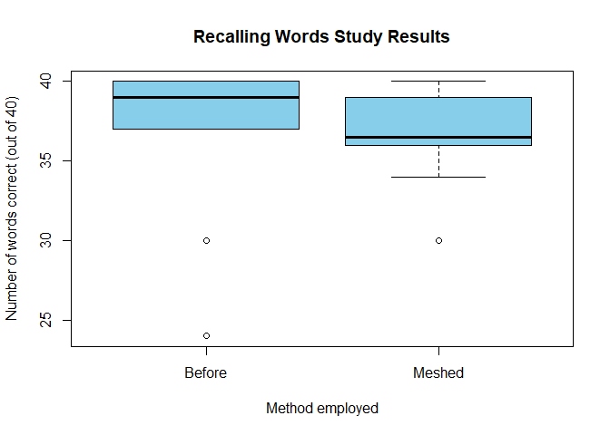

<script type="text/javascript">
 function showhide(id) {
    var e = document.getElementById(id);
    e.style.display = (e.style.display == 'block') ? 'none' : 'block';
 }
</script>


```r
# Play the chunk above and this one to get the data into your Console
View(Friendly)
?Friendly
```


```r
Friendly1 <- Friendly %>% 
    filter(condition == "Meshed" | condition == "Before") %>% 
  droplevels()
```


<br />

## Background

Many teachers and other educators are interested in understanding how to best deliver new content to students. In general, they have two choices of how to do this.

1. The Meshed Approach
    * Deliver new content while simultaneously reviewing previously understood content.

2. The Before Approach
    * Deliver new content after fully reviewing previously understood content.

A study was performed to determine whether the *Meshed* or *Before* approaches to delivering content had any positive benefits on memory recall. 

<div style="padding-left:15px;">

##### <a href="javascript:showhide('uniquename')">The Experiment <span style="font-size:8pt;">(click to view)</span></a>


<div id="uniquename" style="display:none;">

Individuals were seated at a computer and shown a list of words. Words appeared on the screen one at a time, for two seconds each, until all words had been shown (40 total). After all words were shown, they were required to perform a few two-digit mathematical additions (like 15 + 25) for 15 seconds to avoid immediate memory recall of the words. They were then asked to write down as many of the 40 words as they could remember. They were given a maximum of 5.3 minutes to recall words.

The process of showing words and recalling words was repeated four times with the same list of words each time (four chances to get it right). The presentation of the first trial was the same for all treatment conditions. However, trials 2, 3, and 4 were slightly different for each treatment condition.

<div style="padding-left:15px;">

The `SFR` group (the control group) stands for Standard Free Recall. In all four trials the same list of 40 words was presented, in a random order each time.

The `Before` group also used the same 40 words during each trial. However, any words that were correctly recalled in a previous trial were presented first, or *before* the words that were not recalled in the last trial. After all the correct words were presented in random order, the non-recalled words were presented in a random order.

The `Meshed` group also used the same 40 words during each trial. However, words that were correctly recalled in a previous trial were alternated with a missed word during the next presentation order. 

</div>

The data records the number of correctly recalled words (out of the 40 possible) from the fourth trial. Results were obtained for 30 students, 10 in each of the three treatment groups: `SFR`, `Before`, and `Meshed`. 

</div>

##### <a href="javascript:showhide('uniquename2')">The Data <span style="font-size:8pt;">(click to view)</span></a>

<div id="uniquename2" style="display:none;">

The results from the study can be found in the `Friendly` data set in R after loading `library(car)`. 

Note that the data have been filtered. The reason as to why will be revealed later in the Analysis section

Click the "Code" button to see the data.


```r
datatable(Friendly1, options=list(lengthMenu = c(3,10,30)))
```

```{=html}
<div class="datatables html-widget html-fill-item-overflow-hidden html-fill-item" id="htmlwidget-dbf459a28d021a29a003" style="width:100%;height:auto;"></div>
<script type="application/json" data-for="htmlwidget-dbf459a28d021a29a003">{"x":{"filter":"none","vertical":false,"data":[["11","12","13","14","15","16","17","18","19","20","21","22","23","24","25","26","27","28","29","30"],["Before","Before","Before","Before","Before","Before","Before","Before","Before","Before","Meshed","Meshed","Meshed","Meshed","Meshed","Meshed","Meshed","Meshed","Meshed","Meshed"],[40,38,39,37,39,24,30,39,40,40,40,39,34,37,40,36,36,38,36,30]],"container":"<table class=\"display\">\n  <thead>\n    <tr>\n      <th> <\/th>\n      <th>condition<\/th>\n      <th>correct<\/th>\n    <\/tr>\n  <\/thead>\n<\/table>","options":{"lengthMenu":[3,10,30],"columnDefs":[{"className":"dt-right","targets":2},{"orderable":false,"targets":0}],"order":[],"autoWidth":false,"orderClasses":false}},"evals":[],"jsHooks":[]}</script>
```


</div>
</div>

<br />


<!-- Begin writing your analysis below here. -->

<!-- Note that your goal is to use the Friendly data to show whether or not the Meshed or Before methods have any positive benefit on memory recall. -->

## Analysis

There are several different ways of teaching. People have been debating over what methods are best for years and years. Two such methods are the Before method and the Meshed method. For descriptions of these approaches, please refer to the background information found above. Using the data that has been described above, we will be trying to answer the following question: "Is the Meshed approach better than the Before approach?" Because our analysis is only comparing two of the three methods, the data were filtered to eliminate the irrelevant level. Below, you will find a boxplot of the groups that are being examined in this analysis. By looking at this plot, we can make some inferences about the data. However, it is better to run a Wilcoxon Rank Sum Test to confirm any such inferences. 


## Hypotheses

$$
H_0: \text{The distributions of recalled words are stochastically equal}
$$
$$
H_a: \text{One distribution of recalled words is stochastically greater than the other}
$$
For the purposes of this analysis, we will be using an $\alpha$ level of **0.05**. 

## Graphic

The graphic below shows how the five number summary varies based on which method is being employed.


```r
boxplot(correct ~ condition, col = "skyblue", data = Friendly1, ylab = "Number of words correct (out of 40)", xlab = "Method employed", main = "Recalling Words Study Results")
```

<!-- -->


```r
Friendly1 %>% 
  group_by(condition) %>% 
  summarise(Minimum = min(correct), Q1 = quantile(correct, 0.25), Median = median(correct), Q3 = quantile(correct, 0.75), Maximum = max(correct)) %>% 
  pander()
```


--------------------------------------------------------
 condition   Minimum    Q1     Median    Q3     Maximum 
----------- --------- ------- -------- ------- ---------
  Before       24      37.25     39     39.75     40    

  Meshed       30       36      36.5    38.75     40    
--------------------------------------------------------


```r
pander(wilcox.test(correct ~ condition, data = Friendly1))
```


---------------------------------------------------
 Test statistic   P value   Alternative hypothesis 
---------------- --------- ------------------------
       62          0.378          two.sided        
---------------------------------------------------

Table: Wilcoxon rank sum test with continuity correction: `correct` by `condition`

## Conclusion

Based on the p-value of this test, we fail to reject the null hypothesis at the 0.05 $\alpha$ level. This means that we have insufficient evidence to claim that one of the distributions of words correct is stochastically greater than the other. One of the ways that we can look at it is the amount of overlap there is in the boxplots. Relatively speaking, there is quite a bit of overlap between the boxplots. Considering the amount of overlap, the p-value that was obtained from our test makes sense. According to this test, there appears to be no better method. Thus, it does not matter which method you use in a case like this. It will yield similar results no matter what. Of course, this test only took into account the *Before* and *Meshed* approach. The *SFR* group was eliminated at the very beginning. Perhaps if that method were to be taken into account, there could be more promising results. 
